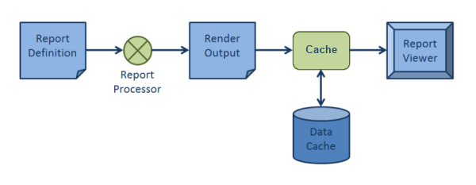
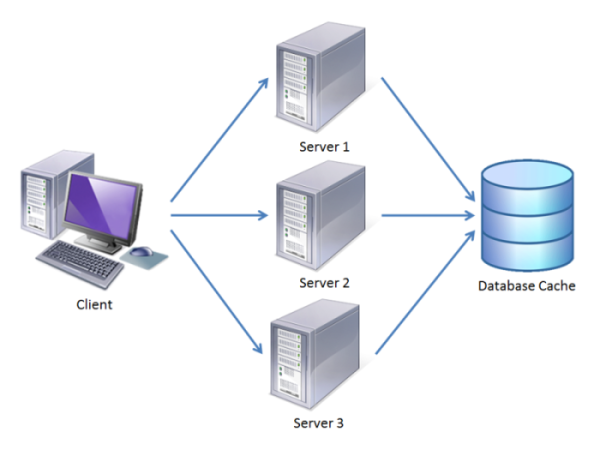

# Cache Management System Overview

__Telerik Reporting__ uses a dedicated cache management system to store and cache rendered pages and some large resources such as images on external storage. This cache management system is utilized by report viewers automatically as shown in the following illustration:

## Applicable For

* __WinForms ReportViewer__ - settings must be applied in the application configuration file. By default the viewer keeps the report state in memory;
* __WPF ReportViewer__ - settings must be applied in the application configuration file. By default the viewer keeps the report state in memory;
* __Silverlight ReportViewer (not supported since R1 2023 SP1)__ - settings must be applied in the [Reporting WCF service]() application configuration file. By default the viewer keeps the report state in memory;
* __ASP.NET WebForms ReportViewer (obsolete web viewer)__ - settings must be applied in the application configuration file. By default the viewer keeps the report state in the ASP.NET Session;

> The cache settings mentioned in this article are not obligatory, and they do not apply to the __HTML5 Report Viewer__ or its Angular, WebForms, MVC, and other wrappers. Details about the Cache Storage of the Reporting REST Service that works with the HTML5 Report Viewer are available in [Report Viewer and Reporting REST services]().

## Cache Management

Such cache management implementation offers the following key benefits:

* __Reduced memory footprint__ – since the rendered pages and resources are cached on external storage rather than being kept in memory, the viewers can handle very large reports with thousands of pages and images without increasing the memory consumed by the application too much.
* __Improved performance__ – the caching mechanism implemented by the cache management system can lead to improved performance of the viewers in certain scenarios.
* __Improved scalability__ – web farms can be configured to cache rendered reports on a dedicated database server. This allows subsequent requests to the same report to be served by different machines in the web farm leading to better load balancing. Only the database storage is shared between all machines in the farm, as shown in the following illustration:

	

## See Also

* [Configuring Cache]()
* [Configuring the File Cache Provider]()
* [Configuring the Database Cache Provider]()
* [Configuring Custom Cache Provider]()
