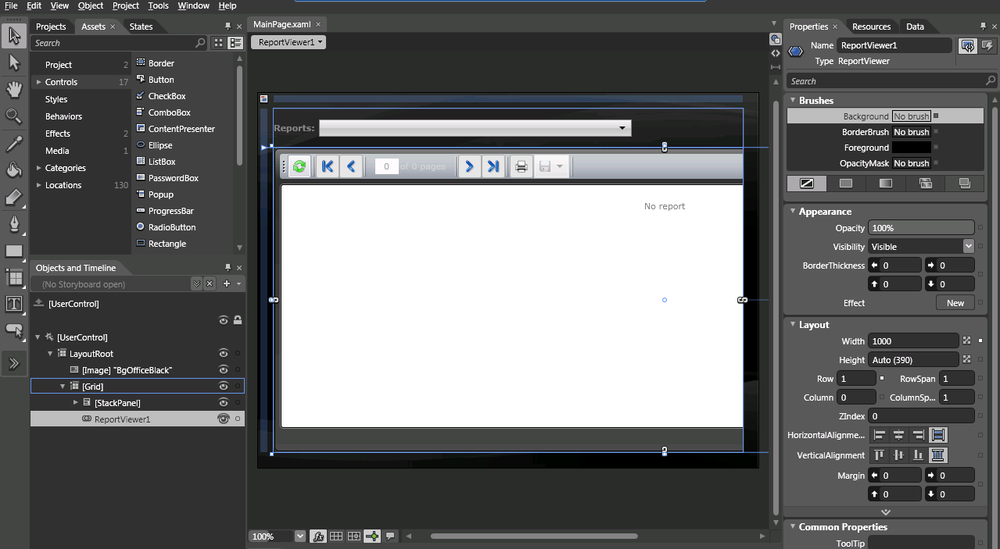

# Add report viewer to a Silverlight application

> The Silverlight Report Viewer and its WCF Reporting Service are no longer supported and deployed with the installation of Telerik Reporting. The last release of Telerik Reporting with included Silverlight Report Viewer is [R1 2023](https://www.telerik.com/support/whats-new/reporting/release-history/progress-telerik-reporting-r1-2023-17-0-23-118).

This article explains the steps needed to create an application which uses the Silverlight report viewer.

1. First you need to create a Silverlight project. Once you do, add references to the following NoXaml assemblies in your Silverlight project:

	+ Telerik.ReportViewer.Silverlight.dll  (located in C:\Program Files (x86)\Progress\Reporting {{site.suiteversion}}\Bin)
	+ System.Windows.Controls.dll
	+ Telerik.Windows.Controls.dll
	+ Telerik.Windows.Controls.Input.dll
	+ Telerik.Windows.Controls.Navigation.dll

	In case you are still not prepared to migrate to Implicit Styling you can use the binaries that include the xaml. However you will still have to add all the xaml files mentioned in the next step, otherwise the Report Viewer will not show up as it will have no style.

	In case you use Telerik UI for Silverlight only for the report viewer, you can use Telerik UI for Silverlight assemblies and XAML that we provide with the local demos. They are internally unlocked for the Silverlight ReportViewer but can only be used with the report viewer. The Telerik UI for Silverlight assemblies are located in _C:\Program Files (x86)\Progress\Reporting {{site.suiteversion}}\Examples\CSharp\SilverlightDemo\bin_.

	The corresponding XAML resources can be found in _C:\Program Files (x86)\Progress\Reporting {{site.suiteversion}}\Silverlight\Themes_.

	The Silverlight ReportViewer is build with the latest official release of Telerik UI for Silverlight. In this way we provide trouble free upgrade for most of the users. This means that you can use the latest version of Telerik UI for Silverlight in your project and report viewer.

	>The files part of Telerik Reporting are the _Telerik.ReportViewer.Silverlight.dll_ and _Telerik.ReportViewer.Silverlight.xaml_. The rest DLLs and XAML resources must be updated from Telerik UI for Silverlight product folder.

1. Add the following xaml files, required for the implicit styling of the report viewer:

	+ *System.Windows.xaml*
	+ *Telerik.Windows.Controls.xaml*
	+ *Telerik.Windows.Controls.Input.xaml*
	+ *Telerik.Windows.Controls.Navigation.xaml*
	+ *Telerik.ReportViewer.Silverlight.xaml* The Telerik UI for Silverlight xaml files are located in _C:\Program Files (x86)\Progress\Reporting {{site.suiteversion}}\Silverlight\Themes_.

1. The next step is to merge these ResourceDictionaries in the App.xaml file:

	````XML
<Application x:Class="SilverlightApplication1.App"
			xmlns="http://schemas.microsoft.com/winfx/2006/xaml/presentation"
			xmlns:x="http://schemas.microsoft.com/winfx/2006/xaml"
			>
	 <Application.Resources>
	   <ResourceDictionary>
		 <ResourceDictionary.MergedDictionaries>
		   <ResourceDictionary Source="/SilverlightApplication1;component/Themes/System.Windows.xaml"/>
		   <ResourceDictionary Source="/SilverlightApplication1;component/Themes/Telerik.Windows.Controls.xaml"/>
		   <ResourceDictionary Source="/SilverlightApplication1;component/Themes/Telerik.Windows.Controls.Input.xaml"/>
		   <ResourceDictionary Source="/SilverlightApplication1;component/Themes/Telerik.Windows.Controls.Navigation.xaml"/>
		   <ResourceDictionary Source="/SilverlightApplication1;component/Themes/Telerik.ReportViewer.Silverlight.xaml"/>
		 </ResourceDictionary.MergedDictionaries>
	   </ResourceDictionary>
	 </Application.Resources>
	</Application>
````


1. Add the ReportViewer to the MainPage.xaml from the __ToolBox__ through __Visual Studio__ or __Expression Blend__. You should skip points #5, #6 and #7 if you have done that, as they describe how to register the report viewer manually. 

	

1. Open __MainPage.xaml__
1. Register the namespace in the following way: xmlns:`<Name of namespace>= "<Name of assembly>"` in our case:

	`xmlns:telerik="clr-namespace:Telerik.ReportViewer.Silverlight;assembly=Telerik.ReportViewer.Silverlight"`

1. Now you would be able to declare the ReportViewer control: 

	````XAML
<telerik:ReportViewer></telerik:ReportViewer>
````


1. Next we need to set the __ReportServiceUri__ and __Report__ properties of the viewer. 

	* `Telerik.ReportViewer.Silverlight.ReportViewer.ReportServiceUri` should point to `Telerik Reporting WCF service`: 

		`ReportServiceUri="../ReportService.svc"`

	* `Telerik.ReportViewer.Silverlight.ReportViewer.Report` should be set to the assembly qualified name of the report you want to show: 

		`Report="Telerik.Reporting.Examples.CSharp.BarcodesReport, CSharp.ReportLibrary, Version=1.0.0.0, Culture=neutral, PublicKeyToken=null"`

	Review [How to use the Report Wizard to create a Band Report]() topic for information on creating a __Telerik Report__.

	The _MainPage.xaml_ should look similar: 

	````XAML
<UserControl x:Class="Telerik.Reporting.CodeSnippets.SilverlightCS.API.MainPage"
		xmlns="http://schemas.microsoft.com/winfx/2006/xaml/presentation"
		xmlns:x="http://schemas.microsoft.com/winfx/2006/xaml"
		xmlns:d="http://schemas.microsoft.com/expression/blend/2008"
		xmlns:mc="http://schemas.openxmlformats.org/markup-compatibility/2006"
		xmlns:telerik="clr-namespace:Telerik.ReportViewer.Silverlight;assembly=Telerik.ReportViewer.Silverlight">

		<Grid x:Name="LayoutRoot">
				<telerik:ReportViewer  x:Name="ReportViewer1" Width="1000"
				ReportServiceUri="../ReportService.svc"
				Report="Telerik.Reporting.Examples.CSharp.BarcodesReport, CSharp.ReportLibrary, Version=1.0.0.0, Culture=neutral, PublicKeyToken=null">
				</telerik:ReportViewer>
		</Grid>
	</UserControl>
````


## See Also

* [Silverlight Application]()
* [Using Custom Bindings]()
