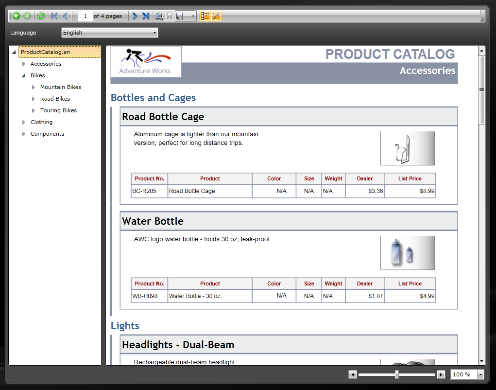

# Silverlight Application Overview

> The Silverlight Report Viewer and its WCF Reporting Service are no longer supported and deployed with the installation of Telerik Reporting. The last release of Telerik Reporting with included Silverlight Report Viewer is [R1 2023](https://www.telerik.com/support/whats-new/reporting/release-history/progress-telerik-reporting-r1-2023-17-0-23-118).

The Silverlight Report Viewer allows developers to deliver reports produced by Telerik Reporting to any rich application developed with Silverlight. The Silverlight viewer lives entirely on the client side, while the reports and the rendering engine are on the server side (accessible through the [Telerik Reporting WCF Service]()). 

  

The toolbar on the Silverlight Report Viewer provides basic functionality for interacting with the currently-loaded report:

* Navigate back in history

* Navigate forward in history

* Refresh

* Go to first page

* Go to previous page

* Go to a specific page

* Total number of pages

* Go to next page

* Go to last page

* Print Preview: switches between __Logical__ and __Physical__ page renderer. See [Rendering and Paging]() for more info. 

* Print: use [Telerik.ReportViewer.Silverlight.ReportViewer.UseNativePrinting](/reporting/api/Telerik.ReportViewer.Silverlight.ReportViewer#Telerik_ReportViewer_Silverlight_ReportViewer_UseNativePrinting) to switch between Silverlight native print and [True Print](). 

* Export: see [Export Formats]() for available export formats. 

* Show/Hide document map

* Show/Hide parameters area

* Zooming

## Silverlight report viewer specific properties

* [Telerik.ReportViewer.Silverlight.ReportViewer.ReportServiceUri](/reporting/api/Telerik.ReportViewer.Silverlight.ReportViewer#Telerik_ReportViewer_Silverlight_ReportViewer_ReportServiceUri) - the location of the report service - absolute or relative [Uri](http://msdn.microsoft.com/en-us/library/system.uri%28VS.95%29.aspx). If the uri is absolute, the same instance is returned. If the uri is relative, a new absolute Uri based on the combination of Source of the current application and the given relative uri is created. The Source usually points to the application package (XAP). 

* [Telerik.ReportViewer.Silverlight.ReportViewer.Report](/reporting/api/Telerik.ReportViewer.Silverlight.ReportViewer#Telerik_ReportViewer_Silverlight_ReportViewer_Report) - the [assembly qualified name](http://msdn.microsoft.com/en-us/library/system.type.assemblyqualifiedname.aspx) of the Report type for the viewer to display; 

* [Telerik.ReportViewer.Silverlight.ReportViewer.UseNativePrinting](/reporting/api/Telerik.ReportViewer.Silverlight.ReportViewer#Telerik_ReportViewer_Silverlight_ReportViewer_UseNativePrinting) - Specifies whether to use native Silverlight printing or [True Print](). Default value is _true_. 

In order to use our Silverlight Report Viewer, you need a Silverlight application. In order to create such, you need the following tools installed:

## System Requirements

* Visual Studio 2010 or later.

* Silverlight 5.

* The latest version of [Silverlight Tools/SDK](http://silverlight.net/getstarted) for Visual Studio 2010+ is needed for development. 

* (optional) Expression Blend.

> The Silverlight ReportViewer requires the Telerik Reporting WCF Service. For more information: [Telerik Reporting WCF Service](). 

## How it works

The Silverlight ReportViewer control is a composite of Telerik UI for Silverlight controls. The viewer's functionality resides in _Telerik.ReportViewer.Silverlight.dll_ and the viewer's UI in _Telerik.ReportViewer.Silverlight.xaml_. 

> The Silverlight ReportViewer control's template can be modified trough the corresponding theme's [Telerik.ReportViewer.Silverlight.xaml]() file and the [Silverlight ReportViewer](/reporting/api/Telerik.ReportViewer.Silverlight.ReportViewer). 

The purpose of the Silverlight ReportViewer control is to display Telerik Reports and allow the user to interact with them. Reports are processed and rendered on the server where __Telerik Reporting engine__ and __Telerik WCF service__ run. The __Telerik Reporting WCF Service__ serves reports to the Silverlight ReportViewer, and is responsible for managing the reports state and their resources as images. The report in the viewer is rendered as standard XAML elements, as Canvas and TextBlock, through Telerik Reporting XAML for Silverlight rendering mechanism. 

## See Also

* [How to Add report viewer to a Silverlight application]()

* [Using Custom Bindings]()
