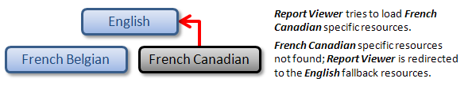

# Silverlight Report Viewer Localization

> The Silverlight Report Viewer and its WCF Reporting Service are no longer supported and deployed with the installation of Telerik Reporting. The last release of Telerik Reporting with included Silverlight Report Viewer is [R1 2023](https://www.telerik.com/support/whats-new/reporting/release-history/progress-telerik-reporting-r1-2023-17-0-23-118).

In the Silverlight Report Viewer, localized resources are stored in separate **RESX** resource files and loaded according to the current UI culture settings. To understand how localized resources are loaded, it is useful to think of them as being organized in a hierarchical manner.

## Types of Resources in the Hierarchy

- At the top of the hierarchy sit the fallback resources for the default UI culture, which is English ("en") by default. These are the only resources that do not have their own file. They are stored directly in the assembly of the **Report Viewer**.
- Below the fallback resources are the resources for any neutral cultures. A neutral culture is associated with a language but not a region. For example, French ("fr") is a neutral culture. Note that the fallback resources are also for a neutral culture, but a special one.
- Below those are the resources for any specific cultures. A specific culture is associated with a language and a region. For example, French Canadian ("fr-CA") is a specific culture.

When the **Report Viewer** tries to load any localized resource and does not find it it will travel up the hierarchy until it finds a resource file containing the requested resource.

The best way to store your resources is to generalize them as much as possible. That means to store localized strings in resource files for neutral cultures rather than specific cultures whenever possible. For instance, if you have resources for the French Belgian ("fr-BE") culture and the resources immediately above are the fallback resources in English, a problem may result when someone uses your application on a system configured for the French Canadian culture. The **Report Viewer** will look for a **RESX**  file named "fr-CA", it will not find it and will load the fallback resource, which is English, instead of loading the French resources. The following picture shows this undesirable scenario.



If you follow the recommended practice of placing as many resources as possible in a neutral resource file for the "fr" culture, the French Canadian user would not see resources marked for the "fr-BE" culture, but he or she would still see strings in French. The following situation demonstrates this preferred scenario.


## Naming Conventions for the Localization Resources

**The Report Viewer** uses the following naming convention when searching for localized **RESX** resource files in the main application folder:

- The names of the **RESX** localization resource files should have the following format: _Telerik.ReportViewer.Silverlight.TextResources.[culture].resx_, where **[culture]** is the name of the culture for the specified localization resource. For example, to provide a localization resource for the French Belgian culture, the corresponding resource file should be named as follows: _Telerik.ReportViewer.Silverlight.TextResources.fr-BE.resx_
- Respectively, to provide a localization resource for the French neutral culture, the corresponding resource file should be named as follows: _Telerik.ReportViewer.Silverlight.TextResources.fr.resx_
- It is possible to override the default resources for the language neutral culture, which are stored in the assembly of the **Report Viewer**. In that case the resource file should be named as follows:_Telerik.ReportViewer.Silverlight.TextResources.resx_

As described above, if for example the current UI culture is set to French Belgian, the **Report Viewer** will search for localized **RESX** resource files inside the main application folder in the following order:

1. Telerik.ReportViewer.Silverlight.TextResources.**fr-BE**.resx
1. Telerik.ReportViewer.Silverlight.TextResources.**fr**.resx
1. Telerik.ReportViewer.Silverlight.TextResources.resx


The above diagram illustrates a simple view of the resource fallback for a UI culture set to "fr-BE". The **Report Viewer** handles the case probing the "fr-BE" **RESX** resource file for the requested key first, and subsequently falls back to the neutral French culture "fr", ultimately looking in the default assembly resources for a value if a value has still not been found.

## Adding Localization Resources for the Report Viewer

1.  Add a new **RESX** resource file to the main project of the application. Name the newly-created **RESX** file according to the naming convention described above.
1.  In the **Property Inspector** specify the following properties for the resource file:

    1. **Build Action:** "_Embedded Resource_"
    1. **Copy to Output Directory:** "_Copy if newer_ " or "_Copy always_"

1.  Open the **RESX** resource file in the **Visual Studio Resource Editor**. Enter the required resource strings (`Telerik.ReportViewer.Silverlight.TextResources`) to translate the **Report Viewer** to the desired language.

1.  Unload the project by right clicking on it and selecting "Unload Project".
1.  Right click on the project again and select "Edit MyProject.csproj".
1.  Locate the **SupportedCultures** tag and add the supported cultures (there is no need to specify the neutral culture):

    ````XML
    <SupportedCultures>
    	fr;fr-BE
    </SupportedCultures>
	````

1. Reload and build the project
1. Repeat steps from 1 to 3 for each desired translation of the __Report Viewer__. Steps 4 to 7 can be performed at the end only once.
1. Compile and run the project. When viewing a __Telerik Report__, the __Report Viewer__ should be translated according to the current UI culture.

## Distributing an Application with a Localized Report Viewer

In order to distribute an application that uses __Telerik Reporting__ with a localized __Report Viewer__, one should distribute all of the required localization __RESX__ resource files, in addition to the main application assemblies. For __Silverlight Applications__ the __RESX__ files should be placed in the "Localization" folder.

## Localization Using the ITextResources interface

The other way to localize the Silverlight __Report Viewer__ in a more flexible manner is to create a class that implements the _ITextResources_ interface and to implement all its properties, which represent all tooltips and messages in the Report Viewer. After you implement ITextResources you have to pass an instance of your custom class to the TextResources property ot the report viewer. The logic is pretty simple, the property just has to return the correct translation for each resource key, as it is shown below:

````C#
public class CustomResources : Telerik.ReportViewer.Silverlight.ITextResources
{
	public string AllFiles
	{
		get
		{
			return "Todos Archivos";
		}
	}

	public string BackToolTip
	{
		get
		{
			return "Navega hacia atrás";
		}
	}

	public string CurrentPageToolTip
	{
		get
		{
			return "Página corriente";
		}
	}

	//...... Implement the rest of the properties ......
}
````
````VB
Public Class CustomResources
	Implements Telerik.ReportViewer.Silverlight.ITextResources

	Public ReadOnly Property AllFiles() As String Implements ReportViewer.Silverlight.ITextResources.AllFiles
		Get
			Return "Todos Archivos"
		End Get
	End Property

	Public ReadOnly Property BackToolTip() As String Implements ReportViewer.Silverlight.ITextResources.BackToolTip
		Get
			Return "Navega hacia atrás"
		End Get
	End Property

	Public ReadOnly Property CurrentPageToolTip() As String Implements ReportViewer.Silverlight.ITextResources.CurrentPageToolTip
		Get
			Return "Página corriente"
		End Get
	End Property

	'...... Implement the rest of the properties ......
End Class
````

Instead of a hard-coded string the property can be set in a method/contructor or to be created a method that returns string and implements a cutsom logic, for example retreives the resource key from a database.

```C#
public class CustomTextResources : Telerik.ReportViewer.Silverlight.ITextResources
{
	public string AllFiles
	{
		get
		{
			return SqlHelper.GetViewerKeyFromDb(TextResourcesEnum.AllFiles);
		}
	}

	public string BackToolTip
	{
		get
		{
			return SqlHelper.GetViewerKeyFromDb(TextResourcesEnum.BackToolTip);
		}
	}

	public string CurrentPageToolTip
	{
		get
		{
			return SqlHelper.GetViewerKeyFromDb(TextResourcesEnum.CurrentPageToolTip);
		}
	}

	//...... Implement the rest of the properties ......
}
```
```VB
Public Class CustomTextResources
	Implements Telerik.ReportViewer.Silverlight.ITextResources

	Public ReadOnly Property AllFiles() As String Implements ReportViewer.Silverlight.ITextResources.AllFiles
		Get
			Return SqlHelper.GetViewerKeyFromDb(TextResourcesEnum.AllFiles)
		End Get
	End Property

	Public ReadOnly Property BackToolTip() As String Implements ReportViewer.Silverlight.ITextResources.BackToolTip
		Get
			Return SqlHelper.GetViewerKeyFromDb(TextResourcesEnum.BackToolTip)
		End Get
	End Property

	Public ReadOnly Property CurrentPageToolTip() As String Implements ReportViewer.Silverlight.ITextResources.CurrentPageToolTip
		Get
			Return SqlHelper.GetViewerKeyFromDb(TextResourcesEnum.CurrentPageToolTip)
		End Get
	End Property

	'...... Implement the rest of the properties ......
End Class
```

## See Also

- [Silverlight Application]()
- [How to Add report viewer to a Silverlight application]()
- [Hierarchical Organization of Resources for Localization](<http://msdn2.microsoft.com/en-us/library/756hydy4(VS.71).aspx>)
- [Silverlight Globalization and Localization Overview](<http://msdn.microsoft.com/en-us/library/cc838238(v=vs.95).aspx>)
- [Security and Localized Satellite Assemblies](<http://msdn2.microsoft.com/en-us/library/ff8dk041(VS.71).aspx>)
