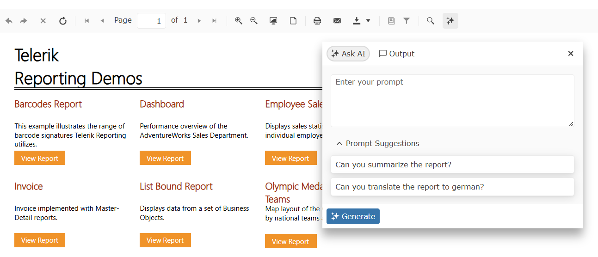
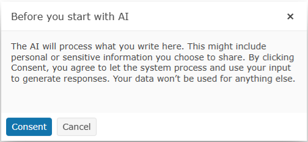
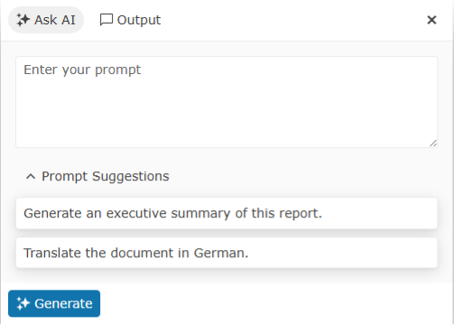
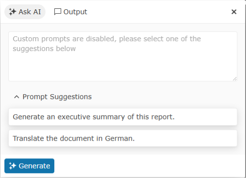
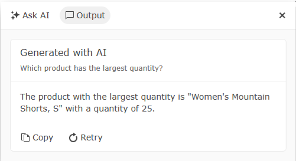

# Overview of the AI Interactivity

Beginning with the **2025 Q2** release, we are introducing the new [AI-Powered Insights]() functionality to our Web Report Viewers.

During the report preview phase, AI-generated insights offer an extensive suite of functionalities, including the formulation of responses, the construction of prompts, engagement with AI-generated content, and the execution of predefined instructions.



## Configuration

The [AI-Powered Insights]() functionality can be enabled through the configuration file of the project where the [Reporting REST Service]() is running.

Below is an example of how to configure the project for the `AzureOpenAI` option.

````JSON
{
	"telerikReporting": {
		"AIClient": {
			"friendlyName": "MicrosoftExtensionsAzureOpenAI",
			"model": "gpt-4o-mini",
			"endpoint": "https://ai-explorations.openai.azure.com/",
			"credential": "...",
			"requireConsent": false,
			"allowCustomPrompts": false,
			"predefinedPrompts": [
				{ "text": "Can you summarise the repor for me?" }
			]
		}
	}
}
````
````XML
<Telerik.Reporting>
	<AIClient
		friendlyName="MicrosoftExtensionsAzureOpenAI"
		model="gpt-4o-mini"
		endpoint="https://ai-explorations.openai.azure.com/"
		credential="..."
		requireConsent="false"
		allowCustomPrompts="false">
		<predefinedPrompts>
			<add text="Can you summarise the repor for me?" />
		</predefinedPrompts>
	</AIClient>
</Telerik.Reporting>
````

>note For more information about the configuration options, visit the [AI-Powered Insights]() article. 

## Visual Representation of the AI Prompt

The AI Prompt will change visually based on the configuration settings and the current selected state - *asking a question* or *inspecting the output*.

### Consent

Before any user can use this feature, upon opening the AI Prompt Dialog, they will be asked to give consent to the AI to process the provided text.



### Ask AI Prompt

After consent is given, the prompt for asking the AI questions will appears in the top-right corner of the report viewer. The UI will change depending on whether custom questions are allowed.

- Default **Ask AI** Rrompt Dialog with enabled custom questions and two predefined ones

	

- **Ask AI** Rrompt Dialog with disabled custom questions and two predefined ones

	

### Output

The **Output** of the AI processor will be displayed in the `Output` tab of the `Ask AI` Prompt after the result has been generated:


## See Also

* [AI-Powered Insights]()
* [AIClient Element]()