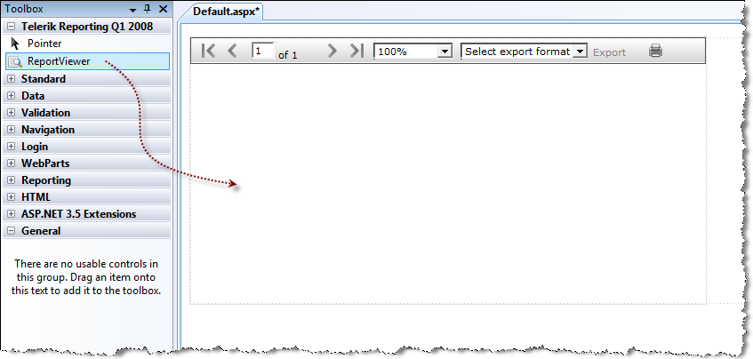

# Using the ASP.NET WebForms Report Viewer

> This is a legacy report viewer and for new projects our recommendation is to use the latest WebForms Report Viewer - [HTML5 Web Forms Report Viewer]()

## Assign report to the viewer in design time

To use Telerik Reports in web application, you need the Web report viewer:

1. Drag the **ReportViewer** control from the **Toolbox** to the design surface of a web form.

   

   By doing so, the ReportViewer control would register automatically the HTTP handler it needs to function properly in the web.config file of the web application/site.

   > The HTTP handler is automatically registered in the `web.config` only when the report viewer control is dropped from the Toolbox to the design surface of a web form. If you drop the report viewer in the text editor (source view) or add it to the web form programatically, you should manually register the HTTP handler using the XML markup below, where `x.x.x.x` is your Telerik Reporting assembly version.

   In the `<system.web>`/`<httpHandlers>` section:

   ```XML
   <system.web>
   ....
   	<httpHandlers>
   		<add path="Telerik.ReportViewer.axd" verb="*" type="Telerik.ReportViewer.WebForms.HttpHandler, Telerik.ReportViewer.WebForms, Version=x.x.x.x, Culture=neutral, PublicKeyToken=a9d7983dfcc261be"/>
   	</httpHandlers>
   ....
   </system.web>
   ```

   In the `<system.webServer>`/`<handlers>` section:

   ```XML
   <system.webServer>
   	<handlers>
   		<add name="Telerik.ReportViewer.axd_*" path="Telerik.ReportViewer.axd" verb="*" type="Telerik.ReportViewer.WebForms.HttpHandler, Telerik.ReportViewer.WebForms, Version=x.x.x.x, Culture=neutral, PublicKeyToken=a9d7983dfcc261be" preCondition="integratedMode"/>
   	</handlers>
   	<validation validateIntegratedModeConfiguration="false"/>
   </system.webServer>
   ```

1. Add reference to the class library that contains your reports in the web application/site.
1. Build the application
1. Set the `ReportSource` for the report viewer. For more information, see [How to Set ReportSource for Report Viewers]()

## Assign report to the viewer programatically

In the `Page_Load` event handler, create an [TypeReportSource](/api/telerik.reporting.typereportsource) and set its [`TypeName`](/api/telerik.reporting.typereportsource#Telerik_Reporting_TypeReportSource_TypeName) property to the [Type.AssemblyQualifiedName](https://learn.microsoft.com/en-us/dotnet/api/system.type.assemblyqualifiedname?view=net-7.0) property. Next assign the `TypeReportSource` instance to the `ReportSource` property of the viewer.

{{source=CodeSnippets\CS\API\Telerik\ReportViewer\WebForms\WebForm1.aspx.cs region=Webviewer_SetReportSource}}
{{source=CodeSnippets\VB\API\Telerik\ReportViewer\WebForms\WebForm1.aspx.vb region=Webviewer_SetReportSource}}

## See Also

- [Report Sources]()

- [ASP.NET Web Forms Report Viewer]()

- [Report Viewer Localization]()

- [Deploying Web ReportViewer in SharePoint]()

- [Medium Trust Support]()
