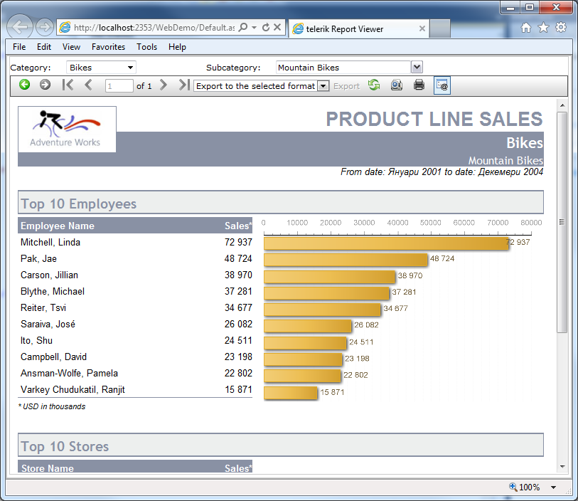

# ASP.NET Web Forms Report Viewer Overview

This document provides a brief overview of the *legacy* ASP.NET WebForms Report Viewer.

> Starting with the [2024 Q4 release](https://www.telerik.com/support/whats-new/reporting/release-history/progress-telerik-reporting-2024-q4-18-3-24-1112), the ASP.NET WebForms Report Viewer will no longer be distributed with Telerik Reporting. We strongly recommend using its successor - the [HTML5 Web Forms Report Viewer](), which includes the latest features, performance enhancements, and security improvements offered by both Microsoft and Telerik.

## Purpose and Features

The ASP.NET ReportViewer is designed to render __Telerik Reports__ within ASP.NET WebForms projects.

> The ASP.NET Report Viewer uses `ASP.NET Session` and `ASP.NET Cache` to preserve the report instance assigned to its `Report` property during page postbacks and for some design reasons as well, so `Session` must be enabled at all times.

The ASP.NET Report Viewer has the following useful features:

* Navigate back in history
* Navigate forward in history
* Go to the first page
* Go to the previous page
* Go to a specific page
* Total number of pages
* Go to the next page
* Go to the last page
* Export: see [Export Formats]() for available export formats.
* Refresh
* Print Preview: switches between __Logical__ and __Physical__ page renderer. See [Rendering and Paging]() for more info.
* Print: see [True Print]() for more info.
* Show/Hide parameters area
* Show/Hide document map

## How it works

The ASP.NET ReportViewer control is a composite of standard ASP.NET Web Server controls.

> The ASP.NET ReportViewer comes with four predefined skins: `Default`, `WebBlue`, `Original`, and `Office2007`. The ASP.NET ReportViewer control's toolbar is immutable. To build custom UI for the toolbar and work with the rendered report in the viewer, you can use the ASP.NET ReportViewer [Client-Side API]().

The purpose of the ASP.NET ReportViewer control is to display Telerik Reports and allow the user to interact with them. Reports are processed and rendered on the server. Reports and their content are delivered to the client through the `Telerik.ReportViewer.axd` handler.

The ASP.NET ReportViewer caches the report data in the session storage when the [session state mode](https://learn.microsoft.com/en-us/dotnet/api/system.web.sessionstate.sessionstatemode?view=netframework-4.8) is `InProc`. For that reason, when the data is provided in the [NeedDataSource]() event handler of the report, the event will be raised only the first time the report gets rendered. When the report is requested for the second time, for example for *Export* or *Print* from the viewer, the event won't be raised as the report already has data.

The ASP.NET ReportViewer control's content is rendered in [`IFRAME`](https://developer.mozilla.org/en-US/docs/Web/HTML/Element/iframe) elements. The report in the viewer is rendered through the __IMAGE__ rendering mechanism based on the [Design Considerations for HTML Rendering]().

## See Also

* [How to Add report viewer to a web page]()
* [Report Viewer Localization]()
* [Deploying Web ReportViewer in SharePoint]()
* [Medium Trust Support]()
* [AJAX support]()
* [Client-Side API]()
