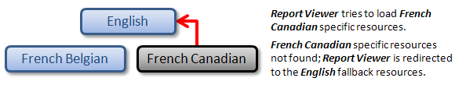
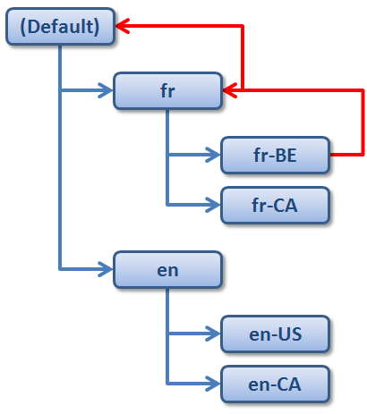

# Localization Overview

> This is a legacy report viewer and for new projects our recommendation is to use the latest WebForms Report Viewer - [HTML5 Web Forms Report Viewer]()

In the ASP.NET WebForms Report Viewer, localized resources are stored in separate `RESX` resource files and loaded according to the current UI culture settings. To understand how localized resources are loaded, it is useful to think of them as being organized in a hierarchical manner.

## Types of Resources in the Hierarchy

* At the top of the hierarchy sit the fallback resources for the default UI culture, which is __English ("en")__, by default. These are the only resources that do not have their own file. They are stored directly in the __assembly__ of the Report Viewer.
* Below the fallback resources are the resources for any neutral cultures. A neutral culture is associated with a language but not a region. For example, __French ("fr")__ is a neutral culture. Note that the fallback resources are also for a neutral culture, but a special one.
* Below those are the resources for any specific cultures. A specific culture is associated with a language and a region. For example, __French Canadian ("fr-CA")__ is a specific culture.

>note When the __Report Viewer__ tries to load any localized resource and does not find it it will travel up the hierarchy until it finds a resource file containing the requested resource.

The best way to store your resources is to generalize them as much as possible. That means to store localized strings in resource files for neutral cultures rather than specific cultures whenever possible. For instance, if you have resources for the __French Belgian ("fr-BE")__ culture and the resources immediately above are the fallback resources in English, a problem may result when someone uses your application on a system configured for the __French Canadian__ culture. The __Report Viewer__ will look for a `RESX` file named `fr-CA`, it will not find it and will load the fallback resource, which is English, instead of loading the French resources. The following picture shows this undesirable scenario.

If you follow the recommended practice of placing as many resources as possible in a neutral resource file for the `fr` culture, the __French Canadian__ user would not see resources marked for the `fr-BE` culture, but he or she would still see strings in French. The following situation demonstrates this preferred scenario.

## Naming Conventions for the Localization Resources

__The Report Viewer__ uses the following naming convention when searching for localized __RESX__ resource files in the main application folder:

* The names of the `RESX` localization resource files should have the following format: `Telerik.ReportViewer.WebForms.Resources.[culture].resx`. Here "`[culture]`" is the name of the culture for the specified localization resource. For example, to provide a localization resource for the __French Belgian__ culture, the corresponding resource file should be named as follows: `Telerik.ReportViewer.WebForms.Resources.fr-BE.resx`
* Respectively, to provide a localization resource for the French neutral culture, the corresponding resource file should be named as follows: `Telerik.ReportViewer.WebForms.Resources.fr.resx`
* It is possible to *override* the default resources for the language neutral culture, which are stored in the assembly of the __Report Viewer__. In that case the resource file should be named as follows: `Telerik.ReportViewer.WebForms.Resources.resx`

As described above, if for example the current UI culture is set to __French Belgian__, the Report Viewer will search for localized `RESX` resource files inside the main application folder in the following order:

1. Telerik.ReportViewer.WebForms.Resources.__fr-BE__.resx
1. Telerik.ReportViewer.WebForms.Resources.__fr__.resx
1. Telerik.ReportViewer.WebForms.Resources.resx

The above diagram illustrates a simple view of the resource fallback for a UI culture set to `fr-BE`. The __ASP.NET WebForms Report Viewer__ handles the case probing the "fr-BE" `RESX` resource file for the requested key first, and subsequently falls back to the neutral French culture "fr", ultimately looking in the default assembly resources for a value if a value has still not been found.

## Adding Localization Resources for the Report Viewer

1. Add an __ASP.NET folder__ "App_GlobalResources" to the main project of the web application or web site, if such a folder does not already exist.
1. Add a new __RESX__ resource file to the "App_GlobalResources" folder. Name the newly-created __RESX__ file according to the naming convention described above.
1. (*not applicable for web site projects*) In the __Property Inspector__ specify the following properties for the resource file:

	1. __Build Action:__ "*None*"
	1. __Copy to Output Directory:__ "*Copy if newer*" or "*Copy always*"

1. Open the __RESX__ resource file in the __Visual Studio Resource Editor__. Enter the required resource strings to translate the __Report Viewer__ to the desired language.
1. Repeat steps from 2 to 4 for each desired translation of the __Report Viewer__.
1. Compile and run the project. When viewing a __Telerik Report__, the __Report Viewer__ should be translated according to the current UI culture.

## Distributing an Application with a Localized Report Viewer

In order to distribute an application that uses __Telerik Reporting__ with a localized __ASP.NET WebForms Report Viewer__, one should distribute all of the required localization `RESX` resource files, in addition to the main application assemblies. For `Web Sites` and `Web Applications` the localization `RESX` resource files should be placed in the `App_GlobalResources` folder. In case of Precompiled website, place the `RESX` files in the `bin` folder.

## See Also

* [Setting the Culture and UI Culture for Web Forms Globalization](https://learn.microsoft.com/en-us/previous-versions/aspnet/bz9tc508(v=vs.100))
* [Create satellite assemblies for .NET apps](https://learn.microsoft.com/en-us/dotnet/core/extensions/create-satellite-assemblies)
