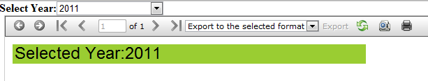
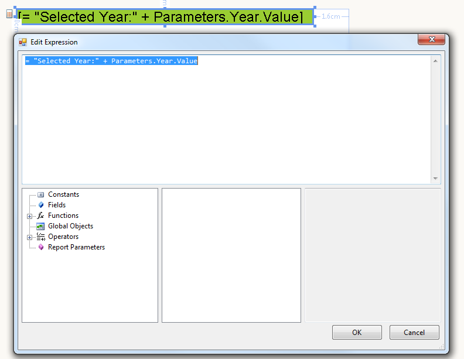

# How to Modify the Value of a TextBox item using an Expression and a Report Parameter

> This is a legacy report viewer and for new projects our recommendation is to use the latest web forms report viewer - [HTML5 Web Forms Report Viewer]()

The goal is to change the value of a TextBox item in the report, according to the selected value in a DropDownList:

  

1. Create a report parameter of type String and set a value e.g. 2011 

  

1. Set the Value property of the TextBox item: 

  

1. Attach the __SelectedIndexChanged__ event handler of the __DropDownList__. In the event handler, get the report assigned to the viewer (in the example the ReportSource is __InstanceReportSource__) and set the value of the report parameter to the selected item of the __DropDownList__ : 
    
    ````C#
	protected void DropDownList1_SelectedIndexChanged(object sender, EventArgs e)
	{
		 InstanceReportSource reportsource = (InstanceReportSource)this.ReportViewer1.ReportSource;
		 Report report = (Report)reportsource.ReportDocument;
		 report.ReportParameters["Year"].Value = ((DropDownList)sender).SelectedItem.Value;
		 ReportViewer1.RefreshReport();
	}
	````
	````VB
	Protected Sub DropDownList1_SelectedIndexChanged(ByVal sender As Object, ByVal e As System.EventArgs) Handles DropDownList1.SelectedIndexChanged
		 Dim reportsource As InstanceReportSource = DirectCast(Me.ReportViewer1.ReportSource, InstanceReportSource)
		 Dim report As Report = DirectCast(reportsource.ReportDocument, Report)
		 report.ReportParameters("Year").Value = DirectCast(sender, DropDownList).SelectedItem.Value
		 ReportViewer1.RefreshReport()
	End Sub
	````


