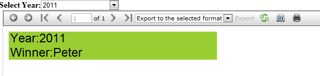
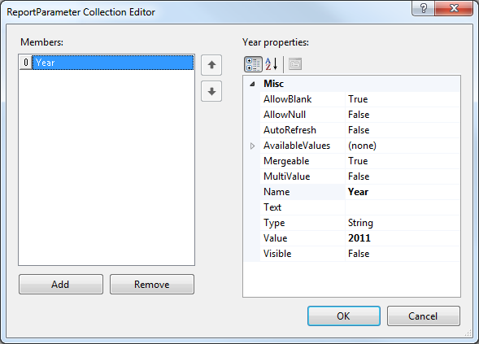
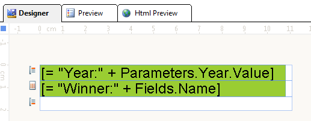

# How to Using Report Parameters to Retrieve Specific data

> This is a legacy report viewer and for new projects our recommendation is to use the latest web forms report viewer - [HTML5 Web Forms Report Viewer]()

The goal is to retrieve a name depending on the selected year from a drop down list: 

  

1. A method with a parameter to retrieve the relevant data only is used as report data source. 
    
    ````C#
	static DataTable GetData(string year)
	{
		DataTable table = new DataTable();
		table.Columns.Add("Name", typeof(string));
		if ("2007" == year)
		{
			table.Rows.Add("Peter");
		}
		else if ("2008" == year)
		{
			table.Rows.Add("Scott");
		}
		return table;
	}
	````
	````VB
	Private Shared Function GetData(ByVal year) As DataTable
		Dim table As DataTable
		table = New DataTable()
		table.Columns.Add("Name", GetType(String))
		If (year = "2007") Then
			table.Rows.Add("Peter")
		ElseIf (year = "2008") Then
			table.Rows.Add("Scott")
		End If
		Return table
	End Function
	````

1. Creating the report parameter: 

  

1. Setting Value for the TextBox items: 

  

1. Setting the report __DataSource__ to the GetData method in the __NeedDataSource__ event handler of the report: 
    
    ````C#
	private void Report2_NeedDataSource(object sender, EventArgs e)
	{
		Telerik.Reporting.Processing.Report report = (Telerik.Reporting.Processing.Report)sender;
		report.DataSource = GetData(report.Parameters["Year"].Value.ToString());
	}
	````
	````VB
	Private Sub Report2_NeedDataSource(ByVal sender As System.Object, ByVal e As System.EventArgs) Handles MyBase.NeedDataSource
		Dim report As Telerik.Reporting.Processing.Report = DirectCast(sender, Telerik.Reporting.Processing.Report)
		report.DataSource = GetData(report.Parameters("Year").Value.ToString())
	End Sub
	````

1. Attach the __SelectedIndexChanged__ event handler of the __DropDownList__. In the event handler, get the report assigned to the viewer (in the example the ReportSource is __InstanceReportSource__) and set the value of the report parameter to the selected item of the __DropDownList__ : 
    
    ````C#
	protected void DropDownList1_SelectedIndexChanged(object sender, EventArgs e)
	{
		 InstanceReportSource reportsource = (InstanceReportSource)this.ReportViewer1.ReportSource;
		 Report report = (Report)reportsource.ReportDocument;
		 report.ReportParameters["Year"].Value = ((DropDownList)sender).SelectedItem.Value;
		 ReportViewer1.RefreshReport();
	}
	````
	````VB
	Protected Sub DropDownList1_SelectedIndexChanged(ByVal sender As Object, ByVal e As System.EventArgs) Handles DropDownList1.SelectedIndexChanged
		 Dim reportsource As InstanceReportSource = DirectCast(Me.ReportViewer1.ReportSource, InstanceReportSource)
		 Dim report As Report = DirectCast(reportsource.ReportDocument, Report)
		 report.ReportParameters("Year").Value = DirectCast(sender, DropDownList).SelectedItem.Value
		 ReportViewer1.RefreshReport()
	End Sub
	````


