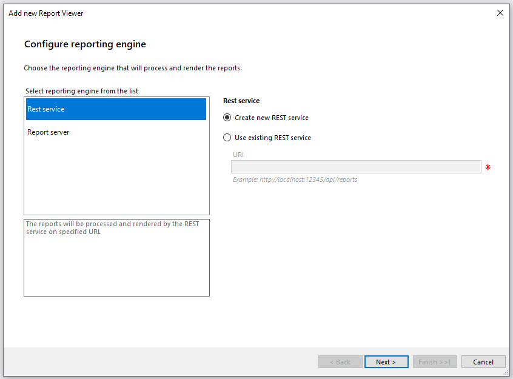
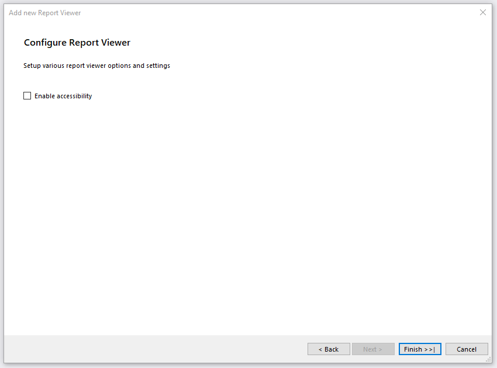

# Using HTML5 ASP.NET MVC Report Viewer With Reporting REST Service

This document describes the easiest way to add an HTML5 MVC Report Viewer to a web project by using a `Telerik HTML5 MVC Report Viewer` item template in Visual Studio. If you are looking for an advanced guide that allows you full control over the configuration, refer to the [Manual Setup]() help article.

## Prerequisites

The following list describes the prerequisites for this tutorial:

1. Review the HTML5 MVC Report Viewer [Requirements](#requirements).
1. The project must target [ASP.NET 4.0 MVC](https://dotnet.microsoft.com/en-us/apps/aspnet/mvc) or a newer framework.
1. Adapt all path references in the described steps according to the project setup. For more information, please refer to the MSDN article [ASP.NET Web Project Paths](https://learn.microsoft.com/en-us/previous-versions/ms178116(v=vs.140)).

## Telerik MVC Report Viewer View Item Template

After a successful [installation of Telerik Reporting](), you have access to the Telerik item templates. The item template does the following for you:

* Adds a `.cshtml` page with the MVC Report Viewer to your project
* References an existing or adds a new [Telerik Reporting REST WebAPI Service]()

The following steps describe how to add the template:

1. To start the item template wizard, in __Solution Explorer__, select the target project. On the __Project menu__, click __Add -> New Item__. In the [Add New Item](https://learn.microsoft.com/en-us/previous-versions/visualstudio/visual-studio-2010/w0572c5b(v=vs.100)) dialog box, navigate to the __Web__ category and select the __Telerik MVC Report Viewer View__ item.
1. Accept the project build prompt. Click 'OK'.
1. The item template will open the __Add new Report Viewer__ dialog with the following steps:

	1. __Configure reporting engine__ configures the reporting engine type that will process and render the reports. You have two options - REST service or Report server. Select the __Rest service__ option. This way, the reports will be processed and rendered by the REST service on the specified URL. On the right side of the dialog, there are two more options:

		+ __Create new REST service__ - Select this option if there is no REST service project available in the solution. The wizard will create and configure a new REST Service in the current project.
		+ __Use existing REST service__ - Select this option if there is a configured REST service project in the solution. With this option, you have to enter a valid REST service URI.

		

	1. __Configure report source__ - this step adds a report definition for the report viewer. If you selected the __Create new REST service__ option in the previous step, you will have to choose one of the following three options. If you, however, selected the __Use existing REST service__ option, you can select only an __Existing report definition__.

		+ __Sample report definition__ - this option will create a sample report definition which will be shown in the new report viewer. It will be placed in a newly created folder called __Reports__ at the root of the application. It can be either modified or changed with another.
		+ __New report definition__ - this option will create a new report definition that will be opened for editing in the respective report designer. On the right side of the dialog there are two possible options:

			- __TRDP report definition__ - creates a TRDP file with the entered __Report name__.
			- __Type report definition__ - creates a CS|VB file with the entered __Report name__ either in an existing report library project or in a newly created one.

		+ __Existing report definition__ - this option will prompt you to choose an existing report definition that will be shown in the report viewer. On the right side of the dialog there are three possible options:

			- __TRDP, TRBP or TRDX report definition__ - enter the path or browse to the report definition. Also, there is an option to enable adding the report definition to the project. In this case, the report viewer will use a UriReportSource with the provided path to the file.
			- __Enter type report definition created in Visual Studio__ - enter the Assembly qualified name of the type report definition. In this case, the report viewer will use a TypeReportSource with the provided Assembly qualified name.
			- __Select type report definition created in Visual Studio__ - select the type report definition from the resolved types in the solution. The engine will search for report types in all projects in the solution that have Telerik Reporting reference included. The VS item template will add the required __connection string__ from the reports project configuration file (if exists).

		

	1. __Configure Report Viewer__ exposes the option to enable [accessibility]() for the report viewer.

		

After finishing, the item template automatically does the following:

* Configures the NuGet packages, if necessary.
* Registers the service routes in `WebApiConfig.cs`.
* Adds a `CSHTML` page with the configured __HTML5 MVC Report Viewer__.
* Displays a __summary log__ with all changes.

To display the newly added MVC page, you need to use your own MVC controller's action returning the view. Note that the auto-generated ReportsController is an [ApiController](https://learn.microsoft.com/en-us/dotnet/api/system.web.http.apicontroller?view=aspnet-webapi-5.2). You can use the following steps to add an action (e.g. `Reports`) returning the desired view (e.g. `Reports.cshtml`), for example, to the `HomeController`.

1. Move the auto-generated View file (i.e. `ReportViewerView1.cshtml`) from the main folder to the 'View' folder of the chosen Controller (`View/Home` for this example);
1. Rename the View accordingly (i.e. from `ReportViewerView1.cshtml` to `Reports.cshtml`);
1. Add a properly named Action that returns the desired view in the chosen Controller (e.g. action `Reports` in `HomeController`).

## Examples

You can find the complete example setup in Telerik Reporting installation path. For example, `C:\Program Files (x86)\Progress\Telerik Reporting {{site.suiteversion}}\Examples\CSharp\.NET Framework\AspNetMvcIntegrationDemo`.

## See Also

* [How To: Use HTML5 ASP.NET MVC Report Viewer With Report Server]()
* [How to: Add New Project Items](https://learn.microsoft.com/en-us/previous-versions/visualstudio/visual-studio-2010/w0572c5b(v=vs.100))
* [Getting Started with ASP.NET MVC](https://learn.microsoft.com/en-us/aspnet/mvc/overview/getting-started/introduction/getting-started)
