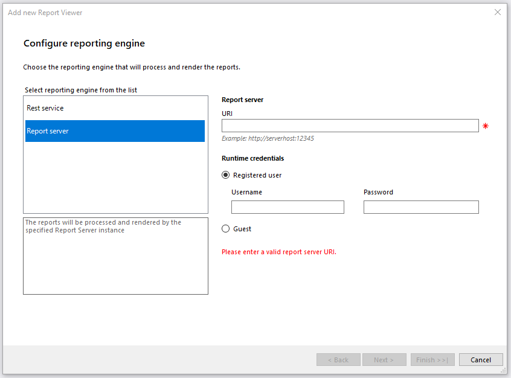
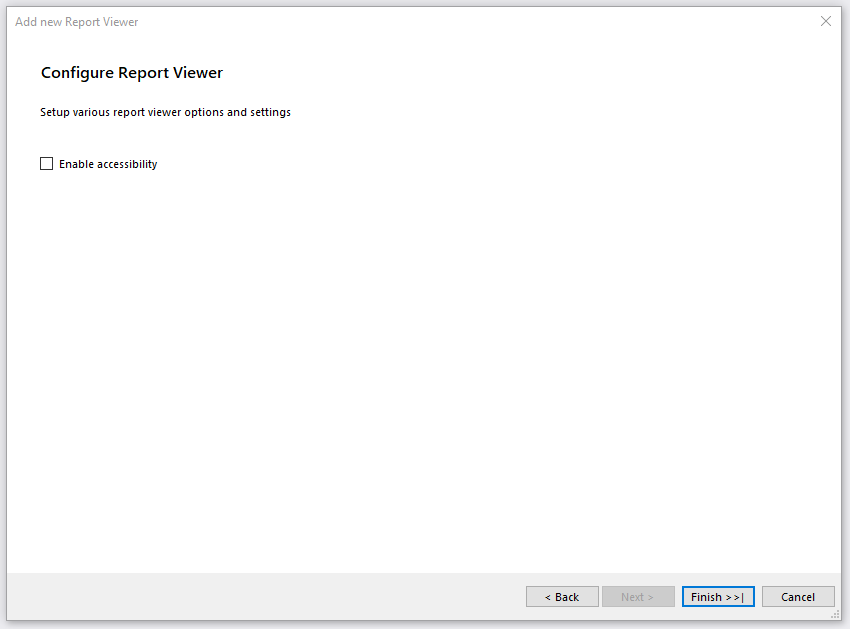

# Using the HTML5 ASP.NET Web Forms Report Viewer with Report Server

The quickest way to add a HTML5 Web Forms Report Viewer to your web project is with the __Telerik HTML5 Web Forms Report Viewer__ item template in Visual Studio. This topic explains how to setup the HTML5 Report Viewer to work with Telerik Report Server using the built-in Guest account.

## Prerequisites

1. Review the HTML5 WebForms Report Viewer [Requirements](#requirements).
1. The project must target [ASP.NET 4.0 Web Forms](https://learn.microsoft.com/en-us/aspnet/web-forms/) or newer framework.
1. Installed and running [Telerik Report Server](https://docs.telerik.com/report-server/introduction).
1. Report Server's built-in __Guest__ user should be enabled.
1. Report Server should contain at least one report that can be accessed by the Guest user account.

## Configuring the HTML5 WebForms Report Viewer to work with Report Server using Item Templates

The VS item template will integrate HTML5 WebForms Report Viewer in an.aspx page and will connect to the [Telerik Report Server](https://docs.telerik.com/report-server/introduction) to process and render reports. The following describes what steps you should perform in order to add it in your application: 

* To start the item template wizard, in __Solution Explorer__, select the target project. On the __Project menu__, click __Add -> New Item__. In the [Add New Item](https://learn.microsoft.com/en-us/previous-versions/visualstudio/visual-studio-2010/w0572c5b(v=vs.100)) dialog box, navigate to the __Web__ category. Select __Telerik Web Forms Report Viewer Form__ item.
* You will be prompted to accept building the project. Click 'OK'.
* The item template will open the __'Add new Report Viewer'__ dialog with the following steps:

	1. __'Configure reporting engine'__ will configure the type of reporting engine that will process and render the reports. You have two options - REST service or Report server. Choose __Report Server__ option. This way, the reports will be processed and rendered by the specified Report Server instance. On the right side of the dialog there are two things that you should enter:

		+ __Report Server URI__ - enter a valid Report Server URI.
		+ __Runtime credentials__ - enter Username and Password for Registered user or choose [Guest user](https://docs.telerik.com/report-server/implementer-guide/user-management/guest-user) if it suits your needs. Make sure your Report Server instance has its Guest account enabled.

		

	1. __'Setup Report Source for Report Server'__ will choose a report definition for the report viewer. There are two things that you should select, but in case you are using Guest account, you will have to fill-in the fields manually. It is because the Guest user cannot read the available categories and reports for security reasons:

		+ __Category__ - select a category from the drop-down menu which contains the desired report.
		+ __Report name__ - select a report from the available reports.

		

	1. __'Configure Report Viewer'__ exposes the option to enable [accessibility]() for the report viewer.

		

After finishing, the item template automatically do the following:

* Configures the NuGet packages, if nessesary.
* Adds an __ASPX page with the configured HTML5 WebForms Report Viewer__.
* Displays a __summary log__ that list all of the made changes.

## See Also

* [How To: Use HTML5 ASP.NET Web Forms Report Viewer With REST Service]()
* [How to: Add New Project Items](https://learn.microsoft.com/en-us/previous-versions/visualstudio/visual-studio-2010/w0572c5b(v=vs.100))
