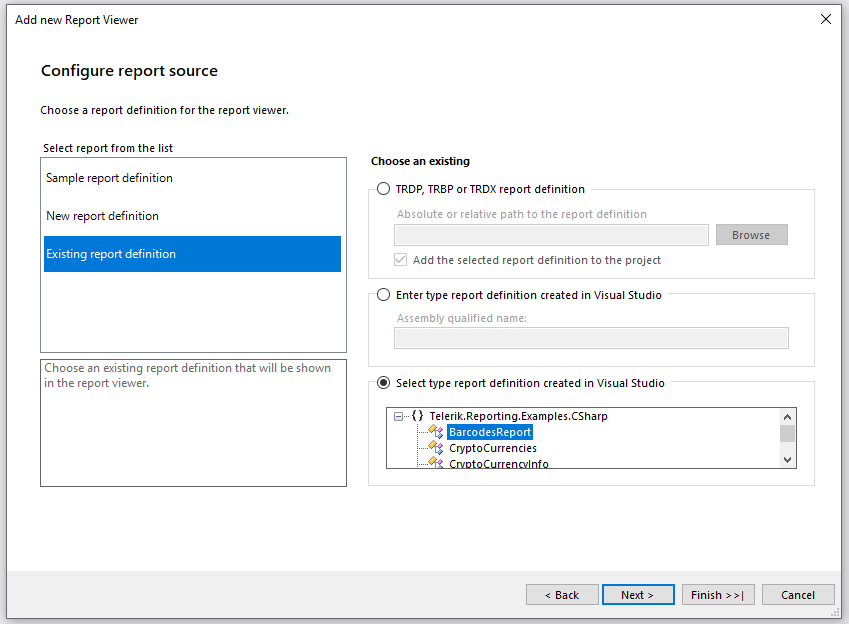

# Using the HTML5 ASP.NET Web Forms Report Viewer with REST Service

The quickest way to add an HTML5 Web Forms Report Viewer to a web project is with the __Telerik HTML5 Web Forms Report Viewer__ item template in Visual Studio.

For full control, manually configure the REST service and add HTML5 Web Forms Report Viewer as elaborated in [Manual Setup]() help article.

## Prerequisites

1. Review the HTML5 WebForms Report Viewer [Requirements](#requirements).
1. The project must target [ASP.NET 4.0 Web Forms](https://learn.microsoft.com/en-us/aspnet/web-forms/) or newer framework.
1. Adapt all path references in the described steps according to the project setup. For more information, please refer to the MSDN article [ASP.NET Web Project Paths](https://learn.microsoft.com/en-us/previous-versions/ms178116(v=vs.140)).

## Telerik Web Forms Report Viewer Form Item Template

The item template will adds.aspx page with HTML5 WebForms Report Viewer and will enable the [Telerik Reporting REST WebAPI Service](). The following describes the item template wizard steps:

* To start the item template wizard, in __Solution Explorer__, select the target project. On the __Project menu__, click __Add -> New Item__. In the [Add New Item](https://learn.microsoft.com/en-us/previous-versions/visualstudio/visual-studio-2010/w0572c5b(v=vs.100)) dialog box, navigate to the __Web__ category and select the __Telerik Web Forms Report Viewer Form__ item.
* Accept the project build prompt. Click 'OK'.
* The item template will open the __'Add new Report Viewer'__ dialog with the following steps:

	1. __'Configure reporting engine'__ will configure the type of reporting engine that will process and render the reports. You have two options - REST service or Report server. Choose __Rest service__ option. This way, the reports will be processed and rendered by the REST service on the specified URL. On the right side of the dialog there are two options:

		+ __Create new REST service__ - in case there is no REST service project setup in the solution. Choosing this option, the REST Service will be configured within the project.
		+ __Use existing REST service__ - in case there is a REST service already configured. Choosing this option, you will have to enter a valid REST service URI.

		

	1. __'Configure report source'__ will choose a report definition for the report viewer. If __Create new REST service__ option was previously selected, you will have to choose one of the following three options. If, however, __Use existing REST service__ option was previously selected, you will only have the option to choose an existing report definition.

		+ __Sample report definition__ - this option will create a sample report definition which will be shown in the new report viewer. It will be placed in a newly created folder called Reports at the root of the application. It can be either modified or changed with another.

		+ __New report definition__ - this option will create a new report definition that will be opened for editing in the respective report designer. On the right side of the dialog, there are two possible options:

			+ __TRDP report definition__ - will create a TRDP file with the entered __Report name__.
			+ __Type report definition__ - will create a CS|VB file with the entered __Report name__ either in an existing report library project or in a newly created one.

		+ __Existing report definition__ - this option will prompt you to choose an existing report definition that will be shown in the report viewer. On the right side of the dialog there are three possible options:

			+ __TRDP, TRBP or TRDX report definition__ - enter the path or browse to the report definition. Also, there is an option to enable adding the report definition to the project. In this case the report viewer will use a UriReportSource with the provided path to the file.
			+ __Enter type report definition created in Visual Studio__ - enter the Assembly qualified name of the type report definition. In this case the report viewer will use a TypeReportSource with the provided Assembly qualified name.
			+ __Select type report definition created in Visual Studio__ - select the type report definition from the resolved types in the solution. The engine will search for report types in all projects in the solution that have Telerik Reporting reference included. The VS item template will add the required __connection string__ from the reports project configuration file (if exists).

		

	1. __'Configure Report Viewer'__ exposes the option to enable [accessibility]() for the report viewer.

		

After finishing, the item template automatically does the following:

* Configures the NuGet packages, if necessary.
* Adds __Global.asax__ if missing, and registers the service routes in the Global.asax.
* Adds an __ASPX page with the configured HTML5 WebForms Report Viewer__.
* Displays a __summary log__ that lists all of the made changes.

## Examples

You can find the complete example setup in Telerik Reporting installation path. For example, __C:\Program Files (x86)\Progress\Telerik Reporting {{site.suiteversion}}\Examples\CSharp\WebFormsDemo__.

## See Also

* [How To: Use HTML5 ASP.NET Web Forms Report Viewer With Report Server]()
* [How to: Add New Project Items](https://learn.microsoft.com/en-us/previous-versions/visualstudio/visual-studio-2010/w0572c5b(v=vs.100))
