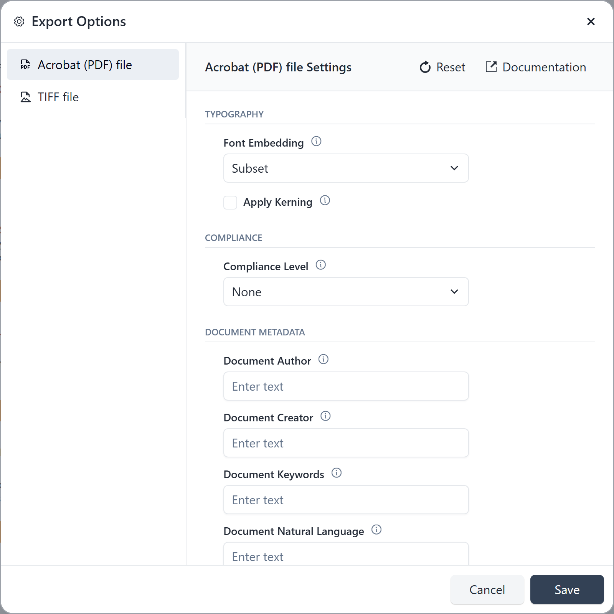
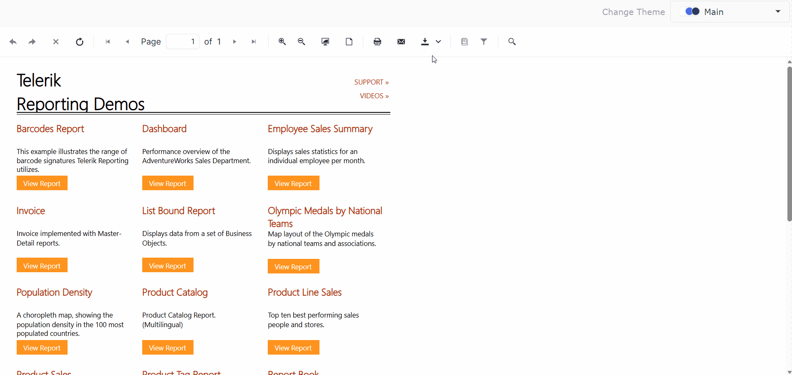

# Configuring Export Options in the HTML5 Report Viewer

Use the Export Options dialog to configure rendering-format device settings before you export a report from the HTML5 Report Viewer.

<p style="text-align: center;"><strong>Export Options Dialog in the HTML5 Report Viewer</strong></p>

<div style="max-width: 75%; margin: 0 auto; text-align: center;" markdown="1">



</div>

## Prerequisites

- An HTML5 Report Viewer connected to a Reporting REST service or Telerik Report Server.
- At least one available rendering extension that provides configurable settings.

## Enable Export Options

Set `exportDialog.enabled` to `true` in the HTML5 Report Viewer initialization options:

```JavaScript
$("#reportViewer1").telerik_ReportViewer({
    serviceUrl: "api/reports/",
    reportSource: { report: "Report Catalog.trdp" },
    exportDialog: { enabled: true }
});
```

The setting defaults to `true`. To hide **Export Options** while keeping direct exports available, set `enabled` to `false`:

```JavaScript
exportDialog: { enabled: false }
```

The command appears in the export menu only when the dialog is enabled and at least one available rendering extension has configurable settings.

## Configure a Format

1. Open a report in the HTML5 Report Viewer.
1. Select **Export** and then **Export Options**.
1. Select a format and change its available settings.
1. Select **Save** to apply the settings and close the dialog.
1. Select the format in the **Export** menu to export the report with the saved settings.

<p style="text-align: center;"><strong>Export Options Workflow</strong></p>



## Next Steps

- [Customize Export Options settings on the Reporting REST Service](slug:customize-export-options)
- [Review Export Options across Telerik Reporting web viewers](slug:web-report-viewers-export-options-dialog)

## See Also

- [HTML5 Report Viewer Overview](slug:telerikreporting/using-reports-in-applications/display-reports-in-applications/web-application/html5-report-viewer/overview)
- [Printing Reports from the HTML5 Report Viewer](slug:telerikreporting/using-reports-in-applications/display-reports-in-applications/web-application/html5-report-viewer/printing-reports)
