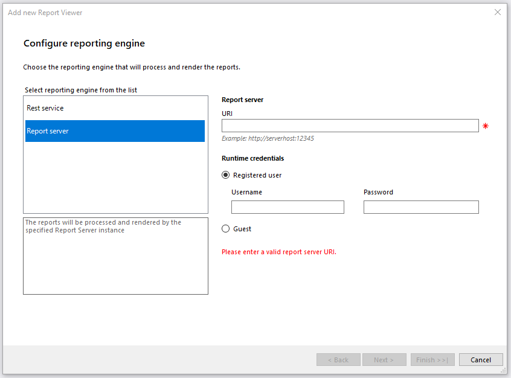
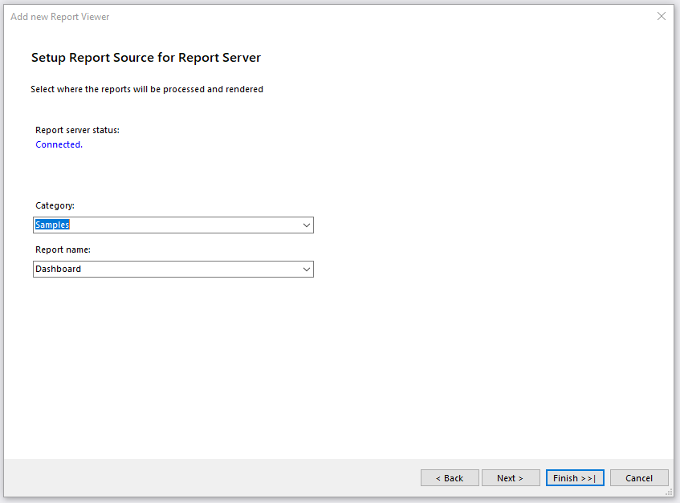

# Using the HTML5 Report Viewer with the Report Server

The quickest way to add an HTML5 Report Viewer to your web project is with the __Telerik HTML5 Report Viewer__ item template in Visual Studio. This topic explains how to set up the HTML5 Report Viewer to work with the Telerik Report Server using the built-in Guest account.

## Prerequisites

1. Review the HTML5 Report Viewer [Requirements]().
1. Installed and running [Telerik Report Server](https://docs.telerik.com/report-server/introduction).
1. Report Server's built-in __Guest__ user should be enabled.
1. Report Server should contain at least one report that can be accessed by the Guest user account.

## Configuring the HTML5 Report Viewer to work with the Report Server using Item Templates

The VS item template will integrate the HTML5 Report Viewer in a.html page and will connect to the [Telerik Report Server](https://docs.telerik.com/report-server/introduction) to process and render reports. The following describes what steps you should perform in order to add it to your application:

* To start the item template wizard, in __Solution Explorer__, select the target project. On the __Project menu__, click __Add -> New Item__. In the [Add New Item](https://learn.microsoft.com/en-us/previous-versions/visualstudio/visual-studio-2010/w0572c5b(v=vs.100)) dialog box, navigate to the __Web__ category. Select __Telerik HTML5 Report Viewer Page__ item.
* You will be prompted to accept building the project. Click 'OK'.
* The item template will open the __'Add new Report Viewer'__ dialog with the following steps:

	1. __'Configure reporting engine'__ will configure the type of reporting engine that will process and render the reports. You have two options - REST service or Report server. Choose __Report Server__ option. This way, the reports will be processed and rendered by the specified Report Server instance. On the right side of the dialog, there are two things that you should enter:

		+ __Report Server URI__ - enter a valid Report Server URI.
		+ __Runtime credentials__ - enter Username and Password for the Registered user or choose [Guest user](https://docs.telerik.com/report-server/implementer-guide/user-management/guest-user) if it suits your needs. Make sure your Report Server instance has its Guest account enabled.

		

	1. __'Setup Report Source for Report Server'__ will choose a report definition for the report viewer. There are two things that you should select, but in case you are using the Guest account, you will have to fill in the fields manually. It is because the Guest user cannot read the available categories and reports for security reasons:

		+ __Category__ - select a category from the drop-down menu that contains the desired report.
		+ __Report name__ - select a report from the available reports.

		

	1. __'Configure Report Viewer'__ exposes the option to enable [accessibility]() for the report viewer.

		

After finishing, the item template automatically does the following:

* Configures the NuGet packages, if necessary.
* Adds a __HTML page with the configured HTML5 Report Viewer__.
* Displays a __summary log__ that list all of the made changes.

## Manually configuring the HTML5 Report Viewer to work with the Report Server

Although the fastest and most convenient way to get a working HTML5 viewer in your application is to use the Visual Studio item templates, the same result can be achieved using manual configuration.

1. Follow the steps described in [HTML5 Viewer Manual Setup]() article to get your HTML5 viewer working. Examine the produced HTML page and especially the section that configures the viewer:

	````JavaScript
$("#reportViewer1")
		.telerik_ReportViewer({
			serviceUrl: "/api/reports/",
			templateUrl: '/ReportViewer/templates/telerikReportViewerTemplate-{{buildversion}}.html',
			reportSource: {
				report: "Telerik.Reporting.Examples.CSharp.ProductCatalog, CSharp.ReportLibrary",
				parameters: {
					CultureID: "en"
				}
			}
		});
````


1. Locate the line that sets the service URL: `serviceUrl: "/api/reports/",`. Comment it out or replace it with the following code:

	````JavaScript
reportServer: {
		url: "https://yourReportServerUrl:port",
		username: null,
		password: null
	},
````


	Substitute the `https://yourReportServerUrl:port` with the actual url of your Report Server instance along with the port if needed. Specifying the username and password can be omitted (in this case the Report Server's Guest account will be used) or can be set to an actual account, defined in the Report Server.

1. If you have modified the Telerik Report Viewer Template HTML file, you can leave the `templateUrl` option intact. Otherwise, it is recommended to delete the line `templateUrl: '/ReportViewer/templates/telerikReportViewerTemplate-{{site.buildversion}}.html'`, so the template will be downloaded automatically from the server.
1. Locate the lines that set the report source's report definition (it should start with `report: "...`). Replace them with the following line: `report: "{Category}/{ReportName}"`, where `{Category}` and `{ReportName}` are the actual names of the category and report that can be accessed by the Guest user or by the user you have provided login credentials for. Set up the report parameters if needed.
1. The initialization should look like the following: 

	````JavaScript
$("#reportViewer1")
		.telerik_ReportViewer({
			reportServer: {
				url: "https://yourReportServerUrl:port",
				username: null,
				password: null
			},
			//templateUrl: '/ReportViewer/templates/telerikReportViewerTemplate-{{buildversion}}.html',
			reportSource: {
				// The report value should contain the Category and ReportName in the following format
				// {Category/ReportName}
				report: "Samples/Dashboard"
				parameters: {
					ReportYear: 2004
				}
			}
		});
````


1. Run the project and you should see the configured in the previous step report appearing in the Report Viewer. If not, check the [Troubleshooting](#Troubleshooting) section below.

## Troubleshooting

The most common reasons for failure are related to the authentication against the Report Server. It is strongly recommended to use a tool like Fiddler or any other web debugger when investigating such a problem. 

| Problem | Cause |
| ------ | ------ |
|The viewer displays the message:<br />`Error registering the viewer with the service. Insufficient credentials.`|Check if the supplied username and password are valid and the user's state is __Enabled__ in Report Server.|
|The page shows the message:<br />`The report server URL is not specified`<br />or<br />`Error loading the report viewer's templates`|The reportServer's __url__ property is empty or invalid.|
|The report viewer loads the template but displays a message<br />`"Error creating report instance`<br/>or<br/>`Unable to get report parameters. Report ' *Category* / *Report* ' cannot be resolved.`|Check again the report source's __report__ arguments and make sure the category name and the report name exist in Report Server.|
|The viewer loads the template but displays a message<br />`Unable to get report parameters. Access denied.`|Make sure that the user account has permission to read the specified report and category.|
|The viewer doesn't load any page and there is only a label saying __loading...__ in the top left page corner.|Check the Fiddler log for a request to the `/Token` URL. This is the request that should obtain the token used to authenticate the user account. When found, check the Response headers and look for the error code below:<ul><li>`HTTP/1.1 502 Fiddler - DNS Lookup Failed`- make sure you have set the Report Server URL correctly.</li><li>`HTTP/1.1 400 Bad Request`- check if the built-in Guest user is __Enabled__ and has __Read__ permissions for the configured report.</li></ul>|

## See Also

* [HTML5 Report Viewer Overview]()
* [How To: Use HTML5 Report Viewer With REST Service]()
* [Telerik Report Server](https://docs.telerik.com/report-server/introduction)
* [How to: Add New Project Items](https://learn.microsoft.com/en-us/previous-versions/visualstudio/visual-studio-2010/w0572c5b(v=vs.100))
