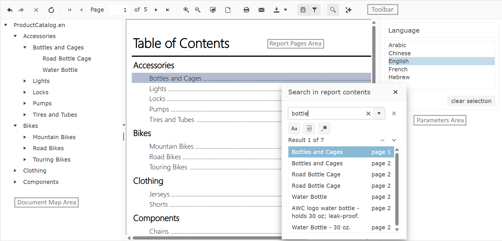

# HTML5 Report Viewer Overview

The [HTML5 Report Viewer](https://www.telerik.com/products/reporting/delivering-viewing-exporting-reports.aspx) is a pure HTML5/JavaScript/CSS3 jQuery-based widget that enables the display of Telerik Reports on an HTML page.

The HTML5 Report Viewer renders its content through the [Reporting HTML Rendering mechanism]().

The layout and styling are based on pure HTML5 templates and CSS3 styles and are customizable. The default implementation supports mobile as well as desktop browsers. The responsive layout adapts itself to the device display for the best viewing experience. You can customize its visual appearance by using the [Kendo UI SASS Themes](https://docs.telerik.com/kendo-ui/styles-and-layout/sass-themes/overview).

## Report Pages Area

The Report Pages area provides the placeholder for the rendered HTML report. All commands provided by the toolbar operate on the HTML report currently shown in this area.

It has built-in support for end-user interactions such as drill-down and drill-through, navigation to bookmarks in the report, and external URLs.

## Toolbar Area

The toolbar of the HTML5 report viewer provides basic functionality for interacting with the currently loaded HTML report:

<body>
	<table>
		<tr>
			<th style="text-align: center">Icon</th>
			<th>Purpose</th>
		</tr>
		<tr>
			<td><svg style="height: 35px; padding: 5px; display: block; margin: auto;" viewBox="0 0 512 512"><path d="M479.9 416c-57.7-56.6-136.7-96-223.9-96v128L32 256 256 64v128c122.2 0 221.5 102.4 223.9 224z"></path></svg></td>
			<td>Navigates Backward</td>
		</tr>
		<tr>
			<td><svg style="height: 35px; padding: 5px; display: block; margin: auto;" viewBox="0 0 512 512"><path d="M256 192V64l224 192-224 192V320c-87.2 0-166.2 39.4-223.9 96C34.5 294.4 133.9 192 256 192z"></path></svg></td>
			<td>Navigates Forward</td>
		</tr>
		<tr>
			<td><svg style="height: 35px; padding: 5px; display: block; margin: auto;" viewBox="0 0 512 512"><path d="M416 141.3 301.3 256 416 370.7 370.7 416 256 301.3 141.3 416 96 370.7 210.7 256 96 141.3 141.3 96 256 210.7 370.7 96z"></path></svg></td>
			<td>Stops Report Rendering</td>
		</tr>
		<tr>
			<td><svg style="height: 35px; padding: 5px; display: block; margin: auto;" viewBox="0 0 512 512"><path d="M480 288c0 123.7-100.3 224-224 224S32 411.7 32 288 132.3 64 256 64V0l160 96-160 96v-64c-88.2 0-160 71.8-160 160s71.8 160 160 160 160-71.8 160-160c0-29.1-7.8-56.4-21.5-80l55.5-32c19.1 32.9 30 71.2 30 112z"></path></svg></td>
			<td>Refreshes the Report Viewer</td>
		</tr>
		<tr>
			<td><svg style="height: 35px; padding: 5px; display: block; margin: auto;" viewBox="0 0 512 512"><path d="M256 256 512 96v320L256 256zm0 160V96L0 256l256 160z"></path></svg></td>
			<td>Returns the Report to the first page</td>
		</tr>
		<tr>
			<td><svg style="height: 35px; padding: 5px; display: block; margin: auto;" viewBox="0 0 512 512"><path d="m160 256 192-128v256z"></path></svg></td>
			<td>Goes to the previous page</td>
		</tr>
		<tr>
			<td><svg style="height: 35px; padding: 5px; display: block; margin: auto;" viewBox="0 0 512 512"><path d="M352 256 160 384V128z"></path></svg></td>
			<td>Goes to the next page</td>
		</tr>
		<tr>
			<td><svg style="height: 35px; padding: 5px; display: block; margin: auto;" viewBox="0 0 512 512"><path d="M0 416V96l256 160L0 416zm512-160L256 96v320l256-160z"></path></svg></td>
			<td>Navigates to the last page of the report</td>
		</tr>
        <tr>
			<td><svg style="height: 35px; padding: 5px; display: block; margin: auto;" viewBox="0 0 512 512"><path d="M288 224H96v-64h192v64zm192 210.7L434.7 480 320 365.3v-22.7l-26.7-26.7C265.7 338.5 230.4 352 192 352c-88.4 0-160-71.6-160-160S103.6 32 192 32s160 71.6 160 160c0 38.4-13.5 73.7-36.1 101.3l26.7 26.7h22.7L480 434.7zM192 320c70.7 0 128-57.3 128-128S262.7 64 192 64 64 121.3 64 192s57.3 128 128 128z"></path></svg></td>
			<td>Zooms in the Report</td>
		</tr>
        <tr>
			<td><svg style="height: 35px; padding: 5px; display: block; margin: auto;" viewBox="0 0 512 512"><path d="M288 224h-64v64h-64v-64H96v-64h64V96h64v64h64v64zm192 210.7L434.7 480 320 365.3v-22.7l-26.7-26.7C265.7 338.5 230.4 352 192 352c-88.4 0-160-71.6-160-160S103.6 32 192 32s160 71.6 160 160c0 38.4-13.5 73.7-36.1 101.3l26.7 26.7h22.7L480 434.7zM192 320c70.7 0 128-57.3 128-128S262.7 64 192 64 64 121.3 64 192s57.3 128 128 128z"></path></svg></td>
			<td>Zooms out the Report</td>
		</tr>
        <tr>
			<td><svg style="height: 35px; padding: 5px; display: block; margin: auto;" viewBox="0 0 512 512"><path d="M448 32H64c-17.6 0-32 14.4-32 32v288c0 17.6 14.4 32 32 32h384c17.6 0 32-14.4 32-32V64c0-17.6-14.4-32-32-32m0 319.942a1 1 0 0 1-.058.058H64.058a.5.5 0 0 1-.058-.058V64.057a1 1 0 0 1 .057-.057h383.885q.031.027.058.057zM384 480H128c35.346 0 64-28.654 64-64h128c0 35.346 28.654 64 64 64m32-160H96c58.263-113.973 183.21-192 320-192z"></path></svg></td>
			<td>Toggles the Scale mode of the Report Viewer between FullPage/PageWidth</td>
		</tr>
		<tr>
			<td><svg style="height: 35px; padding: 5px; display: block; margin: auto;" viewBox="0 0 512 512"><path d="M352 32H96c-17.7 0-32 14.3-32 32v384c0 17.7 14.3 32 32 32h320c17.7 0 32-14.3 32-32V128zm64 416H96V64h224v96h96z"></path></svg></td>
			<td>Toggles the View mode of the Report Viewer between Interactive/Print Preview</td>
		</tr>
		<tr>
			<td><svg style="height: 35px; padding: 5px; display: block; margin: auto;" viewBox="0 0 512 512"><path d="M448 160h-32V96l-64-64H128c-17.7 0-32 14.3-32 32v96H64c-17.6 0-32 14.4-32 32v160c0 17.6 14.4 32 32 32h32v64c0 17.6 14.4 32 32 32h256c17.6 0 32-14.4 32-32v-64h32c17.6 0 32-14.4 32-32V192c0-17.6-14.4-32-32-32zM128 64h192v64h64v64H128V64zm320 256h-64v127.9l-.1.1H128.1l-.1-.1V320H64v-32h384v32zm-288 0h192v32H160v-32zm0 64h160v32H160v-32z"></path></svg></td>
			<td>Opens the Browser's Print Dialog</td>
		</tr>
		<tr>
			<td><svg style="height: 35px; padding: 5px; display: block; margin: auto;" viewBox="0 0 512 512"><path d="M32 384v96h448v-96H32zM288 32h-64v128h-96l128 160 128-160h-96V32z"></path></svg></td>
			<td>Opens the Export Dropdown</td>
		</tr>
		<tr>
			<td><svg style="height: 35px; padding: 5px; display: block; margin: auto;" viewBox="0 0 512 512"><path d="M448 480V96h-32v352H128c-17.6 0-32-14.4-32-32s14.4-32 32-32h256V32H128c-35.2 0-64 28.8-64 64v320c0 23.6 12.9 44.2 32 55.3 9.4 5.5 20.4 8.7 32 8.7zM128 64h224v288H128zm192 64H160V96h160zm0 128H160v-32h160zm-32-64H160v-32h128z"></path></svg></td>
			<td>Toggles the Document Map</td>
		</tr>
		<tr>
			<td><svg style="height: 35px; padding: 5px; display: block; margin: auto;" viewBox="0 0 512 512"><path d="M64 64v32l160 160v224l64-64V256L448 96V64z"></path></svg></td>
			<td>Toggles the Parameters Area</td>
		</tr>
        <tr>
			<td><svg style="height: 35px; padding: 5px; display: block; margin: auto;" viewBox="0 0 512 512"><path d="M365.3 320h-22.7l-26.7-26.7C338.5 265.7 352 230.4 352 192c0-88.4-71.6-160-160-160S32 103.6 32 192s71.6 160 160 160c38.4 0 73.7-13.5 101.3-36.1l26.7 26.7v22.7L434.7 480l45.3-45.3L365.3 320zM64 192c0-70.7 57.3-128 128-128s128 57.3 128 128-57.3 128-128 128S64 262.7 64 192z"></path></svg></td>
			<td>Opens the Search Dialog</td>
		</tr>
		<tr>
			<td><svg style="height: 35px; padding: 5px; display: block; margin: auto;" viewBox="0 0 512 512"><path d="m320 32 54.3 137.7L512 224l-137.7 54.3L320 416l-54.3-137.7L128 224l137.7-54.3zM94 350 0 384l94 34 34 94 34-94 94-34-94-34-34-94zM70.6 70.6 0 96l70.5 25.5L96 192l25.5-70.5L192 96l-70.5-25.5L96 0 70.5 70.5Z"></path></svg></td>
			<td>Toggles the AI Prompt Dialog when the [AI-Powered Insights]() functionality has been enabled.</td>
		</tr>
	</table>
</body>

## Parameters Area

The Parameters Area provides an intuitive UI for user interactions. The HTML5-based Report Viewers use [Kendo UI widgets](https://www.telerik.com/kendo-ui) for parameter editors out-of-the-box. Based on the type of the report parameter, a suitable editor UI is created.

List of the default widgets for different report parameters' types:

* DateTime: [Kendo UI DatePicker widget](https://docs.telerik.com/kendo-ui/controls/editors/datepicker/overview). Even though the time part cannot be selected via the Kendo UI DatePicker widget UI it is still passed to the report engine as a default time part (12:00:00 AM) with the `DateTime` value. If needed, the viewer can be [customized]() to use a [Kendo UI DateTimePicker](https://demos.telerik.com/kendo-ui/datetimepicker/index) or another widget which allows selecting the time part explicitly. When a `DateTime` value is selected in the parameters area of the HTML5 Report Viewer it is interpreted as UTC `DateTime` on the server where the report is processed and rendered. For example, entering 1/1/2000 12:00:00 AM in a DateTimePicker report parameter widget and rendering the report will result in the following `DateTime` value on the server and in the rendered report - 1/1/2000 12:00:00 AM considered as a UTC time.
* Integer | Float | String: [Kendo UI ListView widget](https://docs.telerik.com/kendo-ui/controls/data-management/listview/overview). The default editor could be easily changed to [Kendo UI ComboBox](https://docs.telerik.com/kendo-ui/api/javascript/ui/combobox) (for single select parameters) and [Kendo UI MultiSelect](https://docs.telerik.com/kendo-ui/api/javascript/ui/multiselect) (for multi-select parameters) editors. For more information, check __parameters__ option in [Report Viewer Initialization]() article.

When one or more [report parameters]() have their `Visible` property turned on, a parameter area is shown as part of the report viewer. This helps the report developer to easily provide input methods for the end users. Based on the type of parameters, a suitable editor UI is created. The parameter layout on the parameter area is formatted automatically. The order is determined by the order in which parameters appear in the [ReportParameters collection editor](). The end user can enter or select values in the editors.

When one or more visible report parameters have the `AutoRefresh` property turned off a __Preview__ button appears. In this case, to preview the report, the end user can click the **Preview** button. If all parameters have default values, the report runs automatically on the first view. You can show or hide the parameters area from the __Parameters__ button in the report viewer’s toolbar.

## Document Map Area

The document map pane provides a set of navigational links to report items in a rendered report. When you view a report that has a document map, a separate side pane appears next to the report preview area. A user can click a link in the document map to jump to the HTML report page that displays the corresponding item. Report sections and groups are arranged in the hierarchy of links. Clicking items in the document map refreshes the report preview and displays the area of the report that corresponds to the item in the document map.

To add links to the document map, you set the __DocumentMapText__ property of the report item to text that you create or to an expression that evaluates to the text that you want to be displayed in the document map.

## Report Page Modes

The [page modes]() are two. __Continuous scrolling__ and __Single page__. The Single page mode renders only one page in the viewport. This mode does not hinder the browser with a lot of DOM objects, actions, or event listeners, but limits the report data that the user could read.

The Continuous scroll mode gives the user the ability to read all HTML report pages at once. When the report is ready, in the viewport are rendered N number of pages to fill in the visible part of your report viewer. Each next or previous page will be loaded on demand if the user scrolls up or down. If the user navigates to the 5th page for example, in the DOM tree will be rendered all pages that are visible in the viewport, before and after the wanted page, plus all their actions and event listeners. All other pages, that are out of the visible part, will not be loaded. On their place will be added skeleton pages, that will be replaced with the actual page, only if the user scrolls to them.

Continuous scroll mode is the default page mode. To change the page mode, check __pageMode__ option in [Report Viewer Initialization]() article.

## How does the HTML5 Report Viewer work?

The HTML5 Report Viewer is a composite of [Kendo UI for jQuery](https://www.telerik.com/kendo-jquery-ui) widgets, whose setup consists of three files:

- HTML (UI)
- CSS (styles)
- JS (functionality). 

The viewer can be styled and customized with standard JavaScript, CSS, and custom HTML. For more details refer to [HTML5 Report Viewer Customizing]() articles.

The purpose of the HTML5 Report Viewer is to display Telerik Reports and allow the user to interact with them. Reports are processed and rendered on the server where __Telerik Reporting engine__ and __Reporting REST service__ run. Reports and their resources are handled and delivered to the viewer through the [Reporting REST service]().

The HTML5 Report Viewer's content is rendered in __DIV__ elements. The HTML report in the viewer is rendered through the HTML rendering mechanism based on the [Design Considerations for HTML Rendering]().

## How to display the HTML5 Report Viewer in Web Applications

    <iframe src="https://www.youtube.com/embed/GeCUGTgZziI" 
            title="Setting up Telerik Html5 Report Viewer with an external Telerik Reporting REST Service in .NET" frameborder="0" allowfullscreen
            allow="accelerometer; autoplay; picture-in-picture" 
            style="position: absolute; width: 100%; height: 100%;">
    </iframe>

## See Also

* [Requirements and Browser Support]()
* [How to Use HTML5 Report Viewer with REST Service]()
* [How to Use HTML5 Report Viewer with Report Server]()
* [Manual Setup]()
* [How to Use HTML5 Report Viewer in an ASP.NET Core 2.1 and 2.2 application]()
