# HTML5 Report Viewer Overview

The HTML5 [Report Viewer](https://www.telerik.com/products/reporting/delivering-viewing-exporting-reports.aspx) is a pure HTML5/JavaScript/CSS3 jQuery-based widget that enables the display of Telerik HTML reports in an HTML page.

The HTML5 Report Viewer renders its content through the [Reporting HTML Rendering mechanism]().

The layout and styling are based on pure HTML5 templates and CSS3 styles and are fully customizable. The default implementation supports mobile as well as desktop browsers. The responsive layout adapts itself to the device display for the best viewing experience. You can customize its visual appearance by using the Kendo UI themes.

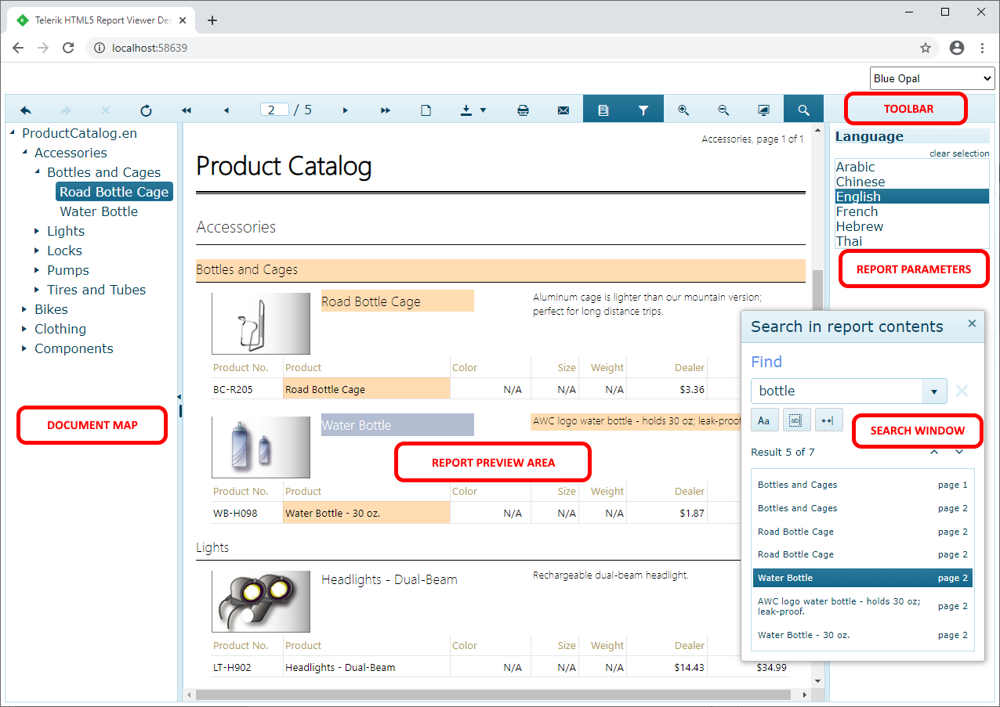

If you encounter any issues when working with the HTML5 Report Viewer, note the following:

* The recommended troubleshooting approach is to use the [Telerik Fiddler Everywhere](https://www.telerik.com/fiddler) or another debugging proxy tool. Fiddler enables you to check the requests, their responses, and statuses by navigating to **Inspectors** > **Request/Response** > **Raw**. In this way, you can check requests made to the Reporting REST service and determine if its URLs are correct and if the relative paths are correctly resolved. Depending on the way the application is hosted, you may need to [adjust relative paths](https://learn.microsoft.com/en-us/previous-versions/ms178116(v=vs.140)).

## HTML Report Preview Area

The Report Preview area provides the placeholder for the rendered HTML report. All commands provided by the toolbar operate on the HTML report currently shown in this area.

It has built-in support for end-user interactions such as drill-down and drill-through, navigation to bookmarks in the report, and external URLs.

## HTML Report Toolbar

The toolbar of the HTML5 report viewer provides basic functionality for interacting with the currently loaded HTML report:

|   |   |
| ------ | ------ |
| 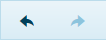|Navigate back/forward in history|
| 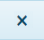|Stop rendering|
| 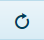|Refresh report|
| 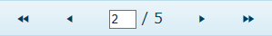|Go to first page, previous page, specific page / total number of pages, next page, last page|
| 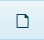|Print Preview: switches between __Logical__ and __Physical__ page renderer. Check [Rendering and Paging]() article for more info.|
| 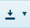|Export: check [Export Formats]() for available export formats.|
| 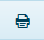|Print: check [Printing Reports]() article for more information.|
| 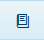|Toggles the document map area|
| |Toggles the send email window that allows sending a report as an attachment, with specific parameters, to a list of users. Check the [send email message article]() for more information.|
| 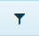|Toggles the parameters area|
| 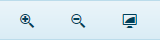|Scale the pages for the best viewing experience including __full page__, __page width__ or __custom scale factor__.|
| 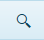|Toggles the search window widget that allows searching in HTML report contents. Check the [search article]() for more information.|

## HTML Report Parameters

The parameters pane provides an intuitive UI for user input. The HTML5-based Report Viewers use [Kendo UI widgets](https://www.telerik.com/kendo-ui) for parameter editors out-of-the-box. Based on the type of parameters, a suitable editor UI is created.

List of the default widgets for different report parameters' types:

* DateTime: [Kendo UI DatePicker widget](https://docs.telerik.com/kendo-ui/controls/editors/datepicker/overview). Even though the time part cannot be selected via the Kendo UI DatePicker widget UI it is still passed to the report engine as a default time part (12:00:00 AM) with the DateTime value. If needed, the viewer can be [customized]() to use a Kendo UI DateTimePicker or another widget which allows selecting the time part explicitly. When a DateTime value is selected in the parameters area of the HTML5 Report Viewer it is interpreted as UTC DateTime on the server where the report is processed and rendered. For example, entering 1/1/2000 12:00:00 AM in a DateTimePicker report parameter widget and rendering the report will result in the following DateTime value on the server and in the rendered report - 1/1/2000 12:00:00 AM considered as a UTC time.
* Integer | Float | String: [Kendo UI ListView widget](https://docs.telerik.com/kendo-ui/controls/data-management/listview/overview). The default editor could be easily changed to [Kendo UI ComboBox](https://docs.telerik.com/kendo-ui/api/javascript/ui/combobox) (for single select parameters) and [Kendo UI MultiSelect](https://docs.telerik.com/kendo-ui/api/javascript/ui/multiselect) (for multi-select parameters) editors. For more information, check __parameters__ option in [Report Viewer Initialization]() article.

When at least one [report parameter]() has its Visible property turned on a parameter area is shown as part of the report viewer. This helps the report developer to easily provide input methods for the end users. Based on the type of parameters, a suitable editor UI is created. The parameter layout on the parameter area is formatted automatically. The order is determined by the order in which parameters appear in the [ReportParameters collection editor](). The end user can enter or select values in the editors.

When at least one visible report parameter has the AutoRefresh property turned off a __Preview__ button appears. In this case, to preview the report, the end user should click the Preview button. If all parameters have default values, the report runs automatically on the first view. You can show or hide the parameters area from the __Parameters__ button in the report viewer’s toolbar.

## HTML Report Document Map

The document map pane provides a set of navigational links to report items in a rendered report. When you view a report that has a document map, a separate side pane appears next to the report preview area. A user can click a link in the document map to jump to the HTML report page that displays the corresponding item. Report sections and groups are arranged in the hierarchy of links. Clicking items in the document map refreshes the report preview and displays the area of the report that corresponds to the item in the document map.

To add links to the document map, you set the __DocumentMapText__ property of the report item to text that you create or to an expression that evaluates to the text that you want to be displayed in the document map.

## HTML Report Page Modes

The [page modes]() are two. __Continuous scrolling__ and __Single page__. The Single page mode renders only one page in the viewport. This mode does not hinder the browser with a lot of DOM objects, actions or event listeners, but limits the report data that the user could read.

The Continuous scroll mode gives the user the ability to read all HTML report pages at once. When the report is ready, in the viewport are rendered N number of pages to fill in the visible part of your report viewer. Each next or previous page will be loaded on demand if the user scrolls up or down. If the user navigates to 5th page for example, in the DOM tree will be rendered all pages that are visible in the viewport, before and after the wanted page, plus all their actions and event listeners. All other pages, that are out of the visible part, will not be loaded. On their place will be added skeleton pages, that will be replaced with the actual page, only if the user scrolls to them.

Continuous scroll mode is the default page mode. To change the page mode, check __pageMode__ option in [Report Viewer Initialization]() article.

## How does HTML5 Report Viewer work?

The HTML5 Report Viewer is a composite of Telerik Kendo Ui widgets, whose template consists of three files: HTML (UI), CSS (styles), and JS (functionality). The viewer can be styled and customized with standard JavaScript, CSS, and custom HTML. For more details refer to [HTML5 Report Viewer Customizing]() articles.

The purpose of the HTML5 Report Viewer is to display Telerik Reports and allow the user to interact with them. Reports are processed and rendered on the server where __Telerik Reporting engine__ and __Reporting REST service__ run. Reports and their resources are handled and delivered to the viewer through the [Reporting REST service]().

The HTML5 Report Viewer's content is rendered in __DIV__ elements. The HTML report in the viewer is rendered through the HTML rendering mechanism based on the [Design Considerations for HTML Rendering]().

## See Also

* [Requirements and Browser Support]()
* [How to Use HTML5 Report Viewer with REST Service]()
* [How to Use HTML5 Report Viewer with Report Server]()
* [Manual Setup]()
* [How to Use HTML5 Report Viewer in an ASP.NET Core 2.1 and 2.2 application]()
