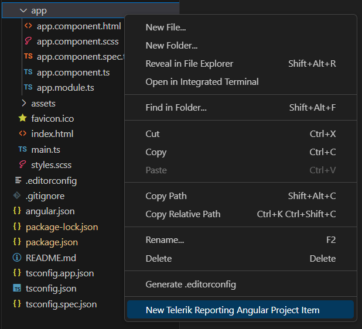
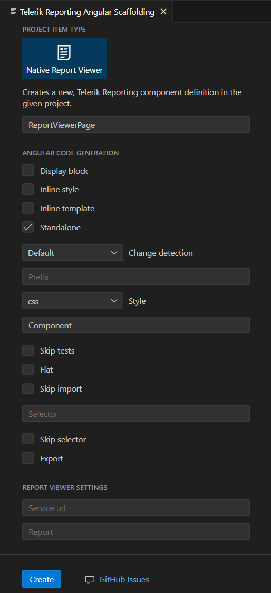

# Adding the Native Angular Report Viewer with the Project Item Generator

This tutorial demonstrates how to add the Native Angular Report Viewer component to an Angular application using the Project Item Generator from the Telerik Reporting Productivity Tools Visual Studio Code extension.

## Prerequisites

The following list describes the prerequisites for completing the tutorial:

* Review the Angular Report Viewer [Requirements]().
* [Angular CLI Project](https://angular.io/cli).
* The [Telerik Reporting Productivity Tools](https://marketplace.visualstudio.com/items?itemName=TelerikInc.telerik-reporting-productivity-tools) Visual Studio Code extension.
* A running application that hosts a Reporting REST service at address `/api/reports`. For more information, see [Telerik Reporting REST Services]().

### Steps:

1. Install the Native Angular Report Viewer Schematic NPM package with the following command:

	````powershell
npm install @progress/telerik-reporting-schematics
````


	>If you receive a *403 Forbidden Error*, you need to register and log in at [npmjs.com](https://www.npmjs.com/) before performing this step.
	>
	>````powershell
npm login --registry=https://registry.npmjs.org --scope=@progress
````


1. Right-click where you want to add the new report viewer component and select the "New Telerik Reporting Angular Project Item" option.

	

1. The scaffolding wizard will open, showing the available component options. Set the `Service url` option to the URL of your Reporting REST Service API, the `Report` option to the report you wish to preview, and click `Create`. If you do not set these options, the Public Reporting Demos API will be used and the report will be "Report Catalog.trdx".

	

1. Import the new component generated by the wizard.
If you have an Angular 16 application, you may import the component in [your application root module](https://angular.io/guide/ngmodules#!#angular-modularity). Ensure the `BrowserAnimationsModule` is imported as well. 

	````TypeScript
import { NgModule } from '@angular/core';
		import { BrowserModule } from '@angular/platform-browser';
		import { BrowserAnimationsModule } from '@angular/platform-browser/animations';
		import { ReportViewerPageComponent } from './report-viewer-page/report-viewer-page.component';
		import { AppComponent } from './app.component';

		@NgModule({
		declarations: [
			AppComponent
		],
		imports: [
			BrowserModule,
			BrowserAnimationsModule,
			ReportViewerPageComponent
		],
		providers: [],
		bootstrap: [AppComponent]
		})

		export class AppModule { }
````

	If you have an Angular 17 application, you can import the component in your `app.component.ts` file.

	````TypeScript
import { Component } from '@angular/core';
		import { RouterOutlet } from '@angular/router';
		import { ReportViewerPageComponent } from './report-viewer-page/report-viewer-page.component';

		@Component({
			selector: 'app-root',
			standalone: true,
			imports: [ RouterOutlet, ReportViewerPageComponent ],
			templateUrl: './app.component.html',
			styleUrl: './app.component.scss'
		})
		export class AppComponent {
			title = 'my-angular-application';
		}
````


1. If you have an Angular 17 application, import `provideAnimations` from `@angular/platform-browser/animations` in `app.config.ts`.

	````TypeScript
import { ApplicationConfig } from '@angular/core';
		import { provideRouter } from '@angular/router';
		import { provideAnimations } from '@angular/platform-browser/animations'
		import { routes } from './app.routes';

		export const appConfig: ApplicationConfig = {
			providers: [provideRouter(routes), provideAnimations()]
		};
````


1. Utilize the selector of the new report viewer component somewhere in the application.
1. Run the application `start` script:

	````powershell
npm run start
````


## See Also

* [Angular CLI](https://angular.io/cli)
* [Telerik Reporting Productivity Tools](https://marketplace.visualstudio.com/items?itemName=TelerikInc.telerik-reporting-productivity-tools)
* [Native Angular Report Viewer Requirements]()
* [Enabling CORS for the Reporting REST Service]()
* [Native Angular Report Viewer Options]()
* [Native Angular Report Viewer Commands]()
* [Native Angular Report Viewer Events]()
