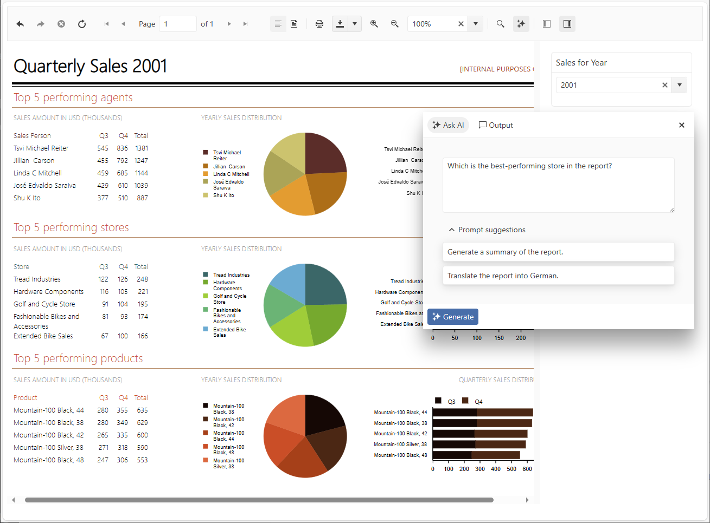

# Overview

The Native Angular Report Viewer is a native Angular component which can be used in Angular applications.

|Button or Input|Action
|:---|:---
|__Navigate back in history__|Navigates to a previous report after the **Navigate to report** interactive action was triggered. 
|__Navigate forward in history__|Navigates to a forward report after the **Navigate back** was used.
|__Stop__|Cancels the loading of the current report if the chosen parameters make it too heavy. 
|__Refresh__|Updates the current report with fresh data.
|__First page__|Displays the respective page of the current report.
|__Previous page__|Displays the respective page of the current report.
|__Current page__|Input allows tracking the number of the displayed page and also displaying a particular page by entering its number.
|__Total pages__|Shows the number of pages of the current report.
|__Next page__|Displays the respective page of the current report.
|__Last page__|Displays the respective page of the current report.
|__Switch the View mode__|Switches the report view between the __Logical__ and __Physical__. __Logical__ provides a convenient on-screen preview experience. __Physical__ provides an exact preview of the eventual print operation.
|__Export__|Initiates an export operation. For more information, refer to the article on [export formats](). 
|__Print__|Initiates printing of the current report.
|__Send Email__|Displays the Send Email dialog.
|__Show/Hide document map__|Allows the user to hide the document map tree if map nodes were defined in the report.
|__Show/Hide parameters area__|Allows the user to hide the report parameter inputs if any.
|__Zoom In__|Allows the user to increase the zoom level of the report content.
|__Zoom Out__|Allows the user to decrease the zoom level of the report content.
|__Switch the Scale mode__|Switches the report view scale mode between fitting the report to the entire page view port or to the viewer's view port.
|__Search__|Allows searching in the report content.

## Demo

A complete example with the native Angular Report Viewer can be found in the installation folder of Telerik Reporting: `C:\Program Files (x86)\Progress\Telerik Reporting {{site.suiteversion}}\Examples\Angular\native-angular-report-viewer-example`.

## See Also

* [How to Use the Native Angular Report Viewer with Reporting Service]()
* [How to Use the Native Angular Report Viewer with Report Server]()
* [Native Angular Report Viewer Requirements]()
* [Native Angular Report Viewer Options]()
* [Native Angular Report Viewer Commands]()
* [Native Angular Report Viewer Events]()