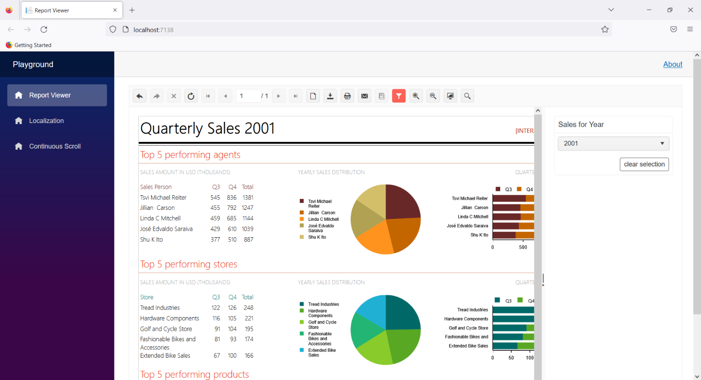

# Native Blazor Report Viewer Overview

The Native Blazor Report Viewer is a native Blazor component which can be used in Blazor applications.

|Button or Input(from left to right)|Action
|:---|:---
|__Navigate back in history__|Navigates to a previous report after the **Navigate to report** interactive action was triggered. 
|__Navigate forward in history__|Navigates to a forward report after the **Navigate back** was used.
|__Stop__|Cancels the loading of the current report if the chosen parameters make it too heavy. 
|__Refresh__|Updates the current report with fresh data.
|__First page__|Displays the respective page of the current report.
|__Previous page__|Displays the respective page of the current report.
|__Current page__|Input allows tracking the number of the displayed page and also displaying a particular page by entering its number.
|__Total pages__|Shows the number of pages of the current report.
|__Next page__|Displays the respective page of the current report.
|__Last page__|Displays the respective page of the current report.
|__Switch the View mode__|Switches the report view between the __Logical__ and __Physical__. __Logical__ provides a convenient on-screen preview experience. __Physical__ provides an exact preview of the eventual print operation.
|__Export__|Initiates an export operation. For more information, refer to the article on [export formats](). 
|__Print__|Initiates printing of the current report.
|__Send Email__|Displays the Send Email dialog.
|__Show/Hide document map__|Allows the user to hide the document map tree if map nodes were defined in the report.
|__Show/Hide parameters area__|Allows the user to hide the report parameter inputs if any.
|__Zoom In__|Allows the user to increase the zoom level of the report content.
|__Zoom Out__|Allows the user to decrease the zoom level of the report content.
|__Switch the Scale mode__|Switches the report view scale mode between fitting the report to the entire page view port or to the viewer's view port.
|__Search__|Allows searching in the report content.

## Requirements

1. Required Application Version:

	+ Blazor 3.1+ application

1. Required Service:

	+ The viewer requires a running instance of [Telerik Reporting REST Services]() in order to display reports. It can be hosted either in the same Blazor application or the viewer can reference a service hosted in another origin. In the later case make sure to [enable Cross-Origin Requests (CORS)](https://learn.microsoft.com/en-us/aspnet/core/security/cors?view=aspnetcore-3.1) in the REST Service project.

1. Required UI libraries:

	+ [Telerik UI for Blazor](https://docs.telerik.com/blazor-ui/introduction) {{site.blazoruiversion}} or later

1. Reference to one of the [Telerik UI for Blazor Built-in Themes](https://docs.telerik.com/blazor-ui/styling-and-themes/overview)

## Comparison with Blazor Html5 Wrapper Report Viewer

The current release of the Native Blazor Report Viewer component is missing the following functionalities:

- Accessibility

> The above functionalities will be implemented in future releases of the Native Blazor Report Viewer

## Demo

The complete example can be found in the installation folder of Telerik Reporting: `C:\Program Files (x86)\Progress\Telerik Reporting {{site.suiteversion}}\Examples\CSharp\CSharp.BlazorNativeExample.VS2022.sln`.
