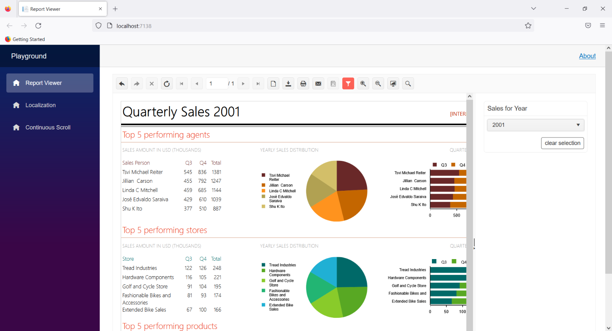

# Native Blazor Report Viewer Overview

The Native Blazor Report Viewer is a native Blazor component that can be used in Blazor applications.

> The Native Blazor Report Viewer is a native Blazor component built with [Telerik UI for Blazor](https://www.telerik.com/blazor-ui) components and a license for this suite is required to use the report viewer.

| Button or Input(from left to right) | Action                                                                                                                                                                                                                                                                                                        |
| :---------------------------------- | :------------------------------------------------------------------------------------------------------------------------------------------------------------------------------------------------------------------------------------------------------------------------------------------------------------ |
| **Navigate back in history**        | Navigates to a previous report after the **Navigate to report** interactive action was triggered.                                                                                                                                                                                                             |
| **Navigate forward in history**     | Navigates to a forward report after the **Navigate back** was used.                                                                                                                                                                                                                                           |
| **Stop**                            | Cancels the loading of the current report if the chosen parameters make it too heavy.                                                                                                                                                                                                                         |
| **Refresh**                         | Updates the current report with fresh data.                                                                                                                                                                                                                                                                   |
| **First page**                      | Displays the respective page of the current report.                                                                                                                                                                                                                                                           |
| **Previous page**                   | Displays the respective page of the current report.                                                                                                                                                                                                                                                           |
| **Current page**                    | Input allows tracking the number of the displayed page and also displaying a particular page by entering its number.                                                                                                                                                                                          |
| **Total pages**                     | Shows the number of pages of the current report.                                                                                                                                                                                                                                                              |
| **Next page**                       | Displays the respective page of the current report.                                                                                                                                                                                                                                                           |
| **Last page**                       | Displays the respective page of the current report.                                                                                                                                                                                                                                                           |
| **Switch the View mode**            | Switches the report view between the **Logical** and **Physical**. **Logical** provides a convenient on-screen preview experience. **Physical** provides an exact preview of the eventual print operation.                                                                                                    |
| **Export**                          | Initiates an export operation. For more information, refer to the article on [export formats](slug:telerikreporting/using-reports-in-applications/export-and-configure/export-formats). To configure available format settings, see [Export Options](slug:native-blazor-report-viewer-export-options-dialog). |
| **Print**                           | Initiates printing of the current report.                                                                                                                                                                                                                                                                     |
| **Send Email**                      | Displays the Send Email dialog.                                                                                                                                                                                                                                                                               |
| **Show/Hide document map**          | Allows the user to hide the document map tree if map nodes were defined in the report.                                                                                                                                                                                                                        |
| **Show/Hide parameters area**       | Allows the user to hide the report parameter inputs if any.                                                                                                                                                                                                                                                   |
| **Zoom In**                         | Allows the user to increase the zoom level of the report content.                                                                                                                                                                                                                                             |
| **Zoom Out**                        | Allows the user to decrease the zoom level of the report content.                                                                                                                                                                                                                                             |
| **Switch the Scale mode**           | Switches the report view scale mode between fitting the report to the entire page view port or to the viewer's view port.                                                                                                                                                                                     |
| **Search**                          | Allows searching in the report content.                                                                                                                                                                                                                                                                       |
| **AI Prompt**                       | Toggles the AI Prompt Dialog when the [AI-Powered Insights](slug:telerikreporting/designing-reports/adding-interactivity-to-reports/ai-powered-insights) functionality has been enabled.                                                                                                                      |

## Requirements

1. Required Application Version:
   - Blazor 3.1+ application

1. Required Service:
   - The viewer requires a running instance of [Telerik Reporting REST Services](slug:telerikreporting/using-reports-in-applications/host-the-report-engine-remotely/telerik-reporting-rest-services/overview) to display reports. It can be hosted either in the same Blazor application or the viewer can reference a service hosted in another origin. In the latter case make sure to [enable Cross-Origin Requests (CORS)](https://learn.microsoft.com/en-us/aspnet/core/security/cors?view=aspnetcore-3.1) in the REST Service project.

1. Required UI libraries:
   - [Telerik UI for Blazor](https://docs.telerik.com/blazor-ui/introduction) {{site.blazoruiversion}} or later

1. Reference to one of the [Telerik UI for Blazor Built-in Themes](https://docs.telerik.com/blazor-ui/styling-and-themes/overview)

## Comparison with Blazor Html5 Wrapper Report Viewer

The current release of the Native Blazor Report Viewer component is missing only the `Accessibility` functionality which is present in its [`Blazor Wrapper Report Viewer`](slug:telerikreporting/using-reports-in-applications/display-reports-in-applications/web-application/blazor-report-viewer/overview) counterpart.

> The above functionality will be added in a future release of the Native Blazor Report Viewer.

## Demo

The complete example can be found in the installation folder of Telerik Reporting: `C:\Program Files (x86)\Progress\Telerik Reporting {{site.suiteversion}}\Examples\CSharp\CSharp.BlazorNativeExample.VS2022.sln`.
