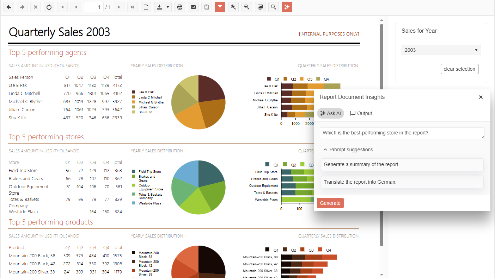

# Native Blazor Report Viewer Overview

The Native Blazor Report Viewer is a native Blazor component which can be used in Blazor applications. 

> It is our newest report viewer, included with the latest release, and as such, it is still being actively developed. There are some missing functionalities that will be implemented in the future.

|Button or Input|Action
|:---|:---
|__Refresh__|Updates the current report with fresh data.
|__First page__|Displays the respective page of the current report.
|__Previous page__|Displays the respective page of the current report.
|__Current page__|Input allows tracking the number of the displayed page and also displaying a particular page by entering its number.
|__Total pages__|Shows the number of pages of the current report.
|__Next page__|Displays the respective page of the current report.
|__Last page__|Displays the respective page of the current report.
|__Switch to Print Preview__|Switches the report view between the __Logical__ and __Physical__. __Logical__ provides a convenient on-screen preview experience. __Physical__ provides an exact preview of the eventual print operation.
|__Switch to Fit Page Width__|Switches the report view scale mode between fitting the report to the entire page view port or to the viewer's view port. 
|__Print__|Initiates printing of the current report.
|__Export__|Initiates an export operation. For more information, refer to the article on [export formats](). 
|__Zoom__|Allows the user to view and change the zoom level of the report content.
|__Show/Hide parameters area__|Allows the user to hide the report parameter inputs if any.
|__Show/Hide document map__|Allows the user to hide the document map tree if map nodes were defined in the report.

## Requirements

1. Required Application Version: 

   + Blazor 3.1+ application 

1. Required Service: 

   + The viewer requires a running instance of [Telerik Reporting REST Services]() in order to display reports. It can be hosted either in the same Blazor application or the viewer can reference a service hosted in another origin. In the later case make sure to [enable Cross-Origin Requests (CORS)](https://docs.microsoft.com/en-us/aspnet/core/security/cors?view=aspnetcore-3.1) in the REST Service project. 

1. Required UI libraries:

   + [Telerik UI for Blazor 3.5+](https://docs.telerik.com/blazor-ui/introduction) 

1. Reference to one of the [Telerik UI for Blazor Built-in Themes](https://docs.telerik.com/blazor-ui/styling-and-themes/overview)

## Comparison with Blazor Html5 Wrapper Report Viewer

The initial release of the Native Blazor Report Viewer component is missing the following functionalities:

- APIs for connecting to a [Telerik Report Server](https://www.telerik.com/report-server) instance

- Report history functionality - Navigate back/forward according to the triggered __NavigateToReport__ actions

- Search report content functionality

- Stop Rendering button for the toolbar

- Infinite scrolling

- Accessibility

- Localization (supported natively by Blazor)

- Extensibility - customizing the toolbar with own tooltips, icons, aria-labels and viewer commands

- [Send Mail Message]() functionality

- Freezing table column and row headers functionalities

- Reports tooltips

> The above functionalities will be implemented in future releases of the Native Blazor Report Viewer

## Demo

The complete example can be found in the installation folder of Telerik Reporting: `C:\Program Files (x86)\Progress\Telerik Reporting {{site.suiteversion}}\Examples\CSharp\CSharp.BlazorNativeExample.VS2022.sln`. 
