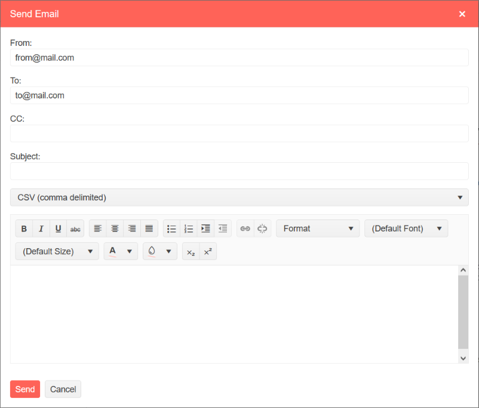

# Using Send Mail Message Functionality in Native Blazor Report Viewer

The native Blazor Report Viewer provides the capability to send the currently displaced report in the specified document format with an e-mail message.

## Enabling the send mail message functionality

By default, the __send mail message__ button is hidden. This is because the [SendMailMessage](/reporting/api/Telerik.Reporting.Services.WebApi.ReportsControllerBase#Telerik_Reporting_Services_WebApi_ReportsControllerBase_SendMailMessage) (or the respective method for ServiceStack, ASP.NET Core, etc.) should be implemented first so that the e-mail messages can be sent server-side.

Web browsers cannot initiate the sending of e-mail messages containing attachments as a security measure. More information on how to implement the necessary server-side code is available at [Implement Send Mail Message]().

Once ready, the send mail message toolbar button can be enabled through the `EnableSendEmail` initialization option.

````CSHTML
<ReportViewer 
...
EnableSendEmail="false" />
````

## Send Mail Message Dialog

The `Send Mail Message` dialog is a [Telerik Blazor UI Window](https://docs.telerik.com/blazor-ui/components/window/overview) widget, that stays on top of the report viewer.



## Pre-configuring the Send Mail Message Dialog Settings

The settings are populated from a `SendEmailDialogSettings` tag, that sits inside the `ReportViewerSettings` parent tag. The values are used __only__ for the initial population of the fields. Two-way binding is __not__ supported for those settings.

### Markup Example

````CSHTML
<ReportViewer
	ServiceUrl="/api/reports"
	@bind-ReportSource="@ReportSource"
	EnableSendEmail="true">
	<ReportViewerSettings>
		<SendEmailDialogSettings
			From="from@mail.com"
			To="to@mail.com"
			Cc="Cc"
			Subject=""
			Body=""
			Format="CSV">
		</SendEmailDialogSettings>
	</ReportViewerSettings>
</ReportViewer>
````

### Setting Fields

* __From__ (Required) - E-mail address used for the MailMessage `FROM` value.
* __To__ (Required) - E-mail address used for the MailMessage `TO` value. Multiple addresses are not supported.
* __CC__ (Optional) - E-mail addresses used for the MailMessage `CC` value. Use `,`(comma) to separate multiple e-mail addresses.
* __Subject__ (Optional) - The MailMessage subject.
* __Body__ (Optional) - The MailMessage body.
* __Format__ - If empty, or not present in the list of supported formats by the report, the first available format from the list is chosen instead. Uses non-localized values, such as `PDF`, `CSV` etc.

## See Also

* [Implement Send Mail Message]()
