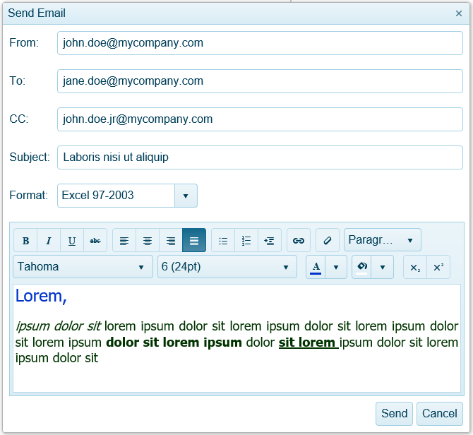

# Send Mail Message in the HTML5-based Report Viewers

HTML5-based report viewers provide the capability to send the current report in the specified document format with an e-mail message.

## Enabling the send mail message functionality

By default, the send mail message button is hidden. This is because the [SendMailMessage](/reporting/api/Telerik.Reporting.Services.WebApi.ReportsControllerBase#Telerik_Reporting_Services_WebApi_ReportsControllerBase_SendMailMessage) (or the respective method for ServiceStack, ASP.NET Core, etc.) should be implemented first so that the e-mail messages can be sent server-side. Web browser (JS client) cannot initiate sending of e-mail messages containing attachments as a security measure. More info on actually implementing the necessary server-side code is available at [Implement Send Mail Message](). Once ready, the send mail message toolbar button can be enabled with the viewer SendEmail initialization option. For more information see [Html5 Report Viewer Options](#options).

> Please note that Angular Report Viewer requires setting the __templateUrl__ option to an HTML template specifically designed for send mail message functionality to work properly, i.e. __telerikReportViewerTemplate-ng.html__ which comes from *node_modules/@progress/telerik-angular-report-viewer/dist/dependencies/telerikReportViewerTemplate-ng.html*.

## Send Mail Message Dialog

The Send Mail Message dialog is a Kendo Window Widget, that stays on top of the report viewer. Since it's not modal, the viewer remains fully functional even when this dialog is shown. The dialog can be closed with the close button in the top right corner or using the __Send Mail Message__ button on the toolbar.

The dialog consists of the following components:

* __From input__ (Required) - E-mail address used for the MailMessage FROM value.
* __To input__ (Required) - E-mail addresses used for the MailMessage TO value. Use `,`(comma) to separate multiple e-mail addresses.
* __CC input__ (Optional) - E-mail addresses used for the MailMessage CC value. Use `,`(comma) to separate multiple e-mail addresses.
* __Subject input__ (Optional) - The MailMessage subject.
* __Body input__ (Optional) - The MailMessage body.

## See Also

* [Implement Send Mail Message]()
* [Html5 Report Viewer Options](#options)
