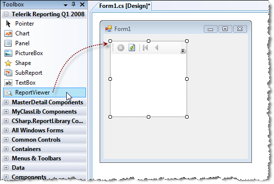

# Adding Manually the WinForms Report Viewer to a Windows Forms .NET Framework Project

## Assign report to the viewer in design time

To use Telerik Reports in Windows Forms application, you need the Windows Forms report viewer:

1. Drag the __ReportViewer__ control from the __Toolbox__ to the form design surface.

	

1. Add reference to the class library that contains your reports in the windows form application.
1. Build the application.
1. Set the __ReportSource__ for the report viewer. For more information, see [How to Set ReportSource for Report Viewers]().
1. To run the report in the viewer, call __ReportViewer.RefreshReport()__ from your application code.

## Assign report to the viewer programmatically

In the __Form_Load__ event handler you create an instance report source and set its __ReportDocument__ property to a report instance. Next assign the instance report source to the __ReportSource__ property of the viewer. Finally call __ReportViewer.RefreshReport()__.

{{source=CodeSnippets\CS\API\Telerik\ReportViewer\WinForms\Form1.cs region=Winviewer_SetReportSource}}
{{source=CodeSnippets\VB\API\Telerik\ReportViewer\WinForms\Form1.vb region=Winviewer_SetReportSource}}

If the current application has to be declared as DPI-aware, an additional element needs to be added to the application manifest file, as explained in the article [Declaring the application as DPI-aware](#declaring-the-application-as-dpi-aware).

## See Also

* [On Telerik Reporting]()
* [Windows Forms Application]()
* [Report Viewer Localization]()
