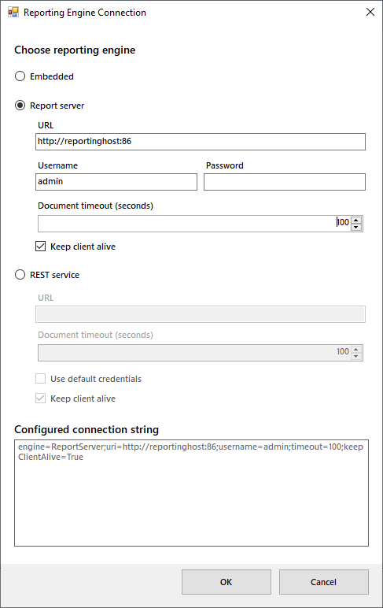
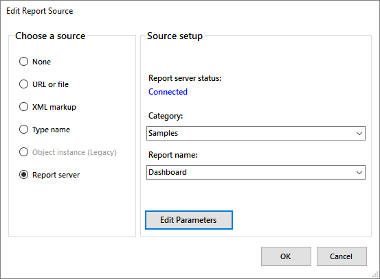

# Using the Windows Forms Report Viewer With Report Server

This topic explains how to setup the Windows Forms Report Viewer to work with Telerik Report Server

## Prerequisites

* Installed and running [Telerik Report Server](https://docs.telerik.com/report-server/introduction) R2 2016 (2.1.16.x) or higher version.
* A valid (enabled) user account - the built-in __Guest__ user account can be used as well.
* In case you are not using [Item Templates](), add references to all the assemblies listed in the article [Requirements For Desktop Viewers Using Remote Report Sources]().

## Configuring the Windows Forms Report Viewer to work with Report Server

1. To create a form and host the report viewer in it, you can either use the item template, as explained in the article [How to Add report viewer to a Windows Forms' .NET Framework project](), or place it yourself through drag-and-drop from the toolbox.
1. As soon as the report viewer is on your form, select it and locate the __ReportEngineConnection__ property. Invoke the UI editor by pressing the ellipsis button. The Report Engine Connection Editor dialog should appear:

	

1. The __Reporting engine__ combobox provides the following options:

	+ *Embedded* - the reports will be processed and rendered at the local machine that hosts the viewer. This is the default mode in order to preserve backwards compatibility.
	+ *REST Service* - the reports will be processed at the machine that hosts configured and running REST Service instance.
	+ *Report Server* - the reports will be processed and rendered at the machine that hosts configured and running [Telerik Report Server](https://docs.telerik.com/report-server/introduction) instance.

	Select __Report Server__.

1. In __Report Server URL__ textbox enter the address and port (if needed) of the machine that hosts the Report Server instance.
1. In __Username__ textbox enter the user account that will be used to access the report or leave it empty if you want to use the built-in __Guest__ account.
1. In __Password__ textbox enter the password associated with the account or leave it empty if you want to use the built-in __Guest__ account.
1. In the __Document timeout__ textbox you can change the timeout for rendering a document, the default is 100 seconds.
1. Uncheck the __Keep client alive__ checkbox if you want the client session to expire.
1. Click __OK__ when ready. The dialog will close and the resulting connection string will be populated as a value of the __ReportEngineConnection__ property.
1. Locate the __ReportSource__ property. Invoke the UI editor by pressing the ellipsis button. The Report Source Editor dialog should appear:

   

1. Select the __Report server__ option. The dialog will try to connect to a report server instance, using the credentials you provided earlier. In case it succeeds, the dialog will populate its *Category* and *Report Name* comboboxes, allowing you to select the desired report. If the report server is not available at the moment, you can still write down the category and report name in the comboboxes and their values will be used to create the report source for the viewer. If needed, you can setup the report source parameters using the dialog, invoked by pressing the __Edit Parameters__ button.
1. Click __OK__ when ready. The dialog will close and the resulting report source will be populated as a value of the __ReportSource__ property.
1. Build and run your application. If your settings are configured correctly, you should see the report, hosted on your Report Server instance, displayed in the report viewer of your WinForms application. If not, check the [Troubleshooting](#Troubleshooting) section below.

## Troubleshooting

The most common reasons for failure are related with the authentication against Report Server. It is strongly recommended to use a tool like Fiddler or any other web debugger when investigating such a problem.

| Problem | Cause |
| ------ | ------ |
|The viewer displays the message: `A problem occurred while registering client.`|Check if the supplied username and password are valid and the user's state is __Enabled__ in Report Server.|
|The viewer displays the message: `System.OperationCanceledException: {ReportName} report cannot be found`|Make sure the URL specified in the report source __report__ is valid and such a category and report exist in Report Server.|
|The viewer displays the message: `System.Net.WebException: The remote name could not be resolved: {server name}`|Make sure that the server specified in the connection string exists and has a valid and running Report Server instance.|

## See Also

* [How to Construct a string to connect to Report Engine]()
* [How to Use Windows Forms Report Viewer With REST Service]()
* [EmbeddedConnectionInfo](/reporting/api/Telerik.ReportViewer.Common.EmbeddedConnectionInfo)
* [ReportServerConnectionInfo](/reporting/api/Telerik.ReportViewer.Common.ReportServerConnectionInfo)
* [RestServiceConnectionInfo](/reporting/api/Telerik.ReportViewer.Common.RestServiceConnectionInfo)
