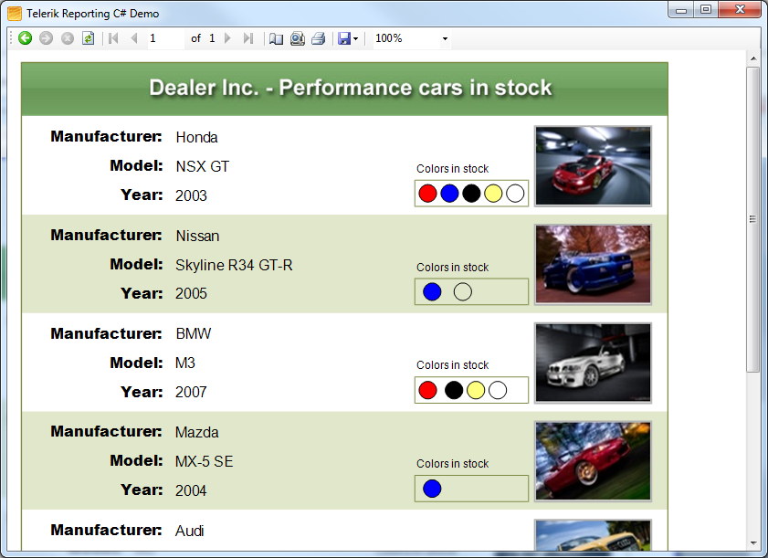

<style>
table th:first-of-type {
	width: 20%;
}
table th:nth-of-type(2) {
	width: 30%;
}
table th:nth-of-type(3) {
	width: 50%;
}
</style>

# Windows Forms Application Overview

The Windows Forms Report Viewer control displays report documents that are generated by the report engine in WinForms applications and to allow the end user to interact with it.



The Windows Forms Report Viewer renders buttons and inputs in the dedicated toolbar to allow the following interactions with the currently loaded report:

|Button or Input|Action
|:---|:---
|__Navigate back in history__|Navigates to a previous report after the **Navigate to report** interactive action was triggered.
|__Navigate forward in history__|Navigates to a forward report after the **Navigate back** was used.
|__Stop__|Cancels the loading of the current report if the chosen parameters make it too heavy.
|__Refresh__|Updates the current report with fresh data.
|__First page__|Displays the respective page of the current report.
|__Previous page__|Displays the respective page of the current report.
|__Current page__|Input allows tracking the number of the displayed page and also displaying a particular page by entering its number.
|__Total pages__|Shows the number of pages of the current report.
|__Next page__|Displays the respective page of the current report.
|__Last page__|Displays the respective page of the current report.
|__Page Setup...__|Opens a dialog to set up the paper size, orientation, and margins of the current report. On closing, the dialog refreshes the report to match the preferences.
|__Switch to Print Preview__|Switches the report view between the __Logical__ and __Physical__. __Logical__ provides a convenient on-screen preview experience. __Physical__ provides an exact preview of the eventual print operation.
|__Print__|Initiates printing of the current report.
|__Export__|Initiates an export operation. For more information, refer to the article on [export formats]().
|__Zoom__|Allows the user to view and change the zoom level of the report content.
|__Show/Hide parameters area__|Allows the user to hide the report parameter inputs if any.
|__Show/Hide document map__|Allows the user to hide the document map tree if map nodes were defined in the report.

## System Requirements

* Visual Studio 2012 or later.
* .NET Framework 4 or above (.NET Framework 4 __Client Profile__ is not supported)
* .NET 6+

## How It Works

The Windows Forms Report Viewer control requires an implementation as a composite of standard Windows Forms controls.

> The toolbar of the Windows Forms Report Viewer is not customizable. To introduce custom commands or strip existing commands, hide the built-in toolbar and use the [API](/reporting/api/Telerik.ReportViewer.WinForms.ReportViewer) to add a custom UI that triggers the commands on the Viewer.

Depending on the configuration of the Viewer, the report generates its pages through the [Telerik Reporting Image Rendering]() as vector or raster images. 

To process and render the report, use any of the following locations:

* On the client machine with the report generation engine embedded in the desktop application.
* On a server machine with the report generation engine embedded in a web application and exposed as [Telerik Reporting REST Service]().
* On a [Telerik Report Server](https://www.telerik.com/report-server) instance.

## Declaring the Application as DPI-Aware

When using Windows Forms Report Viewer on a machine with the Windows Vista (and later) operating system, and with a DPI scale factor higher than 96, the form content (labels, buttons, rendered report image, and so on) may render fuzzy, pixelated, or other types of visual artifacts. The reason for this behavior is that the application in which you are using the Windows Forms Report Viewer is not declared as DPI-aware.

It is recommended that you declare a DPI-aware application by adding a `dpiAware` element to its application manifest:

````XML
<assembly xmlns="urn:schemas-microsoft-com:asm.v1" manifestVersion="1.0" xmlns:asmv3="urn:schemas-microsoft-com:asm.v3" >
	<asmv3:application>
	<asmv3:windowsSettings xmlns="http://schemas.microsoft.com/SMI/2005/WindowsSettings">
		<dpiAware>True</dpiAware>
	</asmv3:windowsSettings>
	</asmv3:application>
</assembly>
````

As of Windows 10 Anniversary Update, the Windows runtime has improved the UX for Windows Forms applications that are not DPI-aware. However, this behavior may lead to incorrect calculations of the interactive item positions and it is recommended that you always declare the Windows Forms application as DPI-aware. For more information about DPI-aware desktop applications, refer to the [High DPI Desktop Application Development on Windows](https://learn.microsoft.com/en-us/windows/win32/hidpi/high-dpi-desktop-application-development-on-windows) MSDN article.

## Keyboard Shortcuts

The Windows Forms Report Viewer supports the following keyboard and mouse commands, which use the `CTRL` key as a modifier that changes the applied action.

| Mouse or key event | Action | Action with the applied CTRL modifier |
| ------ | ------ | ------ |
|Mouse wheel|Scrolls up or down the document.|Zooms in or out.|
|Up|Scrolls the view one row up.|n/a|
|Down|Scrolls the view one row down.|n/a|
|Left|Scrolls the view one row left.|n/a|
|Right|Scrolls the view one row right.|n/a|
|Page up|Scrolls the view up.|Scrolls the view to the top of the current page and then to the previous page.|
|Page down|Scrolls the view down.|Scrolls the view to the bottom of the current page and then to the next page.|
|Home|Scrolls the view to the left.|Scrolls the view to the previous page.|
|End|Scrolls the view to the right.|Scrolls the view to the next page.|
|+ (Plus)|n/a|Zooms in.|
|- (Minus)|n/a|Zooms out.|
|F|n/a|Opens the **Search** dialog.|

## See Also

* [Adding the Report Viewer to a Windows Forms .NET Framework Project]()
* [Report Viewer Localization]()
* [Windows Forms Applications]()
* [Rendering and Paging]()
