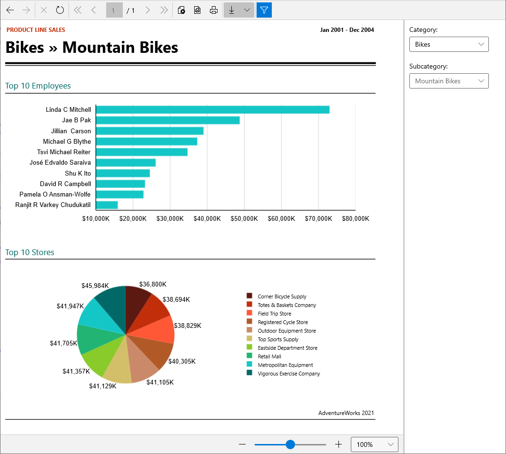

# WinUI Report Viewer Overview

The WinUI report viewer allows developers to deliver reports produced by Telerik Reporting to any application developed using [`WinUI 3`](https://learn.microsoft.com/en-us/windows/apps/winui/winui3/) desktop framework.

The toolbar of the WinUI Report Viewer provides basic functionality for interacting with the currently loaded report:

* Navigate back in history
* Navigate forward in history
* Stop rendering
* Refresh
* Go to the first page
* Go to the previous page
* Go to a specific page
* Total number of pages
* Go to the next page
* Go to the last page
* Page settings
* Print Preview: switches between __Logical__ and __Physical__ page renderer. See [Rendering and Paging]() for more info.
* Print
* Export: see [Export Formats]() for available export formats.
* Show/Hide document map (where applicable)
* Show/Hide parameters area (where applicable)

The bottom panel of the WinUI report viewer contains a slider and drop-down list that control the current zoom level applied to the loaded report contents.

> Visual Studio 2019 and Visual Studio 2019 Preview have known issues when building WinUI applications targeting .NET 5 while having .NET 6 SDK installed on the machine. For a smooth development experience, we recommend using `Visual Studio 2022` and `.NET 6 SDK Preview 6 or later`. Otherwise, you might need to *deinstall* .NET 6 SDK to build WinUI 3 applications.

To use the WinUI report viewer, you need a `WinUI 3` desktop application. To create such, the following tools must be installed:

* `Visual Studio 2022 with enabled Universal Windows Platform development`
* `Windows 10 SDK 10.0.18362 or later installed`
* `.NET 6 SDK Preview 6 or later`

## How it works

The WinUI [ReportViewer](https://www.telerik.com/products/reporting/delivering-viewing-exporting-reports.aspx) control is a composite of Telerik UI for WinUI desktop controls. The viewer's functionality resides in `Telerik.ReportViewer.WinUI.dll` and the viewer's UI in `Telerik.ReportViewer.WinUI.Themes.dll`.

The purpose of the WinUI ReportViewer control is to display Telerik Reports and allow the user to interact with them. Reports may be processed and rendered on the client machine when the viewer utilizes an embedded Reporting engine, or remotely, by a [Telerik Reporting REST Service]() or [Teleirk Report Server](https://docs.telerik.com/report-server/introduction). The report in the viewer is rendered as standard XAML elements, as Canvas and TextBlock, through the Telerik Reporting XAML rendering mechanism, adjusted for WinUI specifics.

Due to the XAML-based nature of WinUI, the WinUI report viewer reuses parts of the source code written for the [WPF Report Viewer](), allowing better maintainability and ensuring error-proof development. This is the reason why specific classes used by the WinUI report viewer might have the `Telerik.ReportViewer.Wpf` namespace. For the same reason, the configuration of the WinUI viewer is almost identical to the configuration of the WPF viewer for the supported functionalities. Check the corresponding WPF Viewer articles depending on the scenario:

* [Integrating the WPF Report Viewer in .NET and .NET Core]()
* [Integrating the WPF Report Viewer With REST Service]()
* [Integrating the WPF Report Viewer With Report Server]()

You may set the ReportSource of the WinUI Viewer as explained in the WinUI sections of the article [Setting ReportSource to Report Viewers]().

## Known Limitations

Currently, the WinUI Report Viewer does not provide the following functionalities:

* Search in report contents.
* Enabled accessibility features for the report viewer and rendered report.
* Localization of the report viewer.
* Modifying the report viewer template through a dedicated.xaml file.

The missing functionalities will be gradually added when possible, given that the current state of the WinUI 3 platform development allows it.

## See Also

* [Windows UI Library (WinUI)](https://learn.microsoft.com/en-us/windows/apps/winui/)
* [Install tools for Windows app development](https://learn.microsoft.com/en-us/windows/apps/windows-app-sdk/set-up-your-development-environment?tabs=cs-vs-community%2Ccpp-vs-community%2Cvs-2022-17-1-a%2Cvs-2022-17-1-b#required-workloads-and-components)
* [Integrating the WPF Report Viewer in .NET and .NET Core]()
* [Integrating the WPF Report Viewer With Report Server]()
* [Integrating the WPF Report Viewer With REST Service]()
