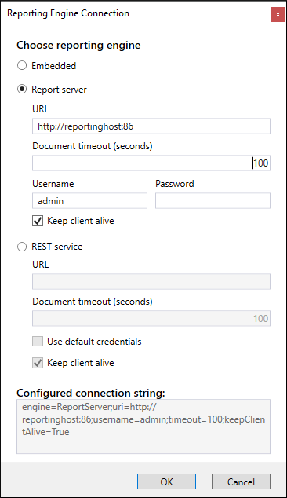
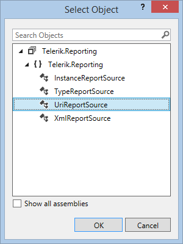

# Integrating the WPF Report Viewer With Report Server

This topic explains how to setup the WPF Report Viewer to work with [Telerik Report Server](https://www.telerik.com/report-server).

## Prerequisites

* Installed and running [Telerik Report Server](https://docs.telerik.com/report-server/introduction) `R2 2016 (2.1.16.x) or higher version`.
* A valid (enabled) user account - the built-in __Guest__ user account can be used as well.
* In case you are not using [Item Templates](), add references to all the assemblies listed in the article [Requirements For Desktop Viewers Using Remote Report Sources]().

## Configuring the WPF Report Viewer to work with Report Server

1. To create a window and host the report viewer in it, you can either use the item template, as explained in the article [How to Add report viewer to a WPF .NET Framework project](), or place it yourself through drag-and-drop from the toolbox.
1. As soon as the report viewer is on your form, select it and locate the `ReportEngineConnection` property. Invoke the UI editor by pressing the ellipsis button. The Report Engine Connection dialog should appear:

	

1. The ` Reporting engine`  combobox provides the following options:

	+ `Embedded` - the reports will be processed and rendered at the local machine that hosts the viewer. This is the default mode in order to preserve backwards compatibility.
	+ `REST Service` - the reports will be processed at the machine that hosts configured and running REST Service instance.
	+ `Report Server` - the reports will be processed and rendered at the machine that hosts configured and running [Telerik Report Server](https://docs.telerik.com/report-server/introduction) instance.

	Select *Report Server*.

1. In __Report Server URL__ textbox enter the address and port (if needed) of the machine that hosts the Report Server instance.
1. In __Username__ textbox enter the user account that will be used to access the report or leave it empty if you want to use the built-in __Guest__ account.
1. In __Password__ textbox enter the password associated with the account or leave it empty if you want to use the built-in __Guest__ account.
1. In the __Document timeout__ textbox you can change the timeout for rendering a document, the default is `100` seconds.
1. Uncheck the __Keep client alive__ checkbox if you want the client session to expire.
1. Click __OK__ when ready. The dialog will close and the resulting connection string will be populated as a value of the __ReportEngineConnection__ property.
1. Locate the __ReportSource__ property. Invoke the UI editor by pressing the __New__ button. The default property editor, provided by Visual Studio, should appear:

	

	>When the [ReportEngineConnection](/api/Telerik.ReportViewer.Wpf.ReportViewer#Telerik_ReportViewer_Wpf_ReportViewer_ReportEngineConnection) property has the `Engine` set to `ReportServer`, the viewer will serialize the report source identifier property (`URI` for the supported [UriReportSource](/api/Telerik.Reporting.UriReportSource)) and send it to the service resolver. The `ReportServer` will try to decompose the identifier using the format `{Category}/{ReportName}` and then look for the corresponding category and report name.

1. Select the __UriReportSource__ entry. Confirm by clicking __OK__.
1. Expand the __ReportSource__ node in Properties window. In the provided __Uri__ textbox enter the category and the name of the report you want to display using the following format: `{Category}/{ReportName}`, as shown below:

	

1. Build and run your application. If your settings are configured correctly, you should see the report, hosted on your Report Server instance, displayed in the report viewer of your WPF application. If not, check the [Troubleshooting](#Troubleshooting) section below.

> When setting [ReportEngineConnection](/api/Telerik.ReportViewer.Wpf.ReportViewer#Telerik_ReportViewer_Wpf_ReportViewer_ReportEngineConnection) with code, make sure you call the [RefreshReport()](/api/Telerik.ReportViewer.Wpf.ReportViewer#Telerik_ReportViewer_Wpf_ReportViewer_RefreshReport) method or set the [ReportSource](/api/Telerik.ReportViewer.Wpf.ReportViewer#Telerik_ReportViewer_Wpf_ReportViewer_ReportSource) property afterward, so the connection's new value will be respected.

## Troubleshooting

The most common reasons for failure are related with the authentication against Report Server. It is strongly recommended to use a tool like Fiddler or any other web debugger when investigating such a problem.

| Problem | Cause |
| ------ | ------ |
|The viewer displays the message: `A problem occurred while registering client.`|Check if the supplied _username_ and _password_ are valid and the user's state is __Enabled__ in Report Server.|
|The viewer displays the message: `System.OperationCanceledException: *{ReportName}* report cannot be found`|Make sure the URL specified in the report source __report__ is valid and such a category and report exist in Report Server.|
|The viewer displays the message: `System.Net.WebException: The remote name could not be resolved: {server name}`|Make sure that the server specified in the connection string exists and has a valid and running Report Server instance.|

## See Also

* [How to Construct a string to connect to Report Engine]()
* [How to Use WPF Report Viewer With REST Service]()
* [EmbeddedConnectionInfo](/api/Telerik.ReportViewer.Common.EmbeddedConnectionInfo)
* [ReportServerConnectionInfo](/api/Telerik.ReportViewer.Common.ReportServerConnectionInfo)
* [RestServiceConnectionInfo](/api/Telerik.ReportViewer.Common.RestServiceConnectionInfo)
