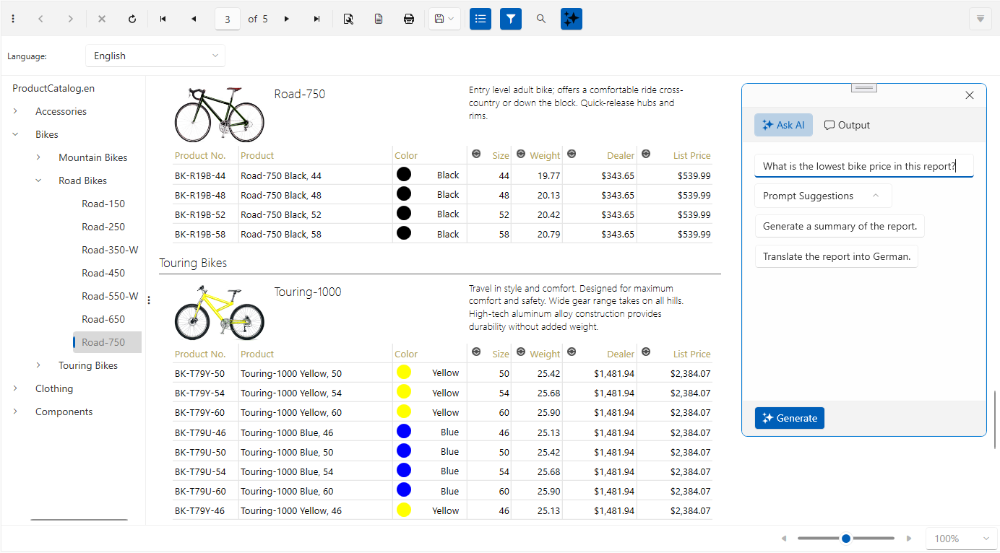

# WPF Report Viewer Overview

The WPF Report Viewer allows developers to deliver reports produced by Telerik Reporting to any rich application developed with WPF.

  

The toolbar of the WPF Report Viewer provides basic functionality for interacting with the currently-loaded report:

* Navigate back in history
* Navigate forward in history
* Refresh
* Go to first page
* Go to previous page
* Go to a specific page
* Total number of pages
* Go to next page
* Go to last page
* Print Preview: switches between __Logical__ and __Physical__ page renderer. See [Rendering and Paging]() for more information.
* Print
* Export: see [Export Formats]() for the available export formats.
* Show/Hide document map
* Show/Hide parameters area
* Zooming

In order to use the WPF Report Viewer, you need a WPF application. In order to create such, you need the following tools installed:

## System Requirements

* Visual Studio 2010 or later.
* .NET Framework 4 or above (.NET Framework 4 __Client Profile__ is not supported)
* .NET Core 3.1
* .NET 5+
* (optional) Expression Blend

## How it works

The WPF ReportViewer control is a composite of Telerik UI for WPF controls. The viewer's functionality resides in `Telerik.ReportViewer.Wpf.dll` and the viewer's UI in `Telerik.ReportViewer.Wpf.xaml`.

> The WPF ReportViewer control's template can be modified trough the corresponding theme's [Telerik.ReportViewer.Wpf.xaml]() file and the [WPF ReportViewer](/api/Telerik.ReportViewer.Wpf.ReportViewer).

The purpose of the WPF ReportViewer control is to display Telerik Reports and allow the user to interact with them. By default, reports are processed and rendered on the client machine unless a [Reporting REST Service]() is used. The report in the viewer is rendered in as standard `XAML` elements, as `Canvas` and `TextBlock`, through Telerik Reporting XAML for WPF rendering mechanism.

## See Also

* [How to Add report viewer to a WPF.NET Framework project]()

* [Setting a Theme (Using Implicit Styles)]()
