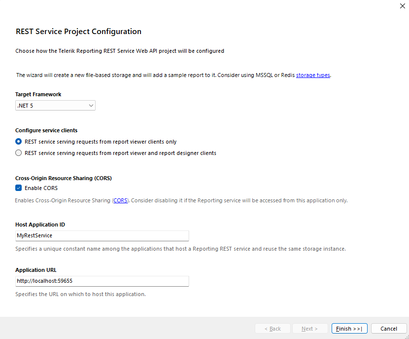

# Hosting the Telerik Reporting REST Service in an ASP.NET Core Application in .NET 5

This article guides you how to host a Reports Web Service in order to expose the Reports Generation Engine to an ASP.NET Core in .NET 5 Web Application.

The guide is separated into sections for readability reasons. Along with the steps, it elaborates on the concepts and theory behind each step.

## Prerequisites

* [Visual Studio 2019, version 16.8+](https://www.visualstudio.com/vs/)
* [NET 5 SDK](https://dotnet.microsoft.com/download/dotnet/5.0)

## Using the REST Service Project Template

In Visual Studio open the __Add New Project__ dialog and select *Telerik Reporting REST Service* project template. After clicking `Create` a menu pops up that allows you to configure the following properties of the REST Service: target framework, service clients (report viewer and report designer), Cross-Origin Resource Sharing, Host Application ID, and Application URL.



Set the Target Framework to .NET 5.

Once you have configured the rest of the options to your liking, click `Finish` and a new project, containing all the necessary files and packages to host the Telerik Reporting REST service instance, will be added to your solution.

## Manually configuring the Telerik.Reporting REST Service

### Creating a Sample ASP.NET Core in .NET 5 Project

First, you need to create a new ASP.NET Core project:

1. Open __Visual Studio 2019__ or newer.
1. From the __File__ menu, select __New > Project__.
1. In the __Add a new Project__ dialog select __ASP.NET Core Web Application__ project template. Choose a name and location for the project and click __Create__.
1. In the __Create a new ASP.NET Core web application__ dialog select from the drop downs __.NET Core__ and __ASP.NET Core 5.0__. Click on __Create__.

### Add Report Definitions

In this tutorial, the resulting service will use the sample report definitions deployed with the Telerik Reporting product installer:

1. Find the sample reports in *{Telerik Reporting installation path}\Report Designer\Examples*.
1. Add a new folder to your solution called `Reports` and copy all sample reports into it.
1. Later in the tutorial we will make sure that the ReportsController is able to resolve the definitions for the requested reports from this project folder.

> It is recommended to use declarative definitions (TRDP/TRDX/TRBP) authored using the [Standalone Report Designer]() or the [Web Report Designer]() in order to take advantage of their design-time tooling because the VS integrated report designer tooling is still not available in .NET 5 projects.

### Add the required dependencies

This guide applies the recommended NuGet package references approach to add the dependencies: 

1. Reference the __Telerik.Reporting.Services.AspNetCore__ (or __Telerik.Reporting.Services.AspNetCore.Trial__) package.
1. Optionally, to enable the Office OpenXML document formats (XLSX, DOCX and PPTX) as export options, reference the __Telerik.Reporting.OpenXmlRendering__ (or __Telerik.Reporting.OpenXmlRendering.Trial__) NuGet package.

> The recommended way of adding the necessary dependencies is to use the [Progress Telerik proprietary NuGet feed]() and reference the dependencies as NuGet packages. This would also add the indirect dependencies to your project bringing easier dependency management. Alternatively, the assemblies are available in the `\Bin\net5.0\` folder of Telerik Reporting installation directory. However, this would require to manually add all indirect dependencies listed in [.NET Core Support - Requirements](#requirements) section and also the following dependency package: [Microsoft.AspNetCore.Mvc.NewtonsoftJson version 5.0.0](https://www.nuget.org/packages/Microsoft.AspNetCore.Mvc.NewtonsoftJson/) and [DocumentFormat.OpenXML version 2.7.2.0 or above](https://www.nuget.org/packages/DocumentFormat.OpenXml/). Note that you need the last reference only to enable the Office OpenXML document formats. The Reporting engine relies on the GDI+ API which is available on the Windows OS. On Linux and macOS we use library called [libgdiplus](https://www.mono-project.com/docs/gui/libgdiplus/) instead. The GDI+ API is required for measuring, laying out, rendering the text glyphs and images.

### Setup the Startup.cs file for the Reports service

The `ConfigureServices` method inside the `Startup.cs` in the project should be modified in order to enable the Reports Service functionality.

1. Make sure the application is configured for WebAPI controllers and call the `AddNewtonsoftJson` on the IMvcBuilder object to place the NewtonsoftJson serialization:

	````C#
services.AddControllers().AddNewtonsoftJson();
````


1. Add the dedicated configuration object needed from the Reports Service in the dependency container. Note how the report source resolver will target the Reports folder we created earlier.

	````C#
// Configure dependencies for ReportsController.
	services.TryAddSingleton<IReportServiceConfiguration>(sp =>
		new ReportServiceConfiguration
		{
			ReportingEngineConfiguration = ConfigurationHelper.ResolveConfiguration(sp.GetService<IWebHostEnvironment>()),
			HostAppId = "Net5RestServiceWithCors",
			Storage = new FileStorage(),
			ReportSourceResolver = new UriReportSourceResolver(
				System.IO.Path.Combine(sp.GetService<IWebHostEnvironment>().ContentRootPath, "Reports"))
		});
````


1. Make sure the endpoints configuration inside the `Configure` method of the `Startup.cs` are configured for API controllers by adding the following line in the lambda expression argument:

	````C#
app.UseEndpoints(endpoints =>
	{
		endpoints.MapControllers();
		//...
	});
````


### Add Configuration Settings (Optional)

The report generation engine can retrieve Sql Connection Strings and specific Report Generation Engine Settings that provide flexibility of the deployed application. It utilizes the [IConfiguration interface](https://learn.microsoft.com/en-us/dotnet/api/microsoft.extensions.configuration.iconfiguration?view=dotnet-plat-ext-6.0) for this purpose.

.NET 5 applications use a [key-value JSON-based](https://learn.microsoft.com/en-us/aspnet/core/fundamentals/configuration/?view=aspnetcore-5.0) file named by default `appSettings.json`. The default ReportingEngineConfiguration:

````C#
ReportingEngineConfiguration = sp.GetService<IConfiguration>()
````

will be initialized from `appSettings.json` or `appsettings.{EnvironmentName}.json`.

To activate JSON file configuration with a different name, for example, `reportingAppSettings.json`, call the [AddJsonFile](https://docs.microsoft.com/en-us/dotnet/api/microsoft.extensions.configuration.jsonconfigurationextensions.addjsonfile?view=dotnet-plat-ext-7.0) extension method on an instance of [ConfigurationBuilder](https://learn.microsoft.com/en-us/dotnet/api/microsoft.extensions.configuration.configurationbuilder?view=dotnet-plat-ext-7.0).

In this guide we will create a helper class loading the json-formatted setting:

````C#
using Microsoft.AspNetCore.Hosting;
using Microsoft.Extensions.Configuration;
static class ConfigurationHelper
{
	public static IConfiguration ResolveConfiguration(IWebHostEnvironment environment)
	{
		var reportingConfigFileName = System.IO.Path.Combine(environment.ContentRootPath, "reportingAppSettings.json");
		return new ConfigurationBuilder()
			.AddJsonFile(reportingConfigFileName, true)
			.Build();
	}
}
````

Finally, all configurations should be placed in the JSON configuraion file (add one in the project root if such does not exist). For example, __ConnectionStrings__ setting should be configured in JSON-based format like this:

````JSON
{
	//...
	"ConnectionStrings": {
		"Telerik.Reporting.Examples.CSharp.Properties.Settings.TelerikConnectionString": "Data Source=.\\SQLEXPRESS;Initial Catalog=AdventureWorks;Integrated Security=true"
	}
}
````

The above type of connection string lacks information about the data provider and will use *System.Data.SqlClient* as provider invariant name. When it's necessary to specify a different data provider, the following notation is also supported:

````JSON
{
	//...
	"ConnectionStrings": {
		"Telerik.Reporting.Examples.CSharp.Properties.Settings.TelerikConnectionString": {
			"connectionString": "Data Source=.\\SQLEXPRESS;Initial Catalog=AdventureWorks;Integrated Security=true",
			"providerName": "System.Data.SqlClient"
		}
	}
}
````

The two types of connection string notations specified above can coexist in a single ConnectionStrings section.

The last supported type of __ConnectionStrings__ configuration uses an array to provide information about each connection string:

````JSON
{
	//...
	"ConnectionStrings": [
		{
			"name": "Telerik.Reporting.Examples.CSharp.Properties.Settings.TelerikConnectionString",
			"connectionString": "Data Source=.\\SQLEXPRESS;Initial Catalog=AdventureWorks;Integrated Security=true",
			"providerName": "System.Data.SqlClient"
		}
	]
}
````

### Setting up the REST service

1. Create folder `Controllers`. Right-click on the project name and select __Add > New folder__. Name it `Controllers`.
1. Implement a Reports controller. Right-click on the `Controllers` folder and add a new item: __Add > New item > Web API Controller Class__ item. Name it `ReportsController`. This will be our Telerik Reporting REST service in the project.
1. Inherit the [ReportsControllerBase](/reporting/api/Telerik.Reporting.Services.WebApi.ReportsControllerBase) type and inject the configuration settings in the constructor. This is how a basic implementation of the controller should look like:

	````C#
namespace CSharp.Net5.ReportingRestServiceCorsDemo.Controllers
	{
		using Microsoft.AspNetCore.Mvc;
		using System.Net;
		using System.Net.Mail;
		using Telerik.Reporting.Services;
		using Telerik.Reporting.Services.AspNetCore;
		[Route("api/reports")]
		public class ReportsController : ReportsControllerBase
		{
			public ReportsController(IReportServiceConfiguration reportServiceConfiguration)
				: base(reportServiceConfiguration)
			{
			}
			protected override HttpStatusCode SendMailMessage(MailMessage mailMessage)
			{
				throw new System.NotImplementedException("This method should be implemented in order to send mail messages");
				//using (var smtpClient = new SmtpClient("smtp01.mycompany.com", 25))
				//{
				//	smtpClient.DeliveryMethod = SmtpDeliveryMethod.Network;
				//	smtpClient.EnableSsl = false;
				//	smtpClient.Send(mailMessage);
				//}
				//return HttpStatusCode.OK;
			}
		}
	}
````


### Test the service implementation

To ensure that the service operates, run the application and navigate to either of the General REST Service API URLs `{applicationRoot}/api/reports/formats` or `{applicationRoot}/api/reports/version`. The first should return a [JSON representing the supported rendering extensions](), and the second - the [version of the Reporting REST Service]().

### Enable Cross-Origin Resource Sharing (CORS) (Optional)

You may need to enable [Cross-Origin Resource Sharing (CORS)](https://developer.mozilla.org/en-US/docs/Web/HTTP/CORS), for example, if you use the REST Service from clients hosted in different domains.

Add the following code to the *ConfigureServices* method of the *Startup.cs* file to add a new CORS policy for the REST Service:

````C#
services.AddCors(corsOption => corsOption.AddPolicy(
	"ReportingRestPolicy",
	corsBuilder =>
	{
		corsBuilder.AllowAnyOrigin()
			.AllowAnyMethod()
			.AllowAnyHeader();
	}
));
````

Activate the above policy for the application by adding the next code in the `Configure` method of the `Startup.cs` file:

````C#
app.UseCors("ReportingRestPolicy");
````

## Demo project

A full example can be found in the installation folder of Telerik Reporting:

`C:\Program Files (x86)\Progress\Telerik Reporting {{site.suiteversion}}\Examples\CSharp\.NET 5\ReportingRestServiceCorsDemo\CSharp.Net5.ReportingRestServiceCorsDemo`

## See Also

* [YouTube video "How to set up a Telerik Reporting REST Service in .NET 5?"](https://www.youtube.com/watch?v=qU_ByzMgJBo)
