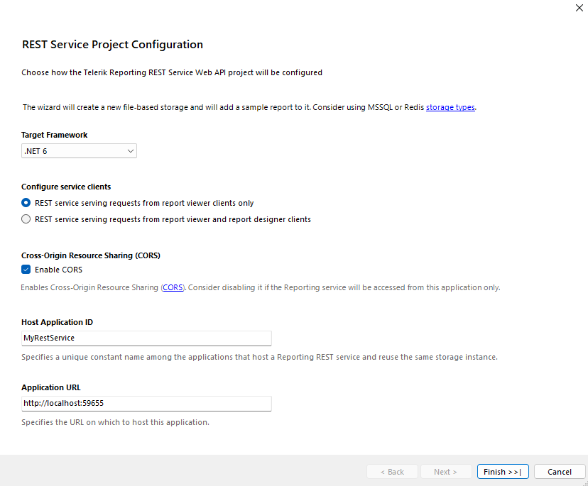

# Hosting the Telerik Reporting REST Service in ASP.NET Core in .NET 6+ with Minimal API

This article guides you how to host a Reporting REST Service in order to expose the Reports Generation Engine to an ASP.NET Core in .NET 6+ Web Application with Minimal APIs. 

Check the [Minimal APIs](https://learn.microsoft.com/en-us/aspnet/core/fundamentals/minimal-apis/overview) article for general details on the approach.
The guide is separated into sections for readability reasons. Along with the steps, it elaborates on the concepts and theory behind each step.

## Prerequisites

* [Visual Studio 2022, version 17+](https://www.visualstudio.com/vs/)
* [NET 6 SDK](https://dotnet.microsoft.com/download/dotnet/6.0) or higher

## Using the REST Service Project Template

In Visual Studio open the __Add New Project__ dialog and select *Telerik Reporting REST Service* project template. After clicking `Create` a menu pops up that allows you to configure the following properties of the REST Service: target framework, service clients (report viewer and report designer), Cross-Origin Resource Sharing, Host Application ID, and Application URL.



Set the Target Framework to .NET 6, or correspondingly to .NET 7, or .NET 8.

Once you have configured the rest of the options to your liking, click `Finish` and a new project, containing all the necessary files and packages to host the Telerik Reporting REST service instance, will be added to your solution.

## Manually configuring the Telerik.Reporting REST Service

### Creating a Sample ASP.NET Core in .NET 6+ Project

First, you need to create a new ASP.NET Core project:

1. Open __Visual Studio 2022__.
1. From the __File__ menu, select __New__ > __Project__.
1. In the __Create a new project__ dialog select __ASP.NET Core Web App__ project template and click __Next__.
1. In the __Configure your new project__ dialog choose a name and location for the project and click __Next__.
1. In the __Additional information__ dialog select from the drop down __.NET 6.0 (Long-term support)__, or correspondingly .NET 7, or .NET 8. If you configure the project for HTTPS make sure to have a proper certificate assigned. Click on __Create__.

### Add Report Definitions

In this tutorial, the resulting service will use the sample report definitions deployed with the Telerik Reporting product installer:

1. Find the sample reports in *{Telerik Reporting installation path}\Report Designer\Examples*.
1. Add a new folder to your solution called `Reports` and copy all sample reports into it.
1. Later in the tutorial we will make sure that the ReportsController is able to resolve the definitions for the requested reports from this project folder.

> It is recommended to use declarative definitions (TRDP/TRDX/TRBP) authored using the [Standalone Report Designer]() or the [Web Report Designer]() in order to take advantage of their design-time tooling because the VS integrated report designer tooling is still not available in .NET 6+ projects.

### Add the Required Dependencies

This guide applies the recommended NuGet package references approach to add the dependencies:

1. Reference the __Telerik.Reporting.Services.AspNetCore__ (or __Telerik.Reporting.Services.AspNetCore.Trial__) package.
1. Optionally, to enable the Office OpenXML document formats (XLSX, DOCX and PPTX) as export options, reference the __Telerik.Reporting.OpenXmlRendering__ (or __Telerik.Reporting.OpenXmlRendering.Trial__) NuGet package.

> The recommended way of adding the necessary dependencies is to use the [Progress Telerik proprietary NuGet feed]() and reference the dependencies as NuGet packages. This would also add the indirect dependencies to your project bringing easier dependency management. 
Alternatively, the assemblies are available in the `\Bin\net6.0\` and  `\Bin\netstandard2.0\` folders of Telerik Reporting installation directory. However, this would require to manually add all indirect dependencies listed in [.NET Support - Requirements](#requirements) section and also the following dependency package: [Microsoft.AspNetCore.Mvc.NewtonsoftJson version 5.0.0](https://www.nuget.org/packages/Microsoft.AspNetCore.Mvc.NewtonsoftJson/) and [DocumentFormat.OpenXML version 2.7.2.0 or above](https://www.nuget.org/packages/DocumentFormat.OpenXml/). 
Note that you need the last reference only to enable the Office OpenXML document formats. The Reporting engine relies on the [GDI+ API](https://learn.microsoft.com/en-us/windows/win32/gdiplus/-gdiplus-gdi-start) which is available on the Windows OS. On Linux and macOS we use the [SkiaSharp](https://github.com/mono/SkiaSharp) 2D Graphics Library based on Google's [Skia](https://skia.org/) Graphics Library

### Setup the Program.cs file as a starting point of the Reporting REST Service project with Minimal APIs

Modify the `Program.cs` file in the project to enable the Reports Service functionality.

1. Make sure the application is configured for WebAPI controllers and call the [`AddNewtonsoftJson`](https://learn.microsoft.com/en-us/dotnet/api/microsoft.extensions.dependencyinjection.newtonsoftjsonmvcbuilderextensions.addnewtonsoftjson) on the [IMvcBuilder](https://learn.microsoft.com/en-us/dotnet/api/microsoft.extensions.dependencyinjection.imvcbuilder) object to place the **NewtonsoftJson** serialization:

	````CSharp
builder.Services.AddControllers().AddNewtonsoftJson();
````


1. Set up the [ReportServiceConfiguration](/api/telerik.reporting.services.reportserviceconfiguration) by invoking the `AddTelerikReporting` extension method on the [IMvcBuilder](https://learn.microsoft.com/en-us/dotnet/api/microsoft.extensions.dependencyinjection.imvcbuilder) object. In the code below, the first argument will represent the [HostAppId](/api/telerik.reporting.services.reportserviceconfiguration#Telerik_Reporting_Services_ReportServiceConfiguration_HostAppId) of the [ReportServiceConfiguration](/api/telerik.reporting.services.reportserviceconfiguration) object, while the second is the path that will be passed to the [UriReportSourceResolver](/api/telerik.reporting.services.urireportsourceresolver). 

	````CSharp
var reportsPath = Path.Combine(builder.Environment.ContentRootPath, "Reports");

builder.Services.AddTelerikReporting("ReportingNet", reportsPath);
````


1. Register the Telerik Reportig Minimal API by invoking the `UseTelerikReporting` extension method on the [WebApplication](https://learn.microsoft.com/en-us/dotnet/api/microsoft.aspnetcore.builder.webapplication) object. The application must also the endpoint routing middleware added by the [UseRouting](https://learn.microsoft.com/en-us/dotnet/api/microsoft.aspnetcore.builder.endpointroutingapplicationbuilderextensions.userouting) method: 

	````CSharp
app.UseTelerikReporting();
app.UseRouting();
````


### Adding Connection Strings to the Configuration

The report generation engine can retrieve SQL Connection Strings and specific Report Generation Engine Settings that provide flexibility of the deployed application. It utilizes the [IConfiguration interface](https://learn.microsoft.com/en-us/dotnet/api/microsoft.extensions.configuration.iconfiguration) for this purpose.

The .NET applications use a [key-value JSON-based](https://learn.microsoft.com/en-us/aspnet/core/fundamentals/configuration/) file named by default `appSettings.json`. The default `ReportingEngineConfiguration` will be initialized from `appSettings.json` or `appsettings.{EnvironmentName}.json`.

All Reporting-related configurations should be placed in the JSON configuraion file - (add one in the project root if such does not exist). For example, the `ConnectionStrings` setting should be configured in JSON-based format like this:

````JSON
{
	"ConnectionStrings": {
		"Telerik.Reporting.Examples.CSharp.Properties.Settings.TelerikConnectionString": "Data Source=.\\SQLEXPRESS;Initial Catalog=AdventureWorks;Integrated Security=true"
	}
}
````

The above type of connection string lacks information about the data provider and will use [System.Data.SqlClient](https://learn.microsoft.com/en-us/dotnet/api/system.data.sqlclient) as provider invariant name. When it's necessary to specify a different data provider, the following notation is also supported:

````JSON
{
	"ConnectionStrings": {
		"Telerik.Reporting.Examples.CSharp.Properties.Settings.TelerikConnectionString": {
			"connectionString": "Data Source=.\\SQLEXPRESS;Initial Catalog=AdventureWorks;Integrated Security=true",
			"providerName": "System.Data.SqlClient"
		}
	}
}
````

The two types of connection string notations specified above can coexist in a single ConnectionStrings section.

The last supported type of `ConnectionStrings` configuration uses an array to provide information about each connection string:

````JSON
{
	//...
	"ConnectionStrings": [
		{
			"name": "Telerik.Reporting.Examples.CSharp.Properties.Settings.TelerikConnectionString",
			"connectionString": "Data Source=.\\SQLEXPRESS;Initial Catalog=AdventureWorks;Integrated Security=true",
			"providerName": "System.Data.SqlClient"
		}
	]
}
````


### Test the Service Implementation

To ensure that the service operates, run the application and navigate to either of the General REST Service API URLs `{applicationRoot}/api/reports/formats` or `{applicationRoot}/api/reports/version`. 

The first should return a [JSON representing the supported rendering extensions](), and the second - the [version of the Reporting REST Service]().

### Enable Cross-Origin Resource Sharing (CORS) (Optional)

You may need to enable [Cross-Origin Resource Sharing (CORS)](https://developer.mozilla.org/en-US/docs/Web/HTTP/CORS), for example, if the Reporting REST Service is used from clients hosted in different domains.

Add the following service to the **Program.cs** file to add a new CORS policy for the REST Service:

````CSharp
builder.Services.AddCors(corsOption => corsOption.AddPolicy(
	"ReportingRestPolicy",
	corsBuilder =>
	{
		corsBuilder.AllowAnyOrigin()
			.AllowAnyMethod()
			.AllowAnyHeader();
	}
));
````

Activate the above policy for the application by adding the code below in the application configuration part of the **Program.cs** file:

````CSharp
app.UseCors("ReportingRestPolicy");
````

## Demo project

A full example can be found in the installation folder of Telerik Reporting:

`C:\Program Files (x86)\Progress\Telerik Reporting {{site.suiteversion}}\Examples\CSharp\.NET 6\ReportingRestServiceCorsDemo\CSharp.Net8.ReportingRestServiceCorsDemo`
