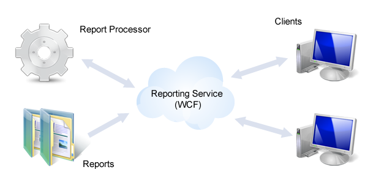

# Telerik Reporting WCF Service Overview

> The Silverlight Report Viewer and its WCF Reporting Service are no longer supported and deployed with the installation of Telerik Reporting. The last release of Telerik Reporting with included Silverlight Report Viewer is [R1 2023](https://www.telerik.com/support/whats-new/reporting/release-history/progress-telerik-reporting-r1-2023-17-0-23-118).

## Overview

Telerik Reporting WCF Service enables the remote access to the [ReportProcessor](/api/Telerik.Reporting.Processing.ReportProcessor). The service acts as a communication interface between the client programs and the reporting engine. The service is responsible for managing the reports state and resources. 

Telerik Reporting WCF Service exposes two contracts:

* The `Telerik.Reporting.Service.IReportService` - meant for basic report operations, which can be used by client viewer applications: render, page navigation, parameters etc. 
* The `Telerik.Reporting.Service.IResourceService` - all its exposed operations should be accessed through HTTP GET request only 

> The default __Telerik Reporting WCF Service__ implementation uses ASP.NET Session in order to store various resources such as report pages and images. When ran out of web context (e.g. self-hosted service), it uses internal session storage. To make your own implementation, create your own service class derived from `ReportServiceBase` and override its `GetState` and `SetState` methods.

The service main purpose is to provide access for the Silverlight Report Viewer to the reporting engine. There are 3 methods of Telerik.Reporting.Service.IReportService that may be of interest to you: 

* `IList<ReportInfo>` - `Telerik.Reporting.Service.IReportService.ListAvailableReports`- returns a list of all available for the report service hosting application Report types. That is all types implementing the [Telerik.Reporting.IReportDocument](/api/Telerik.Reporting.IReportDocument) interface that are available for the application hosting the report service.
* `IList<ExtensionInfo>` - `Telerik.Reporting.Service.IReportService.ListRenderingExtensions` - returns all rendering extensions available for the report service.
* `Telerik.Reporting.Service.IReportService.Render(string format, string report, NameValueDictionary deviceInfo, NameValueDictionary parameters)` - renders the specified __report__ (assembly qualified type name) in the specified __format__ (see ListRenderingExtensions operation above), with the given __[deviceInfo]()__ settings and __parameter values__.

## Deploying the service

The __Telerik Reporting WCF Service__ is a standard WCF service and is compatible with all hosted models described in the [Hosting Services](http://msdn.microsoft.com/en-us/library/ms730158). 

[Telerik Reporting configuration settings]() must be applied in the service project configuration file.

For more information on deploying a Silverlight application that utilizes Telerik Reporting, refer to [Deploying Silverlight Application]() article.

## See Also

* [How to Add Telerik Reporting WCF Service to Web Application]()
* [How to Self Host the Service]()
* [How to Enable SSL for Telerik Reporting WCF service]()
* [How to Implement and use custom IReportResolver]()
