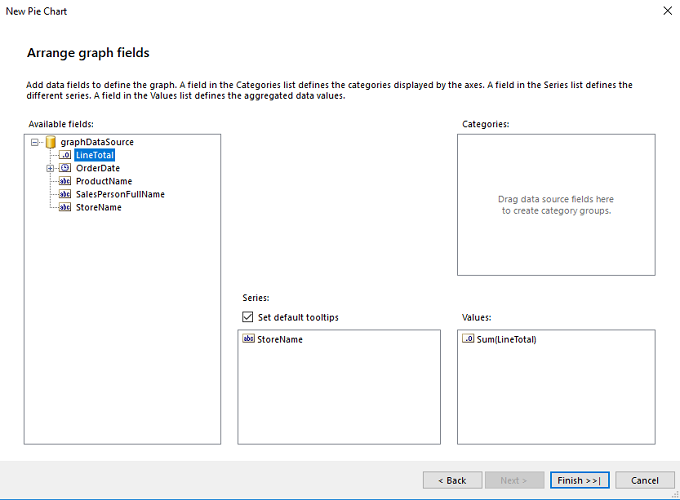
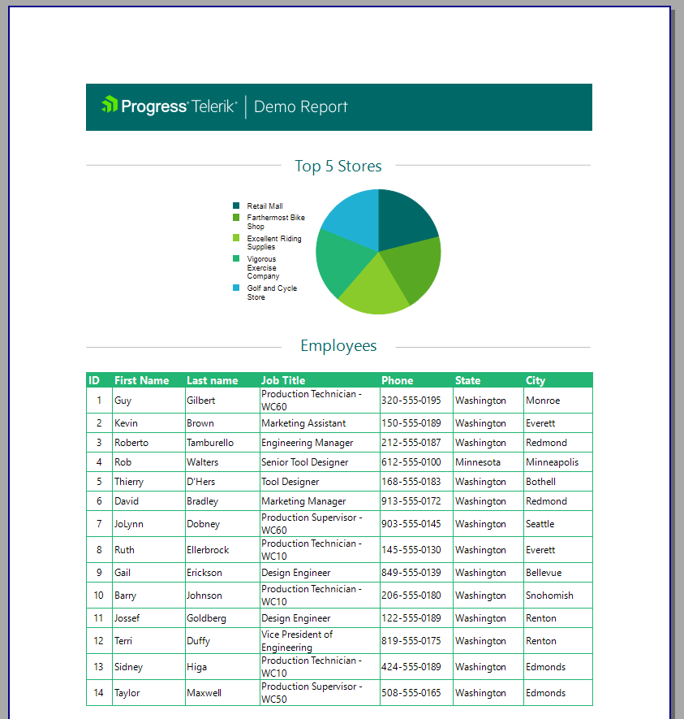

# Creating the Graph


This article is part of the Demo report guide on getting started with Telerik Reporting and demonstrates         how to create a [Graph]() item in the __Report Header__ .       

The controls which the __Report Header__  and the __Report Footer__  contain are displayed only once at the top and bottom         of the entire report respectively. The controls which the __pageHeaderSection__  and the __pageFooterSection__  are displayed on all pages.         The __Report Header__  and __Report Foote__ r are hidden by default.       

## 

1. To show the report header, right-click outside the report and select __Report Header__ .             

1. Add a new SQL Datasource component for the graph with the following query:             

	
      ````sql

SELECT
P.Name AS ProductName, SOD.LineTotal / 1000 AS LineTotal,
SOH.OrderDate,
SS.Name AS StoreName,
C.FirstName + ' ' + COALESCE (C.MiddleName, '') + ' ' + C.LastName AS SalesPersonFullName
FROM
Production. Product AS P
INNER JOIN Sales.SalesOrderDetail AS SOD ON P.ProductID = SOD.ProductID
INNER JOIN Sales.SalesOrderHeader AS SOH ON SOD.SalesOrderID = SOH.SalesOrderID
INNER JOIN Sales.Store AS SS             ON SS.CustomerID = SOH.CustomerID
INNER JOIN Sales.SalesPerson AS SP       ON SP.SalesPersonID = SOH.SalesPersonID
INNER JOIN HumanResources.Employee AS E  ON E.EmployeeID = SP.SalesPersonID
INNER JOIN Person.Contact AS C           ON C.ContactID = E.ContactID
WHERE     (YEAR(SOH.OrderDate) = 2002)
````


1. Rename the datasource to __graphDataSource__ .             

1. Click __reportHeaderSection__ .             

1. Select __Insert__  > __Pie__  > __graphDataSource__ .             

1. Drag __StoreName__  to __Series__ .             

1. Drag __LineTotal__  to __Values__ .               

  

1. Click Finish and select the newly created Graph in order to add Filtering and Sorting.             

1. From the  [Group Explorer]() (Series Groups), click __Filter__  and set the following parameters:             

   + __Expression__ : =Sum(Fields.LineTotal)

   + __Operator__ : Top N

   + __Value__ : =5

1. From the __Group Explorer__  (Series Groups), click __Sorting__  and set the following parameters:             

   + __Expression__ : =Sum(Fields.LineTotal)

   + __Direction__ :  DESC

1. From the __Properties__  grid, select the __Color Palette__  option to set the colors for each bar series:             

	````

              Color [A=255, R=0, G=105, B=104],
              Color [A=255, R=88, G=168, B=35],
              Color [A=255, R=137, G=203, B=42],
              Color [A=255, R=34, G=181, B=115],
              Color [A=255, R=32, G=176, B=212]
            
````


1. Add the title of the graph by inserting a __TextBox__  with __Value__  "Top 5 Stores". Put Shapes next to the text.             

## Previewing the Result

Preview the result by clicking __Preview__  > __PrintPreview__ .           

  

## Next Steps

* [Setting the Page Footer]()

* [Integrating the Report in .NET Framework Application]()

* [Parameterizing the Graph]()

* [How to Add Column Graph]()

## Previous Steps

* [First Steps]()

* [Creating the Demo Report]()

* [Setting the Page Header]()

* [Creating the Table and Populating it with Data]()
