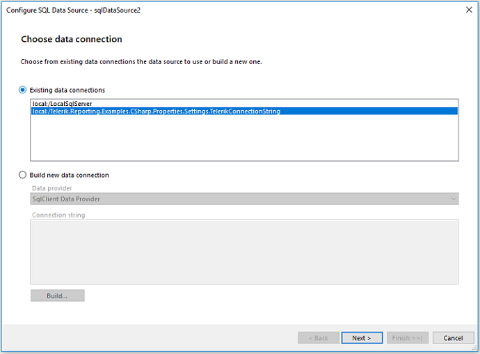

# Creating the Table and Populating it with Data


This article is part of the Demo report guide on getting started with Telerik Reporting and demonstrates how to add an         [        SqlDataSource component      ]()         and present the fetched data into a table item.       

## Adding the SqlDatasource Component

This guide uses the __AdventureWorks__ database that is provided by Telerik Reporting.           The data sources that will be added to the report will generate their data representations.         

1. Select __Data__ > __SQL Data Source__ > __Existing data connections__ > __local:/Telerik.reporting.Examples.CSharp.Properties__.               

  

1. Click __Next__ > __Use as a shared connection__ > __Next__.             

1. On the screen that loads, fill in the __Select Statement__ field with the following query.               The query will extract only the first 14 employees and they will be listed in ascending order according to their id, that is,               the employee with id=1 will be the first one, the employee with id=2 will come second, and so on.             

    
      ````sql
SELECT
[HumanResources].[vEmployee].[EmployeeID] ,
[HumanResources].[vEmployee].[FirstName],
[HumanResources].[vEmployee].[LastName],
[HumanResources].[vEmployee].[JobTitle],
[HumanResources].[vEmployee].[Phone]
FROM [HumanResources].[vEmployee]
WHERE [HumanResources].[vEmployee].[EmployeeID] <= 14
ORDER BY 1 ASC
````


1. From the grid with the properties, change the name of the data source to *tableDataSource* so you can later refer it and render its data in the report.             

## Creating the Table

1. Click the __datailSection__.             

1. From the bar, select __Insert__.             

1. Select __Table__ > __Table Wizard__ > __tableDataSource__.             

1. On the screen that loads, mark all columns and drag them to the __Table Columns__. Click __Next__.             

1. From the window that opens, select a predefined style for your table.             

1. Click __Next__ and __Finish__.             

1. Apply the following __Styling__ to the table:             

   + __BackgroundColor__ and  __BorderColor__ set to be [34, 181, 115].                 

   + __Font > Name__ set to be __SegoeUI__.                 

   + Mark the table header and set the __Color__ property to be __White__.                 

1. Add the title of the table. To do that, add a TextBox and set its __Value__ to be "Employees".             

1. Insert two Shapes next to the text. Set the __ShapeType__ to be __Horizontal Line__ and make the __Color__ to be __Silver__.              

## Previewing the Result

Preview the result by clicking __Preview__ > __PrintPreview__.         

* The generated report uses the __Segoe UI__ font.             

* The color of its table title is __0, 105, 104__.             

* [Shapes]() are used for the lines next to the table title.             

* The __BorderColor__ of the table is __34, 181, 115__.               

  

## Next Steps

* [Creating the Graph]()

* [Setting the Page Footer]()

* [Integrating the Report in.NET Framework Application]()

* [Parameterizing the Graph]()

* [How to Add Column Graph]()

## Previous Steps

* [First Steps]()

* [Creating the Demo Report]()

* [Setting the Page Header]()

#
# See Also

* [Understanding Crosstab Areas]()

