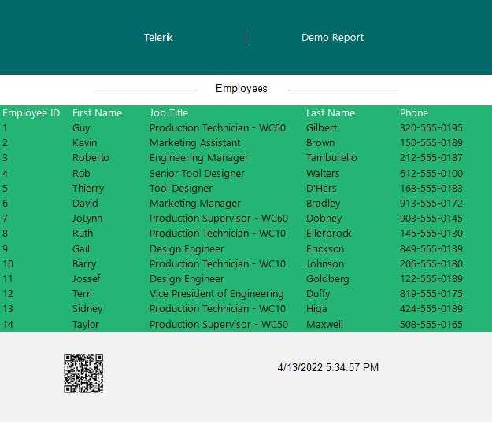
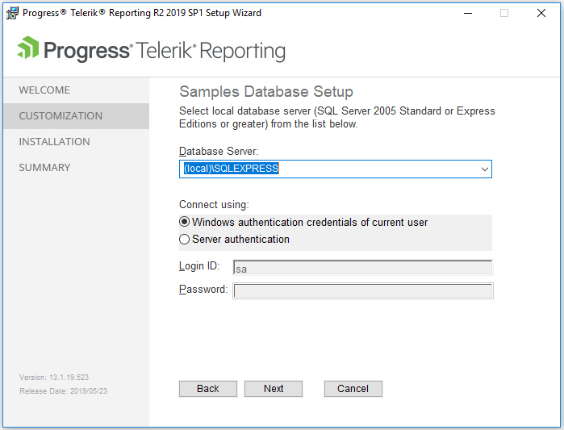
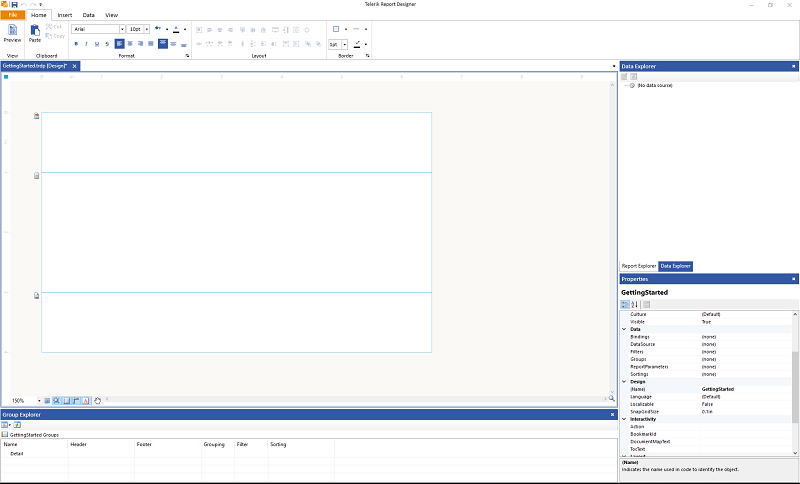
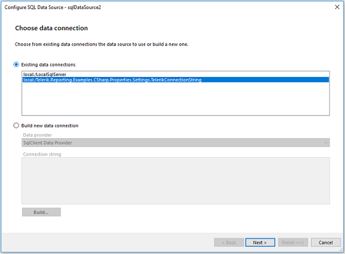
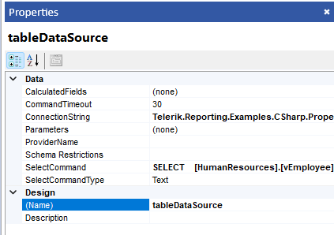

# Designing Your First Telerik Report

This guide targets users who need to quickly get up and running with <a href="https://www.telerik.com/products/reporting/embedded-reporting.aspx" target="_blank">Telerik Reporting</a> and design and export a report.

* First, you will install Telerik Reporting from an MSI file and load the demos.

* Next, you'll create a sample report with the Standalone Report Designer, connect it to data, and visualize the result.

* Then, you will set the report title, header, and footer, and add some basic styling.

* Finally, you will export the report to a PDF file.

At the end, you'll be able to achieve the following result.



For an advanced first-steps scenario on integrating a Telerik Report in an application, refer to the getting started guide on [integrating a report in a web application]().

## Prerequisites

The following prerequisites are required for accomplishing the scenario in this tutorial. For more information on the third-party tooling versions supported by Telerik Reporting, refer to the [list with system requirements](https://www.telerik.com/products/reporting/system-requirements).

* Install Microsoft SQL Server Management Studio.

## Step 1: Install Telerik Reporting

Let's start with the installation of the Telerik Reporting controls, services, and demos:

1. Log in to your [Telerik account](https://www.telerik.com/account). Click __Downloads__ and select __Progress Telerik Reporting__.

1. Download the latest version of the MSI file in the __Installation__ section.

1. In the __Customization__ step, make sure that the Examples are selected for installation.

	The examples use the MS SQL Server AdventureWorks sample database which you will need later for the report.

1. In the __Samples Database Setup__ dialog of the Wizard, select your __Database Server__ and the authentication for the connection.

	The Wizard detects all running instances and lists them in the input field.

	

1. On each subsequent dialog that the Wizard will render, click __Install__ and select __Next__ until the installation is completed.

## Step 2: Create the Sample Report

Next, you'll need to create the report:

1. Navigate to the installation folder, for example, `C:\Program Files (x86)\Progress\Telerik Reporting {{site.suiteversion}}\Report Designer`, and run the `Telerik.ReportDesigner.exe` file which will start the Standalone Designer.

1. Click __New__ > __Blank Report__ and choose a destination for saving the report.

	Each newly created report renders the __pageHeaderSection__, __detailSection__, and __pageFooterSection__ sections. The report also provides the __Report Header__ and __Report Footer__ sections which are hidden by default.

	

## Step 3: Populate the Report with Data

In this step, you'll add the [SqlDataSource component]() and present the fetched data into a table item.

This guide uses the __AdventureWorks__ sample database that may be deployed optionally with the installation of Telerik Reporting examples. The data sources that will be added to the report will generate their data representations.

So, first, let's connect to the data and, then, you'll create the table to present it:

1. Select the predefined connection string in the Standalone Designer by choosing from its toolbar __Data__ > __SQL Data Source__ > __Existing data connections__ > __local:/Telerik.Reporting.Examples.CSharp.Properties.Settings.TelerikConnectionString__.

	

1. Click __Next__ > __Use as a shared connection__ > __Next__.

1. On the screen that loads, fill in the __Select Statement__ field with the query below. The query will extract only the first 14 employees and they will be listed in ascending order according to their `id`, that is, the employee with an `id=1` will be the first one, the employee with an `id=2` will come second, and so on.

	````SQL
SELECT
		[HumanResources].[vEmployee].[EmployeeID] ,
		[HumanResources].[vEmployee].[FirstName],
		[HumanResources].[vEmployee].[LastName],
		[HumanResources].[vEmployee].[JobTitle],
		[HumanResources].[vEmployee].[Phone]
	FROM [HumanResources].[vEmployee]
	WHERE [HumanResources].[vEmployee].[EmployeeID] <= 14
	ORDER BY 1 ASC
````

1. Click __Next__ to execute the query and the __Execute Query...__ button on the next screen to preview the result. Then, click __Finish__.

1. In the __Properties__ pane (__Property Browser__) on the right, change the name of the data source to `tableDataSource` so you can later refer it and render its data in the report.

   

1. Select the __detailSection__ (the middle section of the report). From the toolbar, go to __Insert__ > __Table__ > __Table Wizard__. Under __Data Sources__, select __tableDataSource__ and click __Next__.

1. On the screen that loads, select all listed data source fields and drag them to the __Table Columns__. Click __Next__.

1. From the window that opens, select a predefined style for your table, for example, __Office__. Click __Next__ and __Finish__.

## Step 4: Style the Table and Set Its Title

Now, you may add some styling to the table and define its title.

1. Select the table, and in the __Properties__ pane expand the __Style__ node:

	+ Set __BackgroundColor__ and __BorderColor__ > __Default__ to `34, 181, 115`.

	+ Set __Font > Name__ to `SegoeUI`.

	+ Select the table header and set the __Color__ property to `White`.

1. To set the title of the table, add a [TextBox]() above it:
	
	+ Click the __detailSection__ and select __Insert__ > __Text Box__.
	
	+ In the __Properties__ pane, set the __Value__ of the Text Box to `Employees`. 
	
	+ Center the text by setting __Style__ > __TextAlign__ to `Center`.

1. Let's insert two [Shapes]() on the sides of the title:

	+ Select __Insert__ > __Shape__ from the __Report Items__ section.

	+ Set the __ShapeType__ to `Horizontal Line` and the __Color__ to `Silver`.

## Step 5: Set the Page Header and Footer

In this step, you'll define and style the page header and footer of your report. First, let's start with the header:

1. Click the __pageHeaderSection__. From the __Properties__ pane, select __Style__ > __BackgroundColor__. Set the color to `0, 105, 104`.

1. To add the title, select __Insert__ from the toolbar. Click __TextBox__ to automatically place the TextBox in the header.

1. Set the __Value__ to `Telerik`. Add one more TextBox with text `Demo Report`.

1. Select both TextBoxes by holding the `Shift` or `Ctrl` key while clicking them with the left mouse button. From the __Properties__ pane, apply the following settings:

	+ Set __Style__ > __Font__ > __Name__ to `Segoe UI`.

	+ Set __Style__ > __Color__ to `White`.

	+ Set __Style__ > __TextAlign__ to `Center`.

1. Add a Shape between the TextBoxes. Set the __ShapeType__ to `Vertical Line` and the __LineColor__ property to `White`.

After the report header is all set, let's move on to the footer of the report:

1. Click the __pageFooterSection__. Add a Textbox which will display the current date and time.

1. Set the __Expression__ of the __Value__ property to the `=Now()` [Date and Time function]().

1. To add a barcode item, select __Insert__ > __Barcode__ from the toolbar.

1. Place the link `{{ site.url | remove_first: site.baseurl }}` in the __Value__ field of the __Barcode__. If you receive an error stating that the barcode is too large, change the __Encoder__ to `QRCode`.

1. Set the __BackgroundColor__ of the footer to `242, 242, 242`.

## Step 6: Export the Data to PDF

Here you go with a nice and neat report that provides some basic data to present. If you need to share it, now is the time to export it. For the purposes of this guide, you'll export it to PDF:

1. Go to the __Home__ toolbar item and click __Preview__.

1. Click __Export__ and select __Acrobat (PDF) file__.

1. Save your report document from the pop-up dialog.

That was it! Now you are ready to deep-dive into Telerik Reporting and take full advantage of its more advanced functionalities!

## Next Steps

* [First Steps Guide: Integrating Reports in Applications]()
* [Designing Reports Overview]()
* [About Telerik Reporting]()

## See Also

* [Web Report Designer User Guide]()
