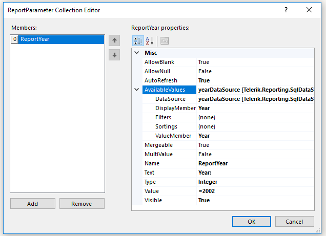
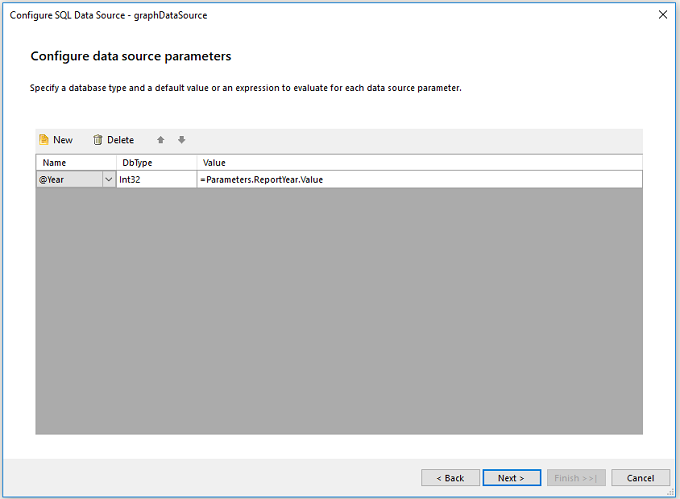
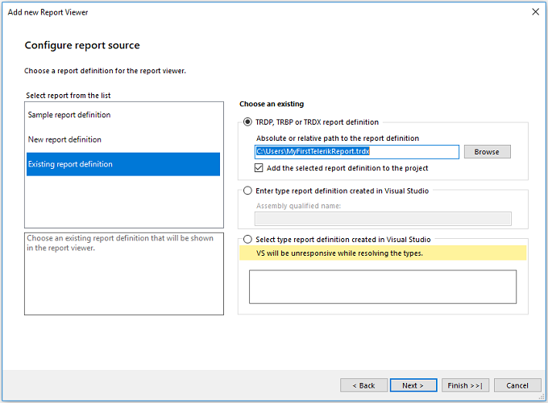

# Integrating Reports in Applications First Steps Guide

This guide targets users who want to build custom reports and, then, present them in applications of their choice. For the purposes of this tutorial, the scenario will deploy the report to the web....? 

* First, you will install Telerik Reporting and create a sample report by using the Telerik templates integrated in Visual Studio.

* Next, you'll add a Graph item to the page header and Graph parameters for the user to choose from. 

* Then, you will add a new graph and visualize the data through the table, and style the report and its items.

* Finally, you will include the report in a web application with the HTML5 Report Viewer.

At the end, you'll be able to achieve the following result. 

.....?? 

For the first-steps scenario on designing a Telerik Report and exporting it to PDF, refer to the getting started guide on [designing a report]().

## Prerequisites 

The following prerequisites are required for accomplishing the scenario in this tutorial. For more information on the third-party tooling versions supported by Telerik Reporting, refer to the [list with system requirements](https://www.telerik.com/products/reporting/system-requirements?_ga=2.82321366.1750314063.1648453324-1000548733.1636637425).

* Install Microsoft SQL Server Management Studio.

## Step 1: Install Telerik Reporting

The steps to accomplish the installation of the Telerik Reporting controls and services are fully described in the [first steps guide on designing the Telerik report](#step-1-install-telerik-reporting).

## Step 2: Create the Sample Report

Next, you'll need to create the report. For the purposes of this guide, you will use the Telerik item templates that are integrated in Visual Studio and will build the report from scratch.

1. Open Visual Studio and go to **File** > **New** to create a new ASP.NET application. Select **Empty** to build a project from the ground up. Click **OK**. 

  As a result, the report is created and Visual Studio presents you with the environment options. 

1. To create a new report viewer page, go to **Add New Item** and select **Telerik HTML5 Report Viewer Page**. 

  As a result, the viewer page is added and Visual Studio rebuilds the project.

1. Now, you'll have to configure the reporting engine that will process the report. As the report will be built from scratch, in the **Configure reporting engine** dialog, incorporate a new REST service end point by selecting the **Create new REST service** checkbox. 

  As a result, you are prompted to choose a report definition. 

1. In the **Configure report source** dialog, for simplicity, select **Sample report definition** provided by Telerik Reporting. Skip **Enable accessibility** and click **Finish**. 

  Now Visual Studio has the needed information, files, and dependencies to create the new project. As a result, a summary screen appears with information about the changes that were made to the project.  

1. You can now view the report on the web. Open the **Report viewer** page where you can see the markup script of the report definition that is generated by Telerik Reporting for displaying the report. Run the application. 

  Your default browser will open and will display the sample report you selected. This sample report is contained in the Telerik HTML5 Report Viewer, which provides a consistent set of controls for navigation and operation. 
 
## Step 3: Add a Graph to the Report Header

Let's now customize the report a bit. In this step, you'll add a graph to the report header and connect it to data. 

1. To show the report header, right-click outside the report and select __Report Header__.             

1. Add a new SQL Datasource component for the graph with the following query:             

    
      ````sql
SELECT
P.Name AS ProductName, SOD.LineTotal / 1000 AS LineTotal,
SOH.OrderDate,
SS.Name AS StoreName,
C.FirstName + ' ' + COALESCE (C.MiddleName, '') + ' ' + C.LastName AS SalesPersonFullName
FROM
Production. Product AS P
INNER JOIN Sales.SalesOrderDetail AS SOD ON P.ProductID = SOD.ProductID
INNER JOIN Sales.SalesOrderHeader AS SOH ON SOD.SalesOrderID = SOH.SalesOrderID
INNER JOIN Sales.Store AS SS             ON SS.CustomerID = SOH.CustomerID
INNER JOIN Sales.SalesPerson AS SP       ON SP.SalesPersonID = SOH.SalesPersonID
INNER JOIN HumanResources.Employee AS E  ON E.EmployeeID = SP.SalesPersonID
INNER JOIN Person.Contact AS C           ON C.ContactID = E.ContactID
WHERE     (YEAR(SOH.OrderDate) = 2002)
````


1. Rename the datasource to __graphDataSource__. 

1. Click __reportHeaderSection__. Select __Insert__ > __Pie__ > __graphDataSource__.             

1. Drag __StoreName__ to __Series__ and __LineTotal__ to __Values__.               

  

1. Click **Finish** and select the newly created Graph to add filtering and sorting.             

1. From the  [Group Explorer]() (Series Groups), click __Filter__ and set the following parameters:             

   + __Expression__ : `=Sum(Fields.LineTotal)`

   + __Operator__ : `Top N`

   + __Value__ : `=5`

1. From the __Group Explorer__ (Series Groups), click __Sorting__ and set the following parameters:             

   + __Expression__ : `=Sum(Fields.LineTotal)`

   + __Direction__ :  `DESC`

1. From the property grid, select the __Color Palette__ option to set the colors for each bar series:             

    ````
Color [A=255, R=0, G=105, B=104],
Color [A=255, R=88, G=168, B=35],
Color [A=255, R=137, G=203, B=42],
Color [A=255, R=34, G=181, B=115],
Color [A=255, R=32, G=176, B=212]
````

1. Add the title of the graph by inserting a __TextBox__ with __Value__ `Top 5 Stores`. Put **Shapes** next to the text.             

## Step 4: Parametrize the Graph 

In this step, you'll add a report parameter and change the data source of the graph so that the user can select a year based on which the graph will display the top five stores.       

1. Add a new SqlDatasource component for the graph with the following query:             

    
      ````sql
SELECT DISTINCT YEAR(OrderDate) AS Year
FROM         Sales.SalesOrderHeader
ORDER BY Year
````


1. Rename the data source to __yearDataSource__.             

1. Right-click outside the report. Select __Report Parameters__ to add the report parameter of the year. Set __ReportYear__ in the following way:               

  

1. Right-click __graphDataSource__. Select __Configure__ and click __Next__ until the __Configure data source command__ is displayed. Change the `WHERE` clause in the following way:             

    
      ````sql
WHERE  (YEAR(SOH.OrderDate) = @Year)
````


1. Set __Configure data source parameters__ dialog in the following way:               

  

1. Set __Configure Design Time Parameters__ in the following way:              

   + __Name__ : `@Year`

   + __Value__ : `2002`. As a result, the year that will be displayed by default will be 2002.

1. Click __Next__ and __Finish__.             

## Step 5: Add a Column Graph

In this step, you'll visualize the data by using a table and a graph, which will display the top five stores per year and per quarter. Then, you'll beautify your report by adding some styles to its items.

1. Click the **Report Header** section. Go to __Insert__ > __Bar__ > __Clustered Bar__ to add the new graph next to the pie chart.             

1. From __Graph Wizard__, select the __graphDataSource__. Drag __StoreName__ to __Categories__,               __OrderDate__ to __Series__, and __Sum(LineTotal)__ to __Values__.             

1. Sort and filter the series groups and the category groups. You can also set specific colors through the __Color palette__ option.  

  Set the series groups in the following way:             

   + __Grouping__ : `=Quarter(Fields.OrderDate)`

   + __Sorting__ : `=Quarter(Fields.OrderDate) ASC`. 
   
   Set the categories groups in the following way:             

   + __Filtering__ : None            

   + __Expression__ : `=Sum(Fields.LineTotal)`

   + __Operator__ : `Top N`

   + __Value__ : `=5`

   + __Sorting__ : `=Quarter(Fields.OrderDate) ASC`


## Step 6: Integrate and Display the Report 

In this final step, you'll integrate your report in an ASP.NET web application and display the project with the HTML5 Report Viewer. 

1. Open __Visual Studio__. Navigate to __File__ > __New__ > __Project__ > __ASP.NET Web Application (.NET Framework Visual C#)__.             

1. Select __Empty project Template__ and click __OK__.             

1. Right-click the project. Select __Add__ > __New Item__ > __Telerik HTML5 Report Viewer Page [version]__. Name the file `index.html`.           

1. In the __Configure reporting engine__ dialog, leave the selections in the same way they are set by default, that is, __REST Service__ > __Create new Rest Service__. Click __Next__.               

  

1. Click __Existing report definition__. Select __Choose an Existing check TRDP, TRDB or TRDX report definition__ to start embedding the report.             

1. Browse to the report location. Click __Next__ > __Next__ > __Finish__.               

  

1. Now, you have to include the connection string in the `web.config` file because of the added named connection string to the report. If the report uses an embedded connection, you do not have to add it again to the Visual Studio project.               

  The connection string looks similar to the following:             

    
      ````xml
<connectionStrings>
<add name="Telerik.Reporting.Examples.CSharp.Properties.Settings.TelerikConnectionString"
connectionString="Data Source=(local)\SQLEXPRESS;Initial Catalog=AdventureWorks;Integrated Security=SSPI"
providerName="System.Data.SqlClient"/>
</connectionStrings>
````

Preview?? 

That was it! Now you are ready to deep-dive into Telerik Reporting and take full advantage of its more advanced functionalities!

## Next Steps

* [Advanced Scenarios: Integrating Reports in Applications First Steps Guide]()
* [Designing Reports Overview]()
* [Group Explorer]()
* [Report Parameter]()