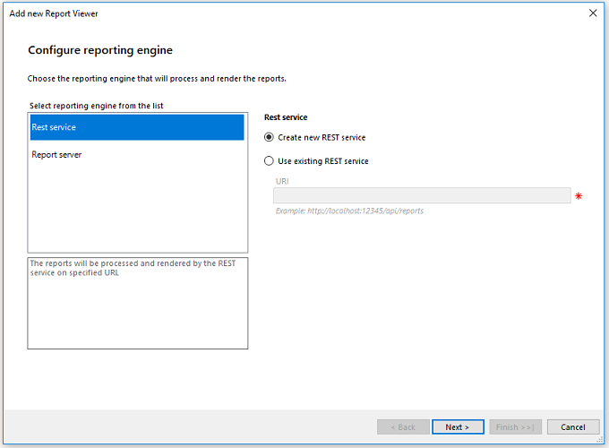
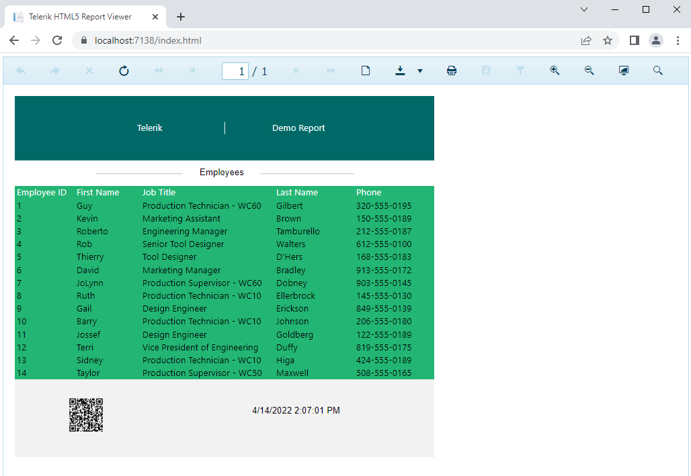

# Integrating Your Telerik Report in Web Applications

This guide targets [users who want to build custom reports and, then, present them in applications of their choice](https://www.telerik.com/products/reporting/embedded-reporting.aspx). For the purposes of this tutorial, the scenario will display the report in an ASP.NET Core application.

* First, you will install Telerik Reporting.

* Next, you will create a sample report by using the Standalone Report Designer.

* Finally, you'll create from scratch an ASP.NET Core application and add an Html5 Report Viewer with the necessary Reporting REST Service through our Visual Studio item template.

At the end, you'll be able to see the report in the web browser, export it in different formats, and print it.

For the first-steps scenario on designing a Telerik Report and exporting it to PDF, refer to the getting started guide on [designing a report]().

## Prerequisites

The following prerequisites are required for accomplishing the scenario in this tutorial. For more information on the third-party tooling versions supported by Telerik Reporting, refer to the [list with system requirements](https://www.telerik.com/products/reporting/system-requirements).

* Install Microsoft SQL Server Management Studio.

## Step 1: Install Telerik Reporting

The steps to accomplish the installation of the Telerik Reporting controls and services are fully described in the [first steps guide on designing the Telerik report](#step-1-install-telerik-reporting).

## Step 2: Create, Populate, and Style the Sample Report

The steps to create, populate with data and style the report are fully described in the steps 2 to 5 from the article [first steps guide on designing the Telerik report](#step-2-create-the-sample-report).

In addition, you will only need to save the report as `DemoReport.trdp`.

## Step 3: Integrate and Display the Report

In this final step, you'll integrate your report in an ASP.NET Core web application in .NET 6 and display the project with the HTML5 Report Viewer.

1. Open __Visual Studio 2022__. From the __Start__ window, choose __Create a new project__.

1. Select __ASP.NET Core Web App__ and name it __TelerikWebApp__. In the __Additional information__ window, select __.NET6.0(Long-term support)__ and leave the rest of the settings as default. Click __Create__.

1. Right-click the project. Select __Add__ > __New Item__ > __Telerik HTML5 Report Viewer Page [version]__. Name the file `index.html`.

1. In the __Configure reporting engine__ dialog, leave the selections in the same way they are set by default, that is, __REST Service__ > __Create new Rest Service__. Click __Next__.

	

1. Click __Sample report definition__ and, then, __Next__ > __Finish__.

1. Run the project to make sure everything works as expected. Navigate to the `index.html` page to make sure you see the sample report.

1. Let's add your own `DemoReport.trdp` report to the application. Note that the Visual Studio Item Template has created a `Reports` folder in your application which contains a default `SampleReport.trdp` report. To add the `DemoReport.trdp` to the same folder, right-click the folder, select __Add__ > __Existing Item__ and navigate to your report.

1. Open the `index.html` file that hosts the HTML5 Report Viewer in the `wwwroot` folder. Find the `reportSource` property of the `#reportViewer1` element that is set up in the `document.ready` event handler of the page. Change its inner `report` element from `"SampleReport.trdp"` to `"DemoReport.trdp"`.

1. Now, you have to include the connection string in the `appsettings.json` file because you added a named connection string to the report. If the report uses an embedded connection, you do not have to add it again to the Visual Studio project.

	The JSON configuration file looks similar to the following:

	````JSON
{
	"Logging": {
		"LogLevel": {
			"Default": "Information",
			"Microsoft.AspNetCore": "Warning"
		}
	},
	"AllowedHosts": "*",
	"ConnectionStrings": [
		{
			"name": "Telerik.Reporting.Examples.CSharp.Properties.Settings.TelerikConnectionString",
			"connectionString": "Data Source=(local)\\MSSQLSERVER01;Initial Catalog=AdventureWorks;Integrated Security=SSPI",
			"providerName": "System.Data.SqlClient"
		}
	]
	}
````

	The following image shows how the viewer will display the report upon running the project and navigating to the `index.html` page in the browser.

	

That was it! Now you are ready to deep-dive into Telerik Reporting and take full advantage of its more advanced functionalities!

## Next Steps

* [Designing Reports Overview]()
* [Group Explorer]()
* [Report Parameter]()
