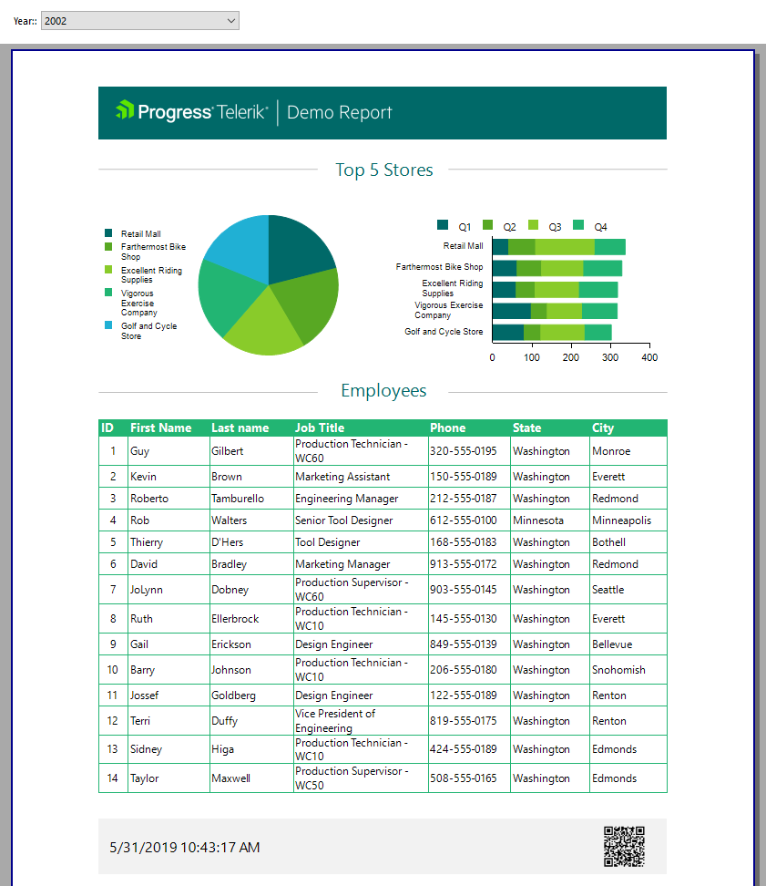

# How to Add Column Graph

visualize the data through a table and graph,         as well as how to style the report and its items. Finally, we will show how to display the report in.NET Application through the Html5 Report Viewer.       

This article is part of the Demo report guide on getting started with Telerik Reporting and demonstrates         how to add a new graph which will display the top five stores per year and per quarter.       

1. Click on the Report Header section and then go to __Insert__ > __Bar__ > __Clustered Bar__             to add the new graph next to the pie chart.             

1. From __Graph Wizard__, use the __graphDataSource__, then drag __StoreName__ to __Categories__,               __OrderDate__ to __Series__, and __Sum(LineTotal)__ to __Values__.             

1. Sort and filter the series groups and the category groups. You can also set specific colors through the __Color palette__ option.             Set the series groups in the folowing way:             

   + __Grouping__ : =Quarter(Fields.OrderDate)

   + __Sorting__ : =Quarter(Fields.OrderDate) ASCSet the cetagories grpups in the following way:             

   + __Filtering__ :                 

   + __Expression__ : =Sum(Fields.LineTotal)

   + __Operator__ : Top N

   + __Value__ : =5

   + __Sorting__ : =Quarter(Fields.OrderDate) ASC

## Previewing the Result

Preview the result by clicking __Preview__ > __PrintPreview__.           

  

## Demo project

You can find the full project in our  [GitHub repository](https://github.com/telerik/reporting-samples/tree/master/FirstStepsProject).         

