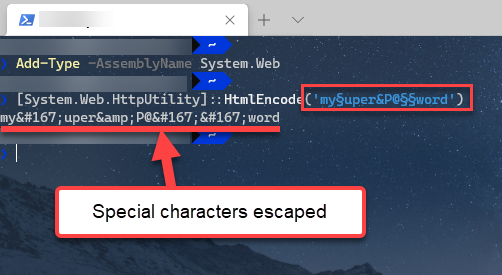

# Adding the Telerik NuGet Feed to Your System

Telerik maintains a publicly accessible NuGet server, providing a collection of NuGet packages to authenticated users. You can add the NuGet feed to your system by using [Visual Studio's NuGet package manager](#setup-in-visual-studio) or the [NuGet CLI](#setup-with-nuget-cli).

To access the NuGet server, you need an active license for Telerik Reporting (trial or commercial).

## Setup in Visual Studio

1. Open Visual Studio.
1. Go to __Tools__ > __NuGet Package Manager__ > __Package Manager Settings__, select __Package Manager Sources__ and click the __+__ button.
1. Choose the feed __Name__, set the feed __URL__ to __https://nuget.telerik.com/v3/index.json__ and click __OK__.

	>caption The Visual Studio NuGet Package Manager and the Telerik NuGet Feed

	

1. Create or load your project.
1. Go to __Tools__ > __NuGet Package Manager__ > __Manage NuGet Packages for solution__.
1. In the upper right-hand corner of the __Manage Packages for Solution__ window, select the Telerik __Package source__ that you just added.
1. Depending on your Visual Studio version, choose the __Online__ or __Browse__ list of packages.
1. In the Windows **Authentication** dialog, enter your Telerik credentials. For example, **user: my.name@my.company.com** and **password: myPassPhraseForTelerikDotCom**.
1. Enter your credentials only once by selecting the __Remember my password__ checkbox. You may need to escape some [special characters in the password](#handling-special-characters-in-password).

	>caption Enter your Telerik.com credentials to access the Telerik NuGet feed

	

After adding the Telerik server, all packages licensed to the authenticated user become available in the Visual Studio NuGet package manager.

## Setup with NuGet CLI

If you work with Visual Studio Code on Linux or Mac OS, use the Nuget CLI to set up the Telerik NuGet feed.

1. Download the latest [NuGet executable](https://dist.nuget.org/win-x86-commandline/latest/nuget.exe).
1. Open a Command Prompt and change the path to the `nuget.exe` location.
1. The command from the example below stores a token in the `%AppData%\NuGet\NuGet.config` file. Your original credentials cannot be obtained from this token.

	````powershell
NuGet Sources Add -Name "telerik.com" -Source "https://nuget.telerik.com/v3/index.json" ^
	-UserName "your login email" -Password "your password"
````

	If you are unable to connect to the feed by using encrypted credentials, store your credentials in clear text.

	````powershell
NuGet Sources Add -Name "telerik.com" -Source "https://nuget.telerik.com/v3/index.json" ^
	-UserName "your login email" -Password "your password" ^
	-StorePasswordInClearText
````

	> Encrypted passwords are only supported on Windows.

	If you have already stored a token instead of storing the credentials as clear text, update the definition in the `%AppData%\NuGet\NuGet.config` file by using the following command:

	````powershell
NuGet Sources Update -Name "telerik.com" -Source "https://nuget.telerik.com/v3/index.json" ^
	-UserName "your login email" -Password "your password" ^
	-StorePasswordInClearText
````


## Handling Special Characters in Password

If your password contains a special character, those characters need to be escaped or it may fail authentication resulting in *Error 401 login failure* from the NuGet server. A common character that needs to be escaped is the ampersand (`&`), but it can be as unique as the section character (`§`). There are two ways to handle this.

1. Change the password so that it only includes characters that do not need to be escaped
1. HTML encodes the password so the special characters are escaped (e.g. `my§uper&P@§§word` becomes `my&sect;uper&amp;P@&sect;&sect;word`).

We strongly discourage entering your password into an online encoder utility, use Powershell instead. Here's one example:

	Add-Type -AssemblyName System.Web
	[System.Web.HttpUtility]::HtmlEncode('my§uper&P@§§word')

Result:



## See Also

* [Restoring NuGet Packages in Your CI Workflow]()
* [NuGet V2 Feed Error about Returned Unexpected 401 Status Code]()
* [Setup a Local NuGet Package Feed]()
