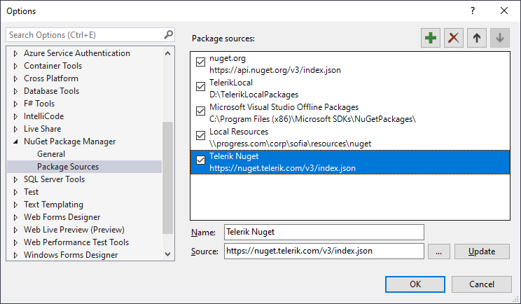

# Adding the Telerik Private NuGet Feed to VS

> The old **https://nuget.telerik.com/nuget** server is deprecated and we encourage our clients to switch to the v3 API. The new v3 API is faster, lighter, and reduces the number of requests from NuGet clients. The **NuGet v2** server at https://nuget.telerik.com/nuget will be sunset in **November 2024**. The new v3 protocol offers faster package searches and restores, improved security, and more reliable infrastructure. To redirect your feed to the NuGet v3 protocol, all you have to do is to change your NuGet package source URL to https://nuget.telerik.com/v3/index.json.  

Telerik provides NuGet packages from the private Telerik NuGet feed which you can add to the Visual Studio NuGet package manager.

## Prerequisites

* Visual Studio 2012 or later.

* Valid Telerik Reporting trial or commercial license.

## Setup

1. Open Visual Studio.
1. Go to __Tools__ > __NuGet Package Manager__ > __Package Manager Settings__, select __Package Manager Sources__ and click the __+__ button.
1. Choose the feed __Name__, set the feed __URL__ to __https://nuget.telerik.com/v3/index.json__ and click __OK__.

	>caption The Visual Studio NuGet Package Manager and the Telerik NuGet Feed

	

1. Create or load your project.
1. Go to __Tools__ > __NuGet Package Manager__ > __Manage NuGet Packages for solution__.
1. In the upper right-hand corner of the __Manage Packages for Solution__ window, select the Telerik __Package source__ that you just added.
1. Depending on your Visual Studio version, choose the __Online__ or __Browse__ list of packages.
1. In the Windows **Authentication** dialog, enter your Telerik credentials. For example, **user: my.name@my.company.com** and **password: myPassPhraseForTelerikDotCom**.
1. Enter your credentials only once by selecting the __Remember my password__ checkbox.

	>caption Enter your Telerik.com credentials to access the Telerik NuGet feed

	

Now all the packages that are licensed to the above users are available in the Visual Studio NuGet Package manager.

> If you work with Visual Studio Code on Linux or Mac OS, use the Nuget CLI to set up the Telerik NuGet feed.

## Setup with NuGet CLI

1. Download the latest [NuGet executable](https://dist.nuget.org/win-x86-commandline/latest/nuget.exe).
1. Open a Command Prompt and change the path to the `nuget.exe` location.
1. The command from the example below stores a token in the `%AppData%\NuGet\NuGet.config` file. Your original credentials cannot be obtained from this token.

	````powershell
NuGet Sources Add -Name "telerik.com" -Source "https://nuget.telerik.com/v3/index.json" ^
	-UserName "your login email" -Password "your password"
````

	If you are unable to connect to the feed by using encrypted credentials, store your credentials in clear text.

	````powershell
NuGet Sources Add -Name "telerik.com" -Source "https://nuget.telerik.com/v3/index.json" ^
	-UserName "your login email" -Password "your password" ^
	-StorePasswordInClearText
````

	> Encrypted passwords are only supported on Windows.

	If you have already stored a token instead of storing the credentials as clear text, update the definition in the `%AppData%\NuGet\NuGet.config` file by using the following command:

	````powershell
NuGet Sources Update -Name "telerik.com" -Source "https://nuget.telerik.com/v3/index.json" ^
	-UserName "your login email" -Password "your password" ^
	-StorePasswordInClearText
````


## See Also

* [Restoring NuGet Packages in Your CI Workflow]()
* [NuGet V2 Feed Error about Returned Unexpected 401 Status Code]()
