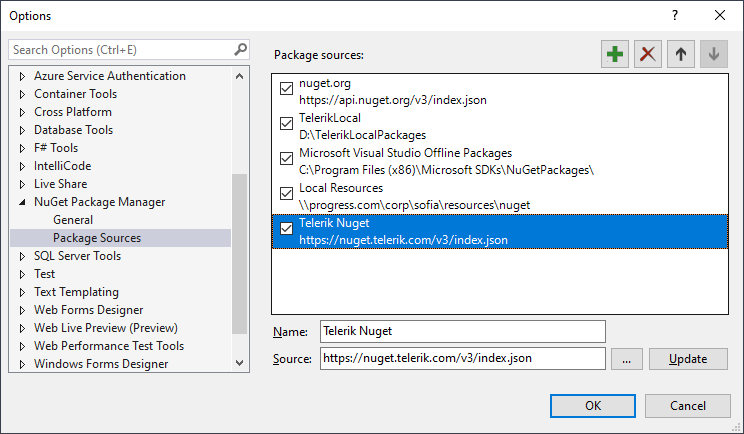
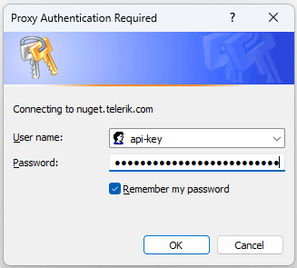
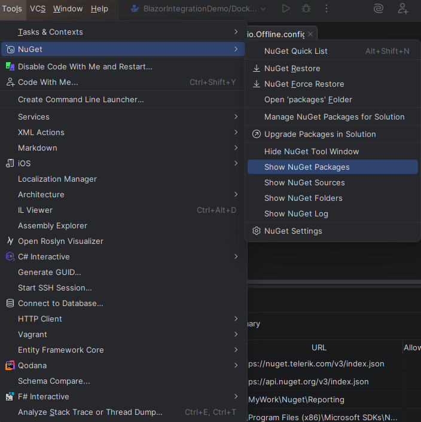
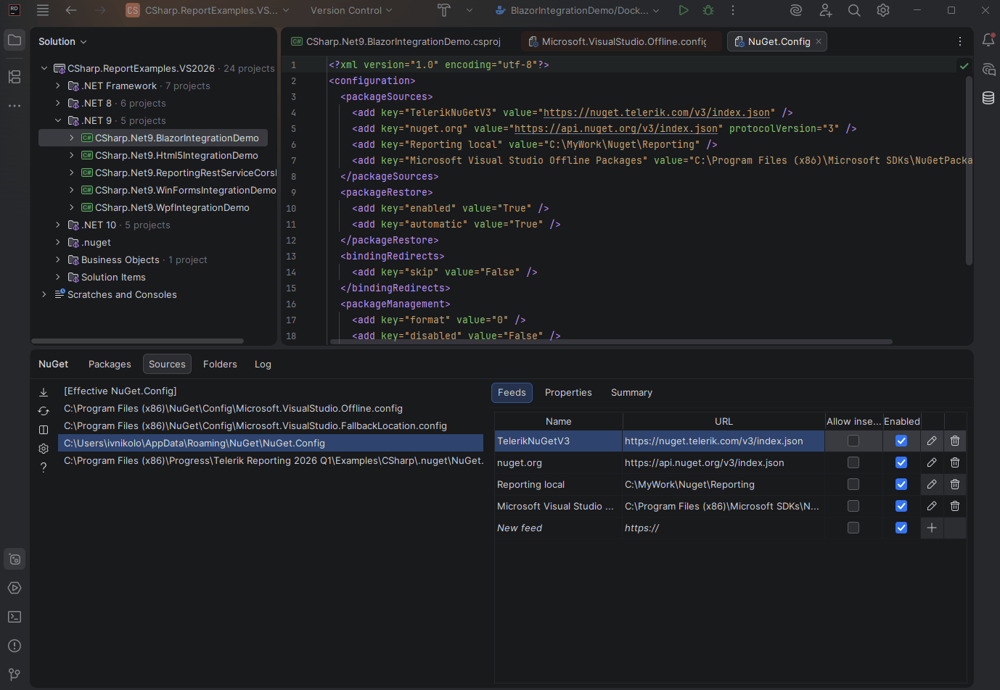

<style> img[alt$="><"] { border: 1px solid lightgrey; } </style>

# Adding the Telerik NuGet Feed to Your System

Use the Telerik NuGet feed to install Telerik Reporting packages in Visual Studio, with the NuGet CLI, or in JetBrains Rider. This article explains how to add the feed, authenticate with an API key.

To access the Telerik NuGet server, you need an active Telerik Reporting license, either trial or commercial, and a Telerik API key that you use instead of a password.

## Before You Start

Before you add the feed, confirm these prerequisites:

* Your Telerik account has access to Telerik Reporting.
* You can sign in to your Telerik account in a browser.
* You are ready to use an API key as the NuGet password.

If Visual Studio never shows a sign-in dialog, you can still complete the setup by using the NuGet CLI or by updating `NuGet.Config` through a tool that stores the credentials for you.

## Generate an API Key

The Telerik NuGet server requires authentication, so the first step is to generate an API key. Use the API key instead of a password when a NuGet client asks for credentials.

Using an API key is more secure than using an account password, especially when you work with [.NET CLI](slug:using-nuget-keys#using-only-cli-commands) or the [`NuGet.Config` file](slug:using-nuget-keys#using-a-nugetconfig-file-with-your-projects).

1. Go to the [API Keys](https://www.telerik.com/account/downloads/api-keys) page in your Telerik account.
1. Click **Generate New Key +**.

   

1. In the **Key Note** field, add a note that describes the API key.
1. Click **Generate Key**.
1. Select **Copy and Close**. Once you close the window, you can no longer copy the generated key. For security reasons, the **API Keys** page displays only a portion of the key.
1. Store the generated NuGet API key as you will need it in the next steps. Whenever you need to authenticate your system with the Telerik NuGet server, use `api-key` as the username and your generated API key as the password.

>important API keys expire after two years. Telerik sends an email when a key is about to expire, but you should also track where you used the key so you can replace it quickly.

## Setup in Visual Studio

Use this method when you install Telerik Reporting packages through the Visual Studio NuGet Package Manager.

1. Open Visual Studio.
1. Go to **Tools** > **NuGet Package Manager** > **Package Manager Settings**.
1. Select **Package Sources** and click **+**.
1. Enter a feed name such as **Telerik**.
1. Set the feed URL to `https://nuget.telerik.com/v3/index.json` and click **OK**.

   >caption The Visual Studio NuGet Package Manager and the Telerik NuGet feed

   

1. Create or load your project.
1. Go to **Tools** > **NuGet Package Manager** > **Manage NuGet Packages for Solution**.
1. In the upper-right corner of the **Manage Packages for Solution** window, select the Telerik **Package source** that you just added.
1. Click the **Browse** tab to see the available packages.
1. If a credentials dialog appears, enter `api-key` in the **User name** field and the [generated API key](#generate-an-api-key) in the **Password** field.

   >caption Credential prompt for the Telerik NuGet feed in Visual Studio

   

After you authenticate successfully, the Telerik packages available to your account appear in the NuGet package list.

## What to Do If No Sign-In Dialog Appears in Visual Studio

Some environments do not show a credentials dialog automatically. That does not block you from using the Telerik feed.

Use these checks and fallback options:

1. Make sure you selected the Telerik package source and clicked **Browse**. In many cases, Visual Studio asks for credentials only when it first queries the feed.
1. If no dialog appears, close the package manager, reopen it, and select the Telerik source again.
1. If the feed still shows no Telerik packages, configure the source with the NuGet CLI by following the steps in [Setup with NuGet CLI](#setup-with-nuget-cli). This path stores the credentials directly and does not depend on a Visual Studio popup.
1. If cached credentials are incorrect or expired, update the Telerik source credentials with the NuGet CLI `Sources Update` command shown later in this article.
1. If you still see only trial packages or no packages, verify that the API key belongs to a Telerik account with access to Telerik Reporting.

>important This article does not depend on a proxy authentication dialog. The supported authentication method is an API key, and you can configure it without any popup by using the NuGet CLI.

## Setup with NuGet CLI

Use the NuGet CLI when you work in Visual Studio Code, on Linux or macOS, in CI environments, or when Visual Studio does not show a credentials dialog.

1. Download the latest [NuGet executable](https://dist.nuget.org/win-x86-commandline/latest/nuget.exe).
1. Open a command prompt and change to the directory that contains `nuget.exe`.
1. Run the following command to store the Telerik feed definition and your API key in `%AppData%\NuGet\NuGet.config`.

   ```powershell
   NuGet Sources Add ^
   -Name "telerik.com" -Source "https://nuget.telerik.com/v3/index.json" ^
   -UserName "api-key" -Password "YOUR-API-KEY" ^
   -StorePasswordInClearText
   ```

If you need to update expired or invalid credentials, run this command:

   ```powershell
   NuGet Sources Update ^
   -Name "telerik.com" -Source "https://nuget.telerik.com/v3/index.json" ^
   -UserName "api-key" -Password "YOUR-API-KEY" ^
   -StorePasswordInClearText
   ```

After you run the command, reopen Visual Studio, Rider, or any other NuGet client so it reloads the updated source configuration.

## Setup in JetBrains Rider

Use this method when you install packages through JetBrains Rider.

1. Open JetBrains Rider.
1. From the main menu, select `Tools` > `NuGet` > `NuGet Quick List`, or press `Alt+Shift+N`.
1. Choose `Show NuGet Packages`.

   

1. At the top of the NuGet tool window, switch to the `Sources` tab.
1. In the left panel, select a specific `NuGet.Config` file, for example `C:\Users\username\AppData\Roaming\NuGet\NuGet.Config`.
1. After selecting a concrete NuGet.Config file, the Feeds list will appear on the right.
1. From this view, you can:
   * Add new package sources.
   * Edit existing feeds.
   * Enable or disable feeds.
   * Review feed URLs and configuration.

   

If Rider does not prompt for Telerik feed credentials, configure the feed first with the NuGet CLI and then reopen Rider.

## Reset Store Credentials

If you previously stored credentials for the Telerik NuGet server, you need to reset them to authenticate with your new API key. Follow these steps:

1. Remove the saved credentials in the [Windows Credential Manager](https://support.microsoft.com/en-us/windows/accessing-credential-manager-1b5c916a-6a16-889f-8581-fc16e8165ac0). These credentials will appear as `nuget.telerik.com` or `VSCredentials_nuget.telerik.com` entries.
1. Remove the Telerik NuGet package source from Visual Studio.
1. If you have added the Telerik package source by using the .NET CLI, try to remove it by running the following commands:
    * [`dotnet nuget list source`](https://docs.microsoft.com/en-us/dotnet/core/tools/dotnet-nuget-list-source)
    * [`dotnet nuget remove source`](https://docs.microsoft.com/en-us/dotnet/core/tools/dotnet-nuget-remove-source)
1. Check if you have any credentials stored in `%AppData%\NuGet\Nuget.Config`. If so, remove them. Here is an example of how your `NuGet.Config` file can look like:

   ```XML 
   <?xml version="1.0" encoding="utf-8"?>
   <configuration>
      <packageSources>
      <add key="nuget.org" value="https://api.nuget.org/v3/index.json" />
      <add key="TelerikOnlineFeed" value="https://nuget.telerik.com/v3/index.json" />
      </packageSources>
      <packageSourceCredentials>
      <TelerikOnlineFeed>
         <add key="Username" value="api-key" />
         <add key="ClearTextPassword" value="Your API KEY" />
      </TelerikOnlineFeed>
      </packageSourceCredentials>
   </configuration>
   ```
1. Try to reset the Visual Studio user data by [forcing NuGet to ask for authentication](https://stackoverflow.com/questions/43550797/how-to-force-nuget-to-ask-for-authentication-when-connecting-to-a-private-feed).
1. Restart Visual Studio.
1. Add the Telerik NuGet package source again through Visual Studio or .NET CLI.

## How to Verify the Feed Setup

After you add the feed and authenticate, confirm that the setup works:

* The Telerik feed appears in your NuGet package sources.
* Telerik Reporting packages are visible when you browse the Telerik source.
* Package installation succeeds without repeated authentication failures.
* If you use the CLI path, the Telerik source is stored in `NuGet.Config` with the expected URL.

## Troubleshoot Common Problems

Use the following checks when the feed still does not work:

* If no sign-in dialog appears, use the CLI method to add or update the Telerik source credentials.
* If you see no Telerik packages, confirm that the Telerik source is selected and the account behind the API key has Telerik Reporting access.
* If authentication keeps failing, generate a new API key and update the stored credentials.
* If the feed worked earlier and stopped working, check whether the API key expired.
* If a corporate network blocks package restore, verify that the system can reach `https://nuget.telerik.com/v3/index.json`.

## See Also

* [Restoring NuGet Packages in Your CI Workflow](slug:using-nuget-keys)
* [NuGet V2 Feed Error about Returned Unexpected 401 Status Code](slug:nuget-feed-returned-unexpected-401-status-error)
* [Setup a Local NuGet Package Feed](slug:setup-local-nuget-feed)
