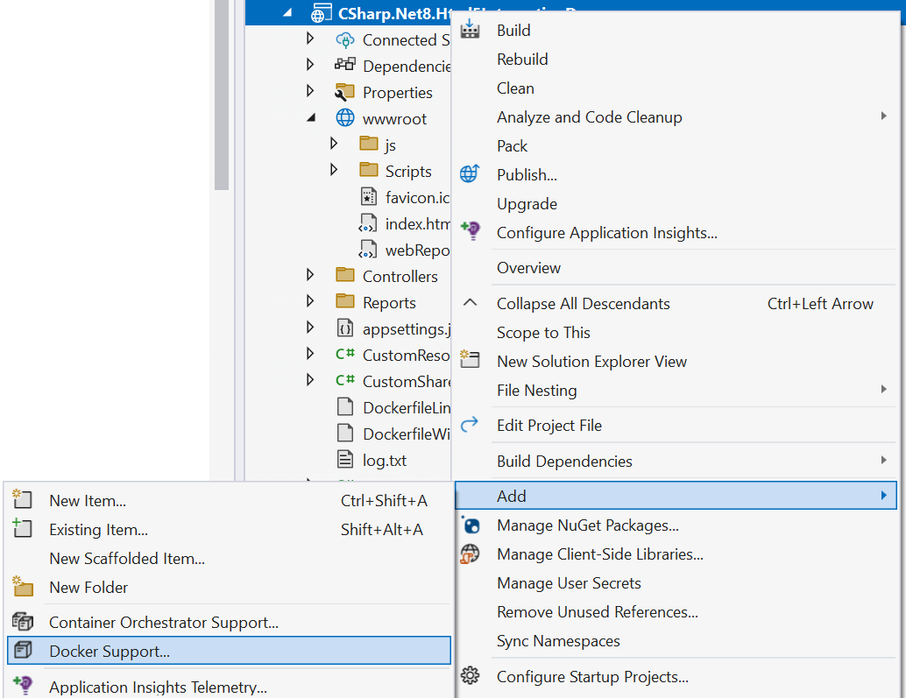
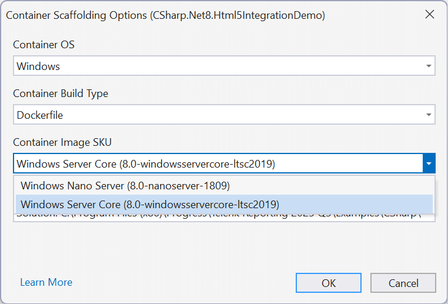

# Available .NET Support for Operating Systems and Docker Containers

Starting with version [`R1 2019 (13.0.19.116)`](https://www.telerik.com/support/whats-new/reporting/release-history/progress-telerik-reporting-r1-2019-13-0-19-116), Telerik Reporting provides a set of assemblies and NuGet packages that are designed for .NET projects and enable you to use Telerik reports in .NET applications on Windows, Linux, and macOS platforms.

The NuGet packages are available in the [Telerik NuGet feed](). Additionally, the assemblies are available in the `\Bin\netstandard2.0\`, `\Bin\net8.0\`, and `\Bin\net8.0-windows\` folders located in the Telerik Reporting installation directory.

The assemblies target .NET Standard 2.0 and the desktop viewers target .NET {{site.mindotnetversion}} or above, which ensures compatibility with a greater variety of frameworks and applications. Also, the NuGet packages resolve the external dependencies to provide better dependency management and code portability.

## Requirements

__.NET {{site.mindotnetversion}}__ or above.

To use NuGet, you are required to provide the following NuGet packages. Note that when using the Telerik NuGet packages, the required dependencies are resolved automatically. Otherwise, you need to add them manually to the project.

| Package Name | Version |
| ------ | ------ |
|`Microsoft.Extensions.Configuration`|2.1.2001|
|`Microsoft.Extensions.Configuration.Binder`|2.1.2001|
|`Microsoft.Extensions.Configuration.Json`|2.1.2001|
|`System.Configuration.ConfigurationManager`|4.5.2000|
|`System.Data.Common`|4.3.2000|
|`System.Data.SqlClient`|4.6.2000|
|`System.Drawing.Common`|4.5.2001|
|`System.IO.Packaging`|4.5.2000|
|`System.Reflection.Emit`|4.3.2000|
|`System.Reflection.Emit.Lightweight`|4.3.2000|
|`System.Runtime.Loader`|4.3.2000|
|`System.Security.Cryptography.Pkcs`|4.5.2001|
|`System.Security.Permissions`|4.5.2000|
|`System.Text.Encoding.CodePages`|4.5.2000|
|`System.Threading.AccessControl`|4.5.2000|
|`sqlite-net-pcl`|1.8.116|

## Features and Limitations

On Windows, the reporting engine still relies on the GDI+ library because it provides the fastest and most convenient way to process text, which is essential to the product.

* For Windows, .NET runtime natively resolves the GDI+ calls.
* For Linux and macOS, you need to install the set of libraries listed below.

Most of the processing and rendering features that work on Windows and use .NET Framework 4 or later are also supported in .NET projects with the new .NET Standard assemblies.

As a downside, the report item designers are not .NET Standard-compatible. As a result, no design-time support in Visual Studio is available, and type reports are not supported. Therefore, you are recommended to [convert]() such reports to `.trdx` or `.trdp` definitions with the Standalone Report Designer.

Also, you can use these classes as runtime-created report instances. You can use report definitions created in Visual Studio as report instances in .NET applications, but their code must not include any calls to CodeDOM-specific classes like `ResourceManager`.

Telerik Reporting supports the following functionalities:

* All rendering extensions except MHTML (HTML archive), XPS (XML Paper Specification), and XLS (Microsoft Excel 97 - 2003).
* HTML, PDF, and OpenXML-based renderings are supported on Linux and macOS. Due to graphics library incompatibilities, in some cases, Graph-based items in the OpenXML renderings are incorrectly displayed.
* All report items except the obsolete Chart item are supported.
* The supported report definition types are `TRDX`, `TRDP`, and report classes created in Visual Studio without the VS designer-specific code.
* Telerik Reporting supports the following Data Source components:

	+ [SqlDataSource]()
	+ [CsvDataSource]()
	+ [WebServiceDataSource]()
	+ [JsonDataSource]()
	+ [ObjectDataSource]()

* The [JSON-based reporting configuration]() is also supported. For CLI projects, the JSON configuration has precedence over the current XML-based reporting configuration.

## Deploying on Linux

### Using `SkiaSharp`

Starting with [R3 2023 (17.2.23.1010)](https://www.telerik.com/support/whats-new/reporting/release-history/progress-telerik-reporting-r3-2023-17-2-23-1010), we introduced a SkiaSharp-based graphics engine, which is cross-platform. The active graphics engine is determined by the value of the __engineName__ element of the [processing Element](), which corresponds with the members of the [Telerik.Drawing.Contract.GraphicsEngine enumeration](/api/telerik.drawing.contract.graphicsengine).

When using SkiaSharp, reference the `Telerik.Drawing.Skia` NuGet package or assembly.

The next libraries should also be referenced when using SkiaSharp. The snippet is relevant for Ubuntu or Debian and may differ for other Linux distributions:

````
sudo apt-get update
sudo apt-get install -y libfreetype6
sudo apt-get install -y libfontconfig1
````

### Using System.Drawing(`libgdiplus`)

> System.Drawing for .NET 8+ is not supported on non-Windows platforms (Linux and MacOS) due to a breaking change introduced by Microsoft, as explained in [System.Drawing.Common is not supported on non-Windows platforms]()

When deploying to a Linux machine, make sure you have the [libgdiplus](https://www.mono-project.com/docs/gui/libgdiplus/) library installed. The library is a Mono implementation of the GDI+ API for non-Windows operating systems.

The following snippet demonstrates how to update and install the necessary libraries on Ubuntu or Debian:

````
sudo apt-get update
sudo apt-get install libc6-dev
sudo apt-get install libgdiplus
````


>note The library [libgdiplus](https://www.mono-project.com/docs/gui/libgdiplus/) returns as a Family Font Name the `Preferred Family` rather than the `Family` name from the font meta information. Details may be found in [Font.Name returns incorrect results on Linux](https://github.com/mono/libgdiplus/issues/617). The two names may be different in the general case. In such a scenario, the font should be referenced with its `Family` name for Windows and `Preferred Family` name for Linux.
>
> In the rare case when the `Preferred Family` name of two fonts coincide and the `Family` names are different, on Linux, only the second font registered as private would be respected, as it will override the first one.

### Common Configurations

Since the `libgdiplus` and `SkiaSharp` libraries are not perfect replacements for the Windows graphics library, the rendered reports may differ in terms of text positioning, word-wrapping, and alignment. These problems mostly affect the [Image rendering extension]() and, therefore, it is not recommended to use it.

The following JSON configuration snippet hides the Image rendering extension from the list of available rendering extensions:

````JSON
"telerikReporting": {
	"extensions": [
		{
			"name": "IMAGE",
			"visible": "false"
		}
	]
}
````

On the Linux machine, you also need to install the fonts you use in the reports. Otherwise, the font substitution algorithm will replace them with a system font. When rendering a PDF document, the fonts get resolved only if they are listed in the [`<privateFonts>`]() configuration element.

## Deploying on macOS

### Using `SkiaSharp`

Starting with [R3 2023 (17.2.23.1010)](https://www.telerik.com/support/whats-new/reporting/release-history/progress-telerik-reporting-r3-2023-17-2-23-1010), we introduced a SkiaSharp-based graphics engine, which is cross-platform. The active graphics engine is determined by the value of the __engineName__ element of the [processing Element](), which corresponds with the members of the [Telerik.Drawing.Contract.GraphicsEngine enumeration](/api/telerik.drawing.contract.graphicsengine).

To use .NET on macOS:

1. Install [.NET for macOS](https://learn.microsoft.com/en-us/dotnet/core/install/macos).
1. Create your .NET application or copy an existing one from a Windows machine.
1. Add the `nuget.config` file with a path to your NuGet repository and [set up the Telerik NuGet Feed]().
1. Install the `Telerik.Drawing.Skia` NuGet package.
1. Add a section in the `appsettings.json` file for any font fallback.
1. Run the following command to build the project and run the application. If you run the project in debug mode, Visual Studio Code will ask you to add the debug configuration to the `launch.json` file.

	`dotnet build`

### Using System.Drawing(`libgdiplus`)

> System.Drawing for .NET 8+ is not supported on non-Windows platforms (Linux and MacOS) due to a breaking change introduced by Microsoft, as explained in [System.Drawing.Common is not supported on non-Windows platforms]()

To use .NET on macOS:

1. Install [.NET for macOS](https://learn.microsoft.com/en-us/dotnet/core/install/macos).
1. Install [libgdiplus](https://www.mono-project.com/docs/gui/libgdiplus/) by using [Homebrew](https://brew.sh/).

	`brew install mono-libgdiplus`

1. Create your .NET application or copy an existing one from a Windows machine.
1. Add the `nuget.config` file with a path to your NuGet repository and [set up the Telerik NuGet Feed]().
1. Add a section in the `appsettings.json` file for any font fallback.
1. Run the following command to build the project and run the application. If you run the project in debug mode, Visual Studio Code will ask you to add the debug configuration to the `launch.json` file.

	`dotnet build`

## Using Container Platforms

You can use Telerik Reporting in a Docker image if it meets the graphics engine requirements.

To use Telerik Reporting in a Windows container, target a Windows-based image with GDI support. The same approach is [recommended by Microsoft](https://learn.microsoft.com/en-us/virtualization/windowscontainers/manage-containers/container-base-images#choosing-a-base-image).

The Microsoft-distributed `microsoft/windowsservercore` images contain the GDI+ graphics library. However, their size is significantly bigger than the size of the .NET runtime in a Linux container. Such a container requires you to install only the libgdiplus library and its accompanying libraries.

>tip Some Docker Containers are created with __invariant culture__. This means that the locales like currency symbol ('$' in 'en-US') may appear unexpected. Use the following code in the Dockerfile to add your culture ('en-US' in the example) to the container:
>
> `ENV DOTNET_SYSTEM_GLOBALIZATION_INVARIANT=false LC_ALL=en_US.UTF-8 LANG=en_US.UTF-8`
>
> __LC_ALL__ stands for all locales, and __LANG__ stands for the language.

### Linux Docker Container with `SkiaSharp`

Starting with [R3 2023 (17.2.23.1010)](https://www.telerik.com/support/whats-new/reporting/release-history/progress-telerik-reporting-r3-2023-17-2-23-1010), we introduced a SkiaSharp-based graphics engine, which is cross-platform. The active graphics engine is determined by the value of the __engineName__ element of the [processing Element](), which corresponds with the members of the [Telerik.Drawing.Contract.GraphicsEngine enumeration](/api/telerik.drawing.contract.graphicsengine).

When using SkiaSharp, reference the `Telerik.Drawing.Skia` NuGet package or assembly.

The next libraries should also be referenced when using SkiaSharp. The snippet is relevant for Ubuntu or Debian and may differ for other Linux distributions:

````
FROM microsoft/dotnet:7.0-runtime AS base
RUN apt-get update && \
    apt-get install -y libfreetype6 libfontconfig1
````

### Linux Docker Container with System.Drawing(`libgdiplus`)

The following `dockerfile` snippet demonstrates how to achieve the desired outcome. When these three libraries are installed, Telerik Reporting will run on the produced Docker image.

````
FROM microsoft/dotnet:6.0-runtime AS base
RUN apt-get update \
	&& apt-get install -y --allow-unauthenticated \
		libc6-dev \
		libgdiplus \
		libx11-dev \
	&& rm -rf /var/lib/apt/lists/*
````

### Windows Docker Container with System.Drawing

Ensure the base image supports GDI+. For example, use the `windowsservercore` from the [Container Base Images](https://learn.microsoft.com/en-us/virtualization/windowscontainers/manage-containers/container-base-images). The option is available from the `Add` > `Docker Support...` choice of the project's Context Menu:



You need to select it from the pop-up configuration window:



Here is sample code from the autogenerated Docker file:

````
FROM mcr.microsoft.com/dotnet/aspnet:8.0-windowsservercore-ltsc2022 AS base
WORKDIR /app
EXPOSE 8080
FROM mcr.microsoft.com/dotnet/sdk:windowsservercore-ltsc2022 AS build
# ...
````

## Sample Projects

Telerik Reporting ships with ready-made .NET examples demonstrating how to show the sample reports in an ASP.NET Core, WinForms, and WPF application. The ASP.NET Core demo also shows how to inject an `appsettings.json` configuration file to the controller and how to initialize a WebHostBuilder so it runs under Windows and Linux.

Sample projects are available in the subfolders with the corresponding framework names in the `\Examples\CSharp` subfolder of the Telerik Reporting installation directory. For example, our .NET 8 ASP.NET Core demo may be found by default in `C:\Program Files (x86)\Progress\Telerik Reporting {{site.suiteversion}}\Examples\CSharp\.NET {{site.mindotnetversion}}\Html5IntegrationDemo`.

### Docker Samples

With [2024 Q2 (18.1.24.514)](https://www.telerik.com/support/whats-new/reporting/release-history/progress-telerik-reporting-2024-q2-18-1-24-514), we started distributing sample Docker files for deploying the Telerik Reporting Web Examples for .NET with Skia Sharp Graphics Engine on Linux Docker containers. The distributed Docker files should be used to build the Docker image from the terminal. They are unsuitable for use with Visual Studio due to the specific folder structure of the Reporting examples. The Visual Studio projects use, by default, TRDP reports deployed in a folder that cannot be accessed by the Docker file when run from Visual Studio.

The Docker files may be found in the folder of the corresponding project. For example, the `Dockerfile` for the .NET 8 Telerik Reporting REST Service project with enabled CORS may be found by default in `C:\Program Files (x86)\Progress\Telerik Reporting {{site.suiteversion}}\Examples\CSharp\.NET {{site.mindotnetversion}}\ReportingRestServiceCorsDemo`. The Dockerfile starts with instructions for building the image and running the Docker container. Replace the placeholders in the curly brackets with the corresponding details: __TelerikNuGetApiKey__, __Telerik Reporting Installation Folder__, and __Connection String to AdventureWorks Database Accessible From the Docker Container__. Here is a sample of the file's content. The deployed Reporting REST Service project with enabled CORS will run on `localhost:4040` in the browser:

````
# command to BUILD docker IMAGE from the Windows Terminal:
# docker image build -f "{Replace With Installation Folder}\Examples\CSharp\.NET {{site.mindotnetversion}}\ReportingRestServiceCorsDemo\Dockerfile" -t net8reportingrestservicecorsdemo --build-arg TelerikNugetServerApiKey={Replace With Your TelerikNuGetApiKey} "{Replace With Installation Folder}"

# command to RUN docker CONTAINER from the Windows Terminal:
# docker run -e ConnectionStrings__Telerik.Reporting.Examples.CSharp.Properties.Settings.TelerikConnectionString__connectionString="{Replace With Connection String to AdventureWorks Database Accessible From the Docker Container}" -it -p 4040:8080 net8reportingrestservicecorsdemo


#See https://aka.ms/customizecontainer to learn how to customize your debug container and how Visual Studio uses this Dockerfile to build your images for faster debugging.
FROM mcr.microsoft.com/dotnet/aspnet:8.0 AS base

WORKDIR /app
EXPOSE 8080

RUN apt-get update && \
    apt-get install -y libfreetype6 libfontconfig1

FROM mcr.microsoft.com/dotnet/sdk:8.0 AS build
ARG BUILD_CONFIGURATION=Release
WORKDIR /src

COPY ["Report Designer/Examples", "Reports"]
COPY ["Examples/CSharp/.NET 8/ReportingRestServiceCorsDemo", ".NET 8/ReportingRestServiceCorsDemo/"]
COPY ["Examples/CSharp/Business Objects", "Business Objects/"]
COPY ["Examples/CSharp/nuget.config", ""]

ARG TelerikNugetServerApiKey
ENV TelerikNugetServer_API_KEY $TelerikNugetServerApiKey

RUN dotnet restore "/src/.NET 8/ReportingRestServiceCorsDemo/CSharp.Net8.ReportingRestServiceCorsDemo.csproj"

WORKDIR "/src/.NET 8/ReportingRestServiceCorsDemo"
RUN dotnet build "./CSharp.Net8.ReportingRestServiceCorsDemo.csproj" -c $BUILD_CONFIGURATION -o /app/build

FROM build AS publish
ARG BUILD_CONFIGURATION=Release
RUN dotnet publish "./CSharp.Net8.ReportingRestServiceCorsDemo.csproj" -c $BUILD_CONFIGURATION -o /app/publish /p:UseAppHost=false

FROM base AS final
WORKDIR /app/Examples/CSharp/NET8/ReportingRestServiceCorsDemo
COPY --from=publish /app/publish .
COPY --from=build ["/src/Reports", "/app/Report Designer/Examples"]
ENTRYPOINT ["dotnet", "CSharp.Net8.ReportingRestServiceCorsDemo.dll"]
````

## See Also

* [ASP.NET Core Web API Implementation Overview]()
* [Adding Report Viewers to Windows Forms .NET Projects]()
* [Adding Report Viewers to WPF .NET Projects]()
