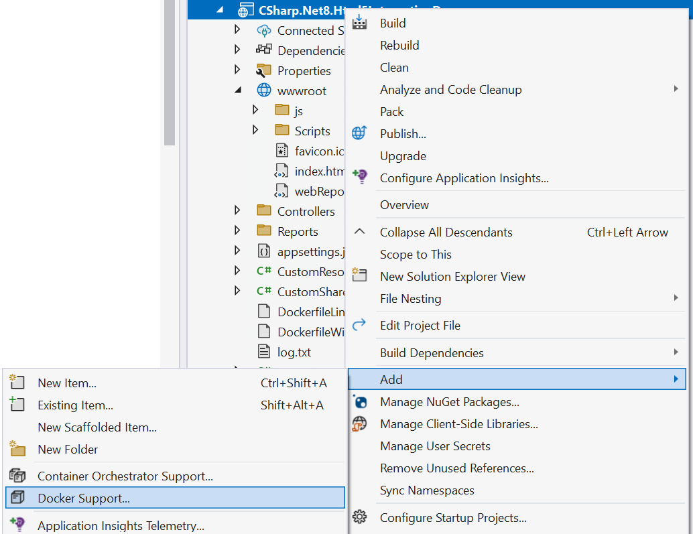
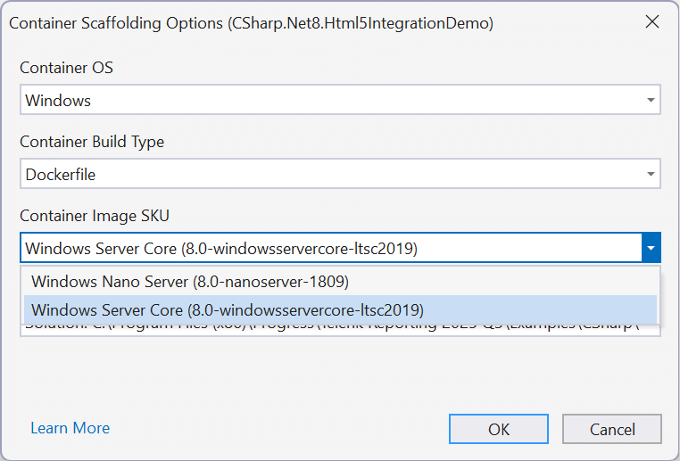

# Available .NET Support for Operating Systems and Docker Containers

Starting with version [`R1 2019 (13.0.19.116)`](https://www.telerik.com/support/whats-new/reporting/release-history/progress-telerik-reporting-r1-2019-13-0-19-116), Telerik Reporting provides a set of assemblies and NuGet packages that are designed for .NET projects and enable you to use Telerik reports in .NET applications on Windows, Linux, and macOS platforms.

The NuGet packages are available in the [Telerik NuGet feed](slug:telerikreporting/using-reports-in-applications/how-to-add-the-telerik-private-nuget-feed-to-visual-studio). Additionally, the assemblies are available in the `\Bin\netstandard2.0\`, `\Bin\net8.0\`, and `\Bin\net8.0-windows\` folders located in the Telerik Reporting installation directory.

The assemblies target .NET Standard 2.0 and the desktop viewers target .NET {{site.mindotnetversion}} or above, which ensures compatibility with a greater variety of frameworks and applications. Also, the NuGet packages resolve the external dependencies to provide better dependency management and code portability.

## Requirements

**.NET {{site.mindotnetversion}}** or above.

To use NuGet, you are required to provide the following NuGet packages. Note that when using the Telerik NuGet packages, the required dependencies are resolved automatically. Otherwise, you need to add them manually to the project.

| Package Name                                | Version  |
| ------------------------------------------- | -------- |
| `Microsoft.Extensions.Configuration`        | 2.1.2001 |
| `Microsoft.Extensions.Configuration.Binder` | 2.1.2001 |
| `Microsoft.Extensions.Configuration.Json`   | 2.1.2001 |
| `System.Configuration.ConfigurationManager` | 4.5.2000 |
| `System.Data.Common`                        | 4.3.2000 |
| `System.Data.SqlClient`                     | 4.6.2000 |
| `System.Drawing.Common`                     | 4.5.2001 |
| `System.IO.Packaging`                       | 4.5.2000 |
| `System.Reflection.Emit`                    | 4.3.2000 |
| `System.Reflection.Emit.Lightweight`        | 4.3.2000 |
| `System.Runtime.Loader`                     | 4.3.2000 |
| `System.Security.Cryptography.Pkcs`         | 4.5.2001 |
| `System.Security.Permissions`               | 4.5.2000 |
| `System.Text.Encoding.CodePages`            | 4.5.2000 |
| `System.Threading.AccessControl`            | 4.5.2000 |
| `sqlite-net-pcl`                            | 1.8.116  |

## Features and Limitations

On Windows, the reporting engine still relies on the GDI+ library because it provides the fastest and most convenient way to process text, which is essential to the product.

- For Windows, .NET runtime natively resolves the GDI+ calls.
- For Linux and macOS, you need to install the set of libraries listed below.

Most of the processing and rendering features that work on Windows and use .NET Framework 4 or later are also supported in .NET projects with the new .NET Standard assemblies.

As a downside, the report item designers are not .NET Standard-compatible. As a result, no design-time support in Visual Studio is available, and type reports are not supported. Therefore, you are recommended to [convert](slug:telerikreporting/designing-reports/report-designer-tools/desktop-designers/standalone-report-designer/how-to-import-reports-created-with-the-vs-report-designer) such reports to `.trdx` or `.trdp` definitions with the Standalone Report Designer.

Also, you can use these classes as runtime-created report instances. You can use report definitions created in Visual Studio as report instances in .NET applications, but their code must not include any calls to CodeDOM-specific classes like `ResourceManager`.

Telerik Reporting supports the following functionalities:

- All rendering extensions except MHTML (HTML archive), XPS (XML Paper Specification), and XLS (Microsoft Excel 97 - 2003).
- HTML, PDF, and OpenXML-based renderings are supported on Linux and macOS. Due to graphics library incompatibilities, in some cases, Graph-based items in the OpenXML renderings are incorrectly displayed.
- All report items except the obsolete Chart item are supported.
- The supported report definition types are `TRDX`, `TRDP`, and report classes created in Visual Studio without the VS designer-specific code.
- Telerik Reporting supports the following Data Source components:

  - [SqlDataSource](slug:telerikreporting/designing-reports/connecting-to-data/data-source-components/sqldatasource-component/overview)
  - [CsvDataSource](slug:telerikreporting/designing-reports/connecting-to-data/data-source-components/csvdatasource-component/overview)
  - [WebServiceDataSource](slug:telerikreporting/designing-reports/connecting-to-data/data-source-components/webservicedatasource-component/overview)
  - [JsonDataSource](slug:telerikreporting/designing-reports/connecting-to-data/data-source-components/jsondatasource-component)
  - [ObjectDataSource](slug:telerikreporting/designing-reports/connecting-to-data/data-source-components/objectdatasource-component/overview)

- The [JSON-based reporting configuration](slug:telerikreporting/using-reports-in-applications/export-and-configure/configure-the-report-engine/overview) is also supported. For CLI projects, the JSON configuration has precedence over the current XML-based reporting configuration.

## Deploying on Linux

Starting with [R3 2023 (17.2.23.1010)](https://www.telerik.com/support/whats-new/reporting/release-history/progress-telerik-reporting-r3-2023-17-2-23-1010), we introduced a SkiaSharp-based graphics engine, which is cross-platform. The active graphics engine is determined by the value of the **engineName** element of the [processing Element](slug:telerikreporting/using-reports-in-applications/export-and-configure/configure-the-report-engine/processing-element), which corresponds with the members of the [Telerik.Drawing.Contract.GraphicsEngine enumeration](/api/telerik.drawing.contract.graphicsengine).

For .NET 8+ applications on Linux, you must use the SkiaSharp graphics engine, so reference the `Telerik.Drawing.Skia` NuGet package or assembly in your project hosting the Reporting service or engine.

The following libraries should also be installed as required by SkiaSharp. The snippet is relevant for Ubuntu or Debian and may differ for other Linux distributions:

```bash
sudo apt-get update
sudo apt-get install -y libfreetype6
sudo apt-get install -y libfontconfig1
```

Since the `SkiaSharp` library is not a perfect replacement for the Windows graphics library, the rendered reports may differ in terms of text positioning, word-wrapping, and alignment. These problems mostly affect the [Image rendering extension](slug:telerikreporting/designing-reports/rendering-and-paging/design-considerations-for-report-rendering/image-rendering-design-considerations) and, therefore, it is not recommended to use it.

The following JSON configuration snippet hides the Image rendering extension from the list of available rendering extensions:

{{source=CodeSnippets\Blazor\Docs\JSON\DotNetCoreExtensionsConfig.json region=DotNetCoreHideExtension}}

On the Linux machine, you also need to install the fonts you use in the reports. Otherwise, the font substitution algorithm will replace them with a system font. When rendering a PDF document, the fonts get resolved only if they are listed in the [`<privateFonts>`](slug:telerikreporting/using-reports-in-applications/export-and-configure/configure-the-report-engine/privatefonts-element) configuration element.

## Deploying on macOS

Starting with [R3 2023 (17.2.23.1010)](https://www.telerik.com/support/whats-new/reporting/release-history/progress-telerik-reporting-r3-2023-17-2-23-1010), we introduced a SkiaSharp-based graphics engine, which is cross-platform. The active graphics engine is determined by the value of the **engineName** element of the [processing Element](slug:telerikreporting/using-reports-in-applications/export-and-configure/configure-the-report-engine/processing-element), which corresponds with the members of the [Telerik.Drawing.Contract.GraphicsEngine enumeration](/api/telerik.drawing.contract.graphicsengine).

To use .NET on macOS:

1. Install [.NET for macOS](https://learn.microsoft.com/en-us/dotnet/core/install/macos).
1. Create your .NET application or copy an existing one from a Windows machine.
1. Add the `nuget.config` file with a path to your NuGet repository and [set up the Telerik NuGet Feed](slug:telerikreporting/using-reports-in-applications/how-to-add-the-telerik-private-nuget-feed-to-visual-studio).
1. Install the `Telerik.Drawing.Skia` NuGet package.
1. Add a section in the `appsettings.json` file for any font fallback.
1. Run the following command to build the project and run the application. If you run the project in debug mode, Visual Studio Code will ask you to add the debug configuration to the `launch.json` file.

   ```zsh
   dotnet build
   ```

## Using Container Platforms

You can use Telerik Reporting in a Docker image if it meets the graphics engine requirements.

To use Telerik Reporting in a Windows container, target a Windows-based image with GDI support. The same approach is [recommended by Microsoft](https://learn.microsoft.com/en-us/virtualization/windowscontainers/manage-containers/container-base-images#choosing-a-base-image).

> tip Some Docker Containers are created with **invariant culture**. This means that the locales like currency symbol ('$' in 'en-US') may appear unexpected. Use the following code in the Dockerfile to add your culture ('en-US' in the example) to the container:
>
> `ENV DOTNET_SYSTEM_GLOBALIZATION_INVARIANT=false LC_ALL=en_US.UTF-8 LANG=en_US.UTF-8`
>
> **LC_ALL** stands for all locales, and **LANG** stands for the language.

### Linux Docker Container

Starting with [R3 2023 (17.2.23.1010)](https://www.telerik.com/support/whats-new/reporting/release-history/progress-telerik-reporting-r3-2023-17-2-23-1010), we introduced a SkiaSharp-based graphics engine, which is cross-platform. The active graphics engine is determined by the value of the **engineName** element of the [processing Element](slug:telerikreporting/using-reports-in-applications/export-and-configure/configure-the-report-engine/processing-element), which corresponds with the members of the [Telerik.Drawing.Contract.GraphicsEngine enumeration](/api/telerik.drawing.contract.graphicsengine).

In Linux containers (for .NET 8+), use the SkiaSharp graphics engine, so reference the `Telerik.Drawing.Skia` NuGet package or assembly in your project hosting the Reporting service or engine.

The following libraries should also be installed in the Docker image as required by SkiaSharp. The snippet is relevant for Ubuntu or Debian and may differ for other Linux distributions:

{{source=CodeSnippets\Blazor\Docs\Dockerfiles\LinuxDockerWithSkiaAddLibs.dockerfile}}

> tip For the report to be rendered as close as possible in the container as it did on Windows, it is recommended that the fonts used within the report are installed on the image. See the [Installing Fonts In Docker Environment](slug:system-null-reference-exception-docker) article for more details.

### Windows Docker Container with System.Drawing

Ensure the base image supports GDI+. For example, use the `windowsservercore` from the [Container Base Images](https://learn.microsoft.com/en-us/virtualization/windowscontainers/manage-containers/container-base-images). The option is available from the `Add` > `Docker Support...` choice of the project's Context Menu:



You need to select it from the pop-up configuration window:



Here is sample code from the autogenerated Docker file:

{{source=CodeSnippets\Blazor\Docs\Dockerfiles\WindowsDockerWithGdiAddLibs.dockerfile}}

## Sample Projects

Telerik Reporting ships with ready-made .NET examples demonstrating how to show the sample reports in an ASP.NET Core, WinForms, and WPF application. The ASP.NET Core demo also shows how to inject an `appsettings.json` configuration file to the controller and how to initialize a WebHostBuilder so it runs under Windows and Linux.

Sample projects are available in the subfolders with the corresponding framework names in the `\Examples\CSharp` subfolder of the Telerik Reporting installation directory. For example, our .NET 8 ASP.NET Core demo may be found by default in `C:\Program Files (x86)\Progress\Telerik Reporting {{site.suiteversion}}\Examples\CSharp\.NET {{site.mindotnetversion}}\Html5IntegrationDemo`.

### Docker Samples

With [2024 Q2 (18.1.24.514)](https://www.telerik.com/support/whats-new/reporting/release-history/progress-telerik-reporting-2024-q2-18-1-24-514), we started distributing sample Docker files for deploying the Telerik Reporting Web Examples for .NET with Skia Sharp Graphics Engine on Linux Docker containers. The distributed Docker files should be used to build the Docker image from the terminal. They are unsuitable for use with Visual Studio due to the specific folder structure of the Reporting examples. The Visual Studio projects use, by default, TRDP reports deployed in a folder that cannot be accessed by the Docker file when run from Visual Studio.

The Docker files may be found in the folder of the corresponding project. For example, the `Dockerfile` for the .NET 8 Telerik Reporting REST Service project with enabled CORS may be found by default in `C:\Program Files (x86)\Progress\Telerik Reporting {{site.suiteversion}}\Examples\CSharp\.NET {{site.mindotnetversion}}\ReportingRestServiceCorsDemo`. The Dockerfile starts with instructions for building the image and running the Docker container. Replace the placeholders in the curly brackets with the corresponding details: **TelerikNuGetApiKey**, **Telerik Reporting Installation Folder**, and **Connection String to AdventureWorks Database Accessible From the Docker Container**. Here is a sample of the file's content. The deployed Reporting REST Service project with enabled CORS will run on `localhost:4040` in the browser:

{{source=CodeSnippets\Blazor\Docs\Dockerfiles\DockerSamples.dockerfile}}

## See Also

* [ASP.NET Core Web API Implementation Overview](slug:telerikreporting/using-reports-in-applications/host-the-report-engine-remotely/telerik-reporting-rest-services/asp.net-core-web-api-implementation/overview)
* [Adding Report Viewers to Windows Forms .NET Projects](slug:telerikreporting/using-reports-in-applications/display-reports-in-applications/windows-forms-application/how-to-add-report-viewer-to-a-windows-forms-net-core-project)
* [Adding Report Viewers to WPF .NET Projects](slug:telerikreporting/using-reports-in-applications/display-reports-in-applications/wpf-application/how-to-add-report-viewer-to-a-wpf-.net-core-project)
