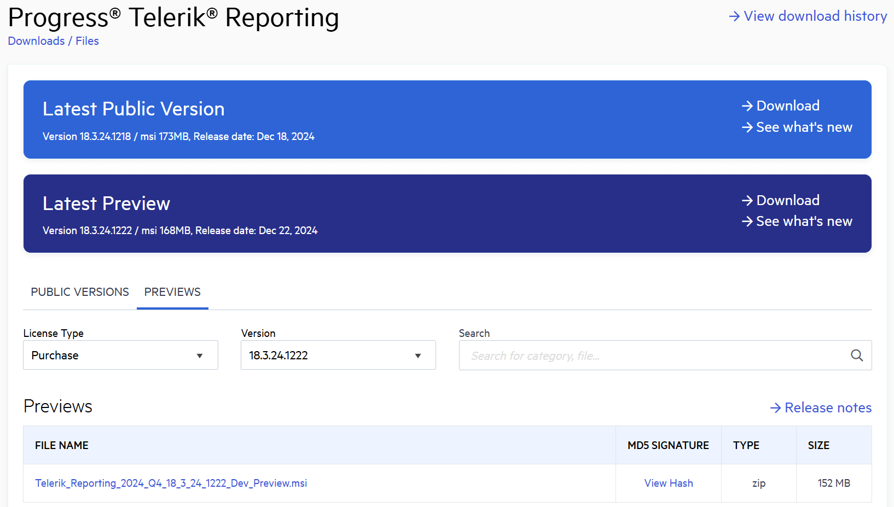
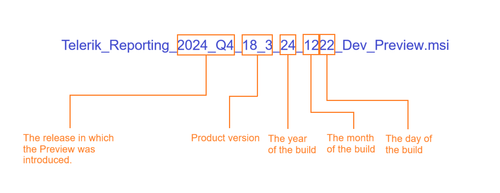

# Preview Release

The Preview is a minor release for Telerik Reporting assemblies, that is uploaded between the major releases (Q1, Q2, Q3, and Q4). The Preview is released on demand so its frequency vary from none to several versions between two major releases. The purpose of the Preview is to allow the users to test the latest bug fixes before the major release. 

## Downloading the Preview Release

The previews are available only if they are released after an official release. Once a new official version is out and no previews are released afterwards, the previous previews are no longer available.

The Preview is __available as a NuGet__ package. Note that the Preview packages are not uploaded on the [Telerik NuGet Feed](), but are available only as [local nuget package]().

Alternatively, you can __download the Preview assemblies__ from [your telerik.com account](https://www.telerik.com/account/).

1. Go to the Telerik Reporting for Reporting product [download page](https://www.telerik.com/account/downloads/product-download?product=REPORTING). 
	
2. Click on the __Download__ button in the __Latest Preview__ banner. This will download an archive with the Reporting __assemblies__.

	To get a specific version of the Preview, open the __Previews__ tab on the download page. Then, select a version from the list.

	
	
## Version Number Breakdown

The numbers in the name are determined by the source code build date. In other words, the version number corresponds to the date when the msi was built.

The following image shows the name of the Preview generated on the 22nd of December (12th month), in the 2024 Q4 release sprint.

 
## See Also  
* [Installation Approaches for Telerik Reporting]()
* [Telerik Reporting Licensing]()  
