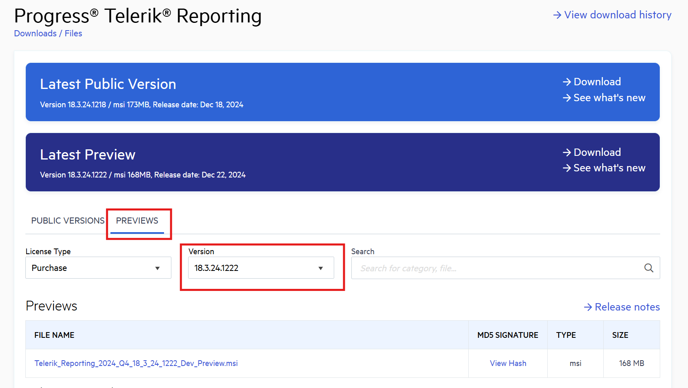

# Preview Release

A preview release is a minor release with bug fixes that is published between the major releases (Q1, Q2, Q3, and Q4). Preview releases are published on demand and have no release cadence.

If a preview version gets released, it remains available for download only until the release of the next official version. Once the official version is published, the preview that preceded it is removed from the [Downloads](https://www.telerik.com/account/downloads/product-download?product=REPORTING) section of your Telerik account.

## Downloading the Preview Release

The preview versions are available in the [Downloads](https://www.telerik.com/account/downloads/product-download?product=REPORTING) section of your Telerik account where you can select your preferred distribution asset type: NuGet packages, MSI, or a ZIP archive.

To download a preview release:

1. Go to the Telerik Reporting [Downloads page](https://www.telerik.com/account/downloads/product-download?product=REPORTING).

2. Click the __Download__ button in the __Latest Preview__ banner.

3. (Optional) To get a specific version of the preview (if multiple versions are available), click the __Previews__ tab on the download page. Then, select a version from the list.

   

## Version Number Breakdown

The numbers in the name are determined by the build time of the source code.

The following image shows the name of the Preview generated on the 22nd of December (12th month), in the 2024 Q4 release sprint.

   

## See Also

* [Installation Approaches for Telerik Reporting]()
* [Telerik Reporting Licensing]()  
