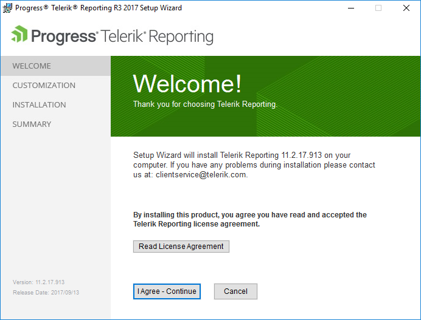
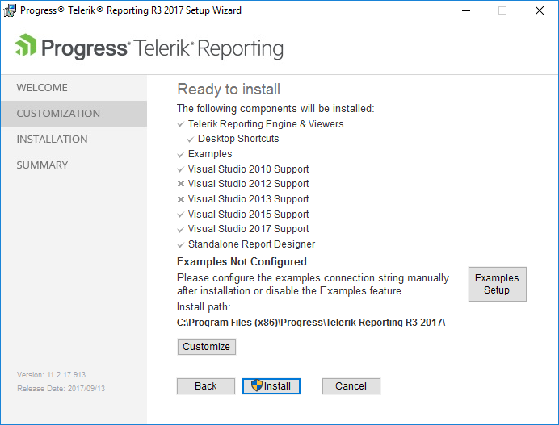
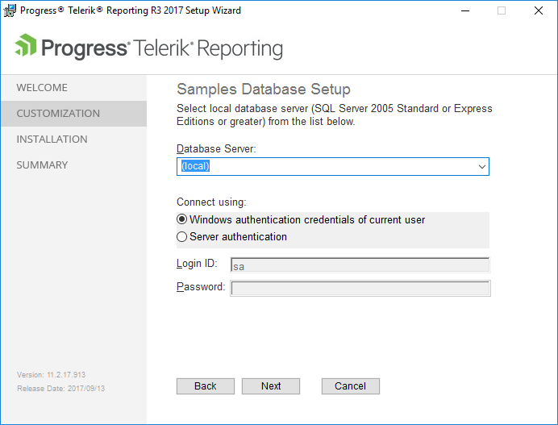
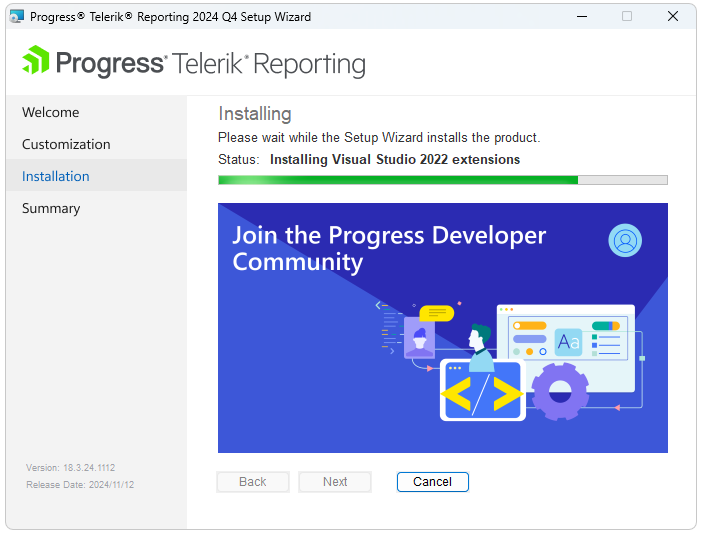
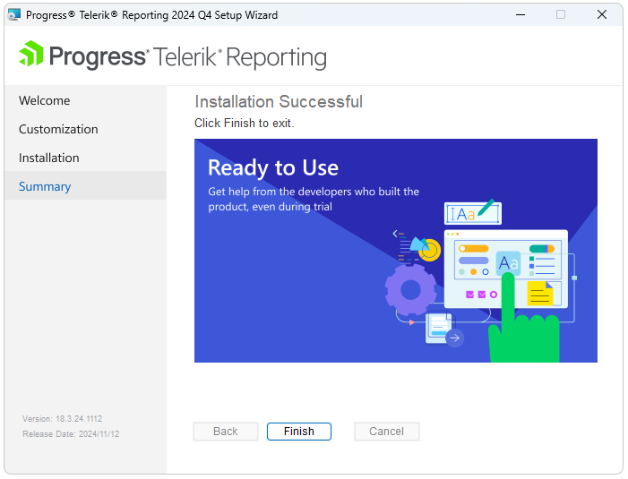

# Installation Approaches for Telerik Reporting

Telerik Reporting supports three installation approaches: the [Control Panel](#using-the-control-panel), the [MSI installer](#using-the-msi-file), and [NuGet packages](#using-nuget-packages). Choose the approach based on whether you need design-time support and how you plan to manage the installation in your workflow.

>note After installing the product, you need to [download and activate your Telerik Reporting License Key](slug:license-key).

Use this table to choose the approach that fits your workflow:

| Approach | Best For | Design-Time Support |
| :-------- | :------- | :------------------ |
| [Control Panel](#using-the-control-panel) | Evaluating the product or managing multiple Telerik products on your machine. | Yes |
| [MSI installer](#using-the-msi-file) | Full local installation with Visual Studio integration, sample projects, and the Standalone Report Designer. | Yes |
| [NuGet packages](#using-nuget-packages) | Adding Telerik Reporting to an existing project or automating installation in a CI/CD pipeline. | No |

## Using the Control Panel

You can install Telerik Reporting by downloading and running the Progress Control Panel. The Control Panel manages downloads, installations, and updates across all your Telerik products from a single interface. For complete instructions, refer to the [Progress Control Panel online documentation](https://docs.telerik.com/controlpanel/introduction).

The [Progress Control Panel](https://www.telerik.com/download-trial-file/v2/control-panel) automatically downloads and stores your license key in your home directory, making it available for all projects you develop on your local machine. For details, see [Setting Up Telerik Reporting License Key](slug:license-key).

## Using the MSI File

You can install Telerik Reporting by using the `.msi` file for a full local installation. The installer adds Telerik Reporting to your computer under `Program Files/Progress`, creates the required virtual folders and projects, and provides all files needed for development with Telerik Reporting.

The MSI installation wizard installs the product by default in the `C:\Program Files (x86)\Progress\Telerik Reporting {{site.suiteversion}}` folder. Only the ODBC drivers (optional) are installed in 'C:\Program Files (x86)\Progress'.

The MSI installer is the recommended approach for a full local installation. It automatically registers the required Telerik Reporting assemblies in the machine GAC for the Visual Studio Report Designer, configures the Project and Item Templates across all Visual Studio instances, and creates and populates the AdventureWorks sample database for the sample projects.

### Specifics

During the MSI installation process, note the following:

* For Telerik Reporting versions earlier than R3 2017, the default installation paths were `C:\Program Files\Telerik\` and `C:\Program Files (x86)\Telerik\`.
* The latest package available for download has all updates and hotfixes applied. You do not need to update it further after installation.
* The MSI installation does not overwrite previous Telerik Reporting installations unless the new installation is the same version. The installer keeps your existing installation and places new files in a separate folder.
* The **Downloads** page lists previously downloaded products. For any missing products or product versions, contact the Sales team through the support ticketing system by submitting a [**General Feedback**](https://www.telerik.com/account/support-tickets/general-feedback) thread.

### MSI Installation

To install Telerik Reporting through the MSI automatic installer file:

1. Log into your [Telerik account](https://www.telerik.com/account). Select the **Downloads** tab to view the available products and select **Telerik Reporting**.
1. From the next page, download the MSI installation and the documentation files and download the automatic installation MSI file. The source code is available for download only for commercial license holders.
1. When the download completes, run `Telerik_Reporting_[suiteversion].msi`. In the dialog that appears after you execute the MSI file, confirm that you have read and accepted the License Agreement.

	

1. In the dialog that opens, select the features you require.

	+ If Telerik Reporting does not locate a local SQL Server instance, or if the SQL Server Browser Service is stopped, the **Examples** dialog option installs the examples but the application configuration files do not contain valid connection strings. You can still access working demos on the [Telerik Reporting demos page](https://demos.telerik.com/reporting).
	+ To set up the examples with a valid connection string, select **Examples Setup**. All local SQL Server 2005 and later instances are supported.
	+ The examples require the MS SQL Server [AdventureWorks database](https://learn.microsoft.com/en-us/previous-versions/sql/sql-server-2008/ms124659(v=sql.100)). If the database is not already available on your machine, the wizard deploys it locally.
	+ To install AdventureWorks manually from the SQL script in the installer, navigate to `[InstallDir]/Examples/Data/AdventureWorks OLTP`. For the script to run correctly, uncomment the `SET @data_path = 'C:\Program Files\Microsoft SQL Server\90\Tools\Samples\AdventureWorks OLTP\';` statement and specify the correct path to the CSV data files in the same folder.

	

1. (If **Examples Setup** was selected) In the **Setup Wizard** dialog, select your **Database Server** and the authentication for the connection. The Wizard detects all running instances and lists them in the input field.

	>note To enable the wizard to detect all running SQL Server instances, start the [SQL Server Browser Service](https://learn.microsoft.com/en-us/previous-versions/sql/sql-server-2008-r2/ms181087(v=sql.105)).

	

	

	

## Using NuGet Packages

You can add Telerik Reporting to a project by installing NuGet packages from the Telerik NuGet server at `https://nuget.telerik.com/v3/index.json`. The packages contain the libraries for .NET Core projects, the Reporting Engine, and the [Reporting REST WebAPI-based service](slug:telerikreporting/using-reports-in-applications/host-the-report-engine-remotely/telerik-reporting-rest-services/asp.net-web-api-implementation/overview). You can also use them with the standard .NET 4.6.2+ framework.

>note The Telerik Reporting NuGet packages do not include design-time support. If you need the Visual Studio Report Designer or the Standalone Report Designer, use the [MSI installer](#using-the-msi-file) instead.

Installing the Telerik Reporting NuGet packages involves three steps:

1. [Generating an API key required for the NuGet authentication](#step-1-generating-an-api-key).
1. [Adding the Telerik NuGet server to Visual Studio](#step-2-adding-the-telerik-nuget-package-source-to-visual-studio).
1. [Installing the Telerik Reporting NuGet packages](#step-3-installing-telerik-reporting).

### Step 1: Generating an API Key

As the Telerik NuGet server requires authentication, the first step is to obtain an API key that you will use instead of a password. Using an API key instead of a password is a more secure approach, especially when working with [.NET CLI](slug:using-nuget-keys#using-only-cli-commands) or the [`NuGet.Config` file](slug:using-nuget-keys#using-a-nugetconfig-file-with-your-projects).

1. Go to the [API Keys](https://www.telerik.com/account/downloads/api-keys) page in your Telerik account.
1. Click **Generate New Key +**.

   

1. In the **Key Note** field, add a note that describes the API key.
1. Click **Generate Key**.
1. Select **Copy and Close**. Once you close the window, you can no longer copy the generated key. For security reasons, the **API Keys** page displays only a portion of the key.
1. Store the generated NuGet API key as you will need it in the next steps. Whenever you need to authenticate your system with the Telerik NuGet server, use `api-key` as the username and your generated API key as the password.

>note API keys expire after two years. Telerik sends an email when a key is about to expire. Set your own calendar reminder with details about where you used the key—file paths, project links, AzDO and GitHub Action variable names, and so on.

### Step 2: Adding the Telerik NuGet Package Source to Visual Studio

To configure the Telerik NuGet feed in Visual Studio:

1. Open Visual Studio.
1. Go to **Tools > NuGet Package Manager > Package Manager Settings**.
1. Select **Package Sources**, and then click the + button.
1. In the **Source** field, enter `https://nuget.telerik.com/v3/index.json`. If you use a locally available NuGet package downloaded from <a href="https://www.telerik.com/account/" target="_blank">your account</a>, add the path to the local package instead of the URL.
1. Click **Update** and then **OK**.

The Telerik NuGet feed is now available as a package source.

For details on adding a NuGet feed, refer to the [official Microsoft NuGet documentation](https://www.visualstudio.com/en-us/docs/package/nuget/consume).

### Step 3: Installing Telerik Reporting

After adding the Telerik NuGet feed as a package source, authenticate your local NuGet instance and install Telerik Reporting:

1. Create a new Reporting project or open an existing one.
1. Go to **Tools** > **NuGet Package Manager** > **Manage NuGet Packages for Solution...**. Select the Telerik NuGet **Package source** from the drop-down list on the left.
1. Select the **Browse** tab to see the available packages.
1. In the authentication window, enter `api-key` in the **User name** field and the [generated API key](#step-1-generating-an-api-key) in the **Password** field.
1. Select the desired Telerik Reporting NuGet package and click **Install**.

## See Also

* [Adding the Telerik Private NuGet Feed to VS](slug:telerikreporting/using-reports-in-applications/how-to-add-the-telerik-private-nuget-feed-to-visual-studio)
* [Restoring NuGet Packages in Your CI Workflow](slug:using-nuget-keys)
* [Troubleshooting Telerik NuGet](slug:troubleshooting-nuget)
