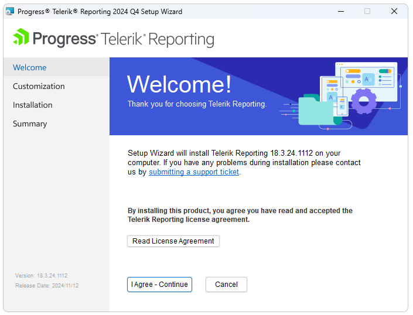
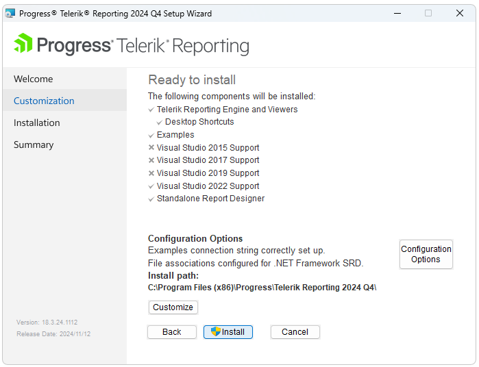
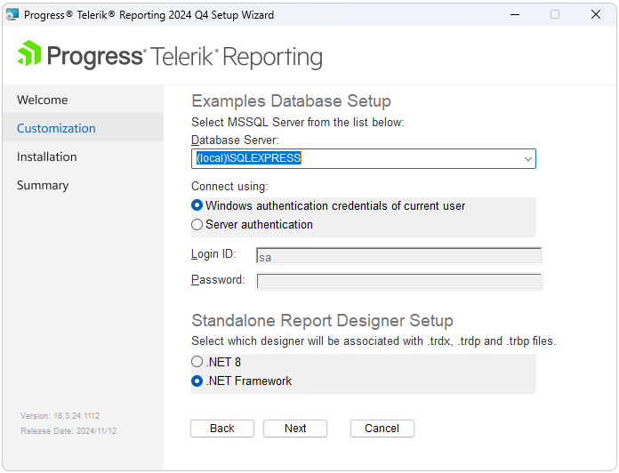

# Installation Approaches for Telerik Reporting

Telerik Reporting provides options for installing the product by using [the Control Panel](#using-the-control-panel), by [the MSI installer file](#using-the-msi-file), or [NuGet](#installing-with-nuget). The NuGet packages add the Reporting assemblies to the project, but do not provide design time support.

>note After installing the product, you will need to [download and activate/update your Telerik Reporting License Key]().

## Using the Control Panel

You can install Telerik Reporting by downloading the Control Panel. For the complete instructions, refer to the [Progress Control Panel](https://docs.telerik.com/controlpanel/introduction) online documentation.

The [Progress Control Panel](https://www.telerik.com/download-trial-file/v2/control-panel) will automatically download and store your license key in your home directory. This makes it available for all projects you develop on your local machine. For details, check the article [Setting Up Telerik Reporting License Key]().

## Using the MSI File

You can install Telerik Reporting by using the `.msi` file for automatic product installation. The file installs Telerik Reporting on your computer in a `Program Files/Progress` folder, automatically creates the necessary virtual folders and projects, and provides all required files for developing with Telerik Reporting.

When you download the Telerik Reporting, the wizard for the MSI installation will by default install the product in the `C:\Program Files (x86)\Progress\Telerik Reporting {{site.suiteversion}}` folder for 32-bit machines, or in the `C:\Program Files\Progress\Telerik Reporting {{site.suiteversion}}` folder for 64-bit machines.

Using the MSI installer is the recommended way for installing Telerik Reporting. The MSI installer will automatically register the Telerik Reporting assemblies needed for Visual Studio Telerik Report Designer in the machine GAC, configure the Project and Item Templates in all Visual Studio instances, and create and populate the AdventureWorks sample database used by the sample projects.

### Specifics

During the MSI installation process, consider the following:

* Prior to R3 2017, the default installation paths were `C:\Program Files\Telerik\` and `C:\Program Files (x86)\Telerik\` respectively.
* The latest package that is available for download has all updates/HOTFIXES applied already and you don't need to update it further.
* The MSI installation will not overwrite previous Telerik Reporting installations unless the current installation is of the same version. The installer will keep your existing installation. The new files will be placed in a separate folder and the new installation will not damage the common installer files.
* The __Downloads__ page lists previously downloaded products. For any missing products or product versions, contact the Sales team through the support ticketing system by submitting a [__General Feedback__](https://www.telerik.com/account/support-tickets/general-feedback) thread.
* To access the latest Telerik Reporting internal builds, after you log into your Telerik account, navigate to __Latest Internal Build__ under __Downloads__. For internal builds from earlier releases, select the respective Telerik Reporting version.

### MSI Installation

To install Telerik Reporting through the MSI automatic installer file:

1. Log into your [Telerik account](https://www.telerik.com/account). Click the __Downloads__ tab to view the available products and select __Telerik Reporting__.
1. From the next page, download the MSI installation and the documentation files and download the automatic installation MSI file. The source code is available for download only for commercial license holders.
1. When the download completes, run `Telerik_Reporting_[suiteversion].msi`. In the dialog that appears after you execute the MSI file, confirm that you have read and accepted the License Agreement.

	

1. In the dialog that opens, select the features you require.

	+ If Telerik Reporting does not locate a local SQL server instance on your machine or if your SQL browser service is stopped, the examples from the __Examples__ dialog option will be installed but the configuration files for the application will not have valid connection strings. However, you can still access the working demos on the [Telerik Reporting Demos page](https://demos.telerik.com/reporting).
	+ To set up the examples and the used connection string, select __Examples Setup__. All local SQL Server 2005+ instances are supported.
	+ The examples use the MS SQL Server [AdventureWorks database](https://learn.microsoft.com/en-us/previous-versions/sql/sql-server-2008/ms124659(v=sql.100)). Unless already available on your machine, the AdventureWorks database will also be deployed locally.
	+ Alternatively, you can install AdventureWorks by manually executing the SQL script from the installer. To use this option, navigate to __[InstallDir]/Examples/Data/AdventureWorks OLTP__. For the script to run correctly, uncomment the `SET @data_path = 'C:\Program Files\Microsoft SQL Server\90\Tools\Samples\AdventureWorks OLTP\';` statement and specify the correct path to the CSV data files which are in the same folder as the SQL script file.

	

1. (If __Examples Setup__ was selected) In the __Setup Wizard__ dialog, select your __Database Server__ and the authentication for the connection. The Wizard detects all running instances and lists them in the input field.

	> To enable the Wizard to detect all running SQL Server instances, run the [SQL Server Browser Service](https://learn.microsoft.com/en-us/previous-versions/sql/sql-server-2008-r2/ms181087(v=sql.105)).

	

	 

	 

## Using NuGet Packages

You can add Telerik Reporting to a project by using the [Telerik Reporting NuGet packages](https://nuget.telerik.com/v3/index.json). The NuGet packages are a single ZIP file with the `.nupkg` extension.

* The `.nupkg` file contains the libraries for .NET Core projects, the Reporting Engine, and the implementation of the [Reporting REST WebAPI-based service]() where you can use the packages with the standard .NET 4.6.1 framework.
* The Telerik Reporting NuGet packages do not include design-time support.
* The legacy https://nuget.telerik.com/nuget server is now deprecated. Make sure to switch to the new https://nuget.telerik.com/v3/index.json server, which is faster, lighter, and reduces the number of requests from your NuGet client. For more information on how to add a NuGet feed, refer to the [official Microsoft documentation](https://www.visualstudio.com/en-us/docs/package/nuget/consume).

### Adding the Telerik NuGet Feed

To install the Telerik Reporting NuGet packages, add the Telerik NuGet feed to Visual Studio and install the product. The following video demonstrates the steps for adding the Telerik NuGet feed to Visual Studio. If you prefer, however, you can follow the steps that are listed in writing after the video.

<iframe width="560" height="315" src="https://www.youtube.com/embed/c3m_BLMXNDk" frameborder="0" allow="accelerometer; autoplay; encrypted-media; gyroscope; picture-in-picture" allowfullscreen></iframe>

To configure the Telerik NuGet Feed in Visual Studio:

1. Open Visual Studio and go to **Tools** > **NuGet Package Manager** > **Package Manager Settings**.
1. Select **Package Sources** and then click the `+` button to add a new package source.
1. Enter a **Name** for the new package source, for example, **Telerik NuGet**.
1. Add the `https://nuget.telerik.com/v3/index.json` URL as a **Source**. Make sure the URL does not have a trailing slash. Click **OK**.

### Installing Telerik Reporting

After you have successfully added the Telerik NuGet feed as a package source, you need to authenticate your local NuGet instance and install Telerik Reporting:

1. Create a new Reporting project or open an existing one.
1. Go to **Tools** > **NuGet Package Manager** > **Manage NuGet Packages for Solution...**. Select the Telerik NuGet **Package source** from the drop-down list on the left.
1. Select the **Browse** tab to see the available packages. Enter your Telerik credentials in the Windows Authentication dialog.

	> You may need to escape some [special characters in the password](#handling-special-characters-in-password)
	
1. Select Telerik Reporting and click **Install**.

## See Also

* [Adding the Telerik Private NuGet Feed to VS]()
* [Restoring NuGet Packages in Your CI Workflow]()
* [Troubleshooting Telerik NuGet]()
