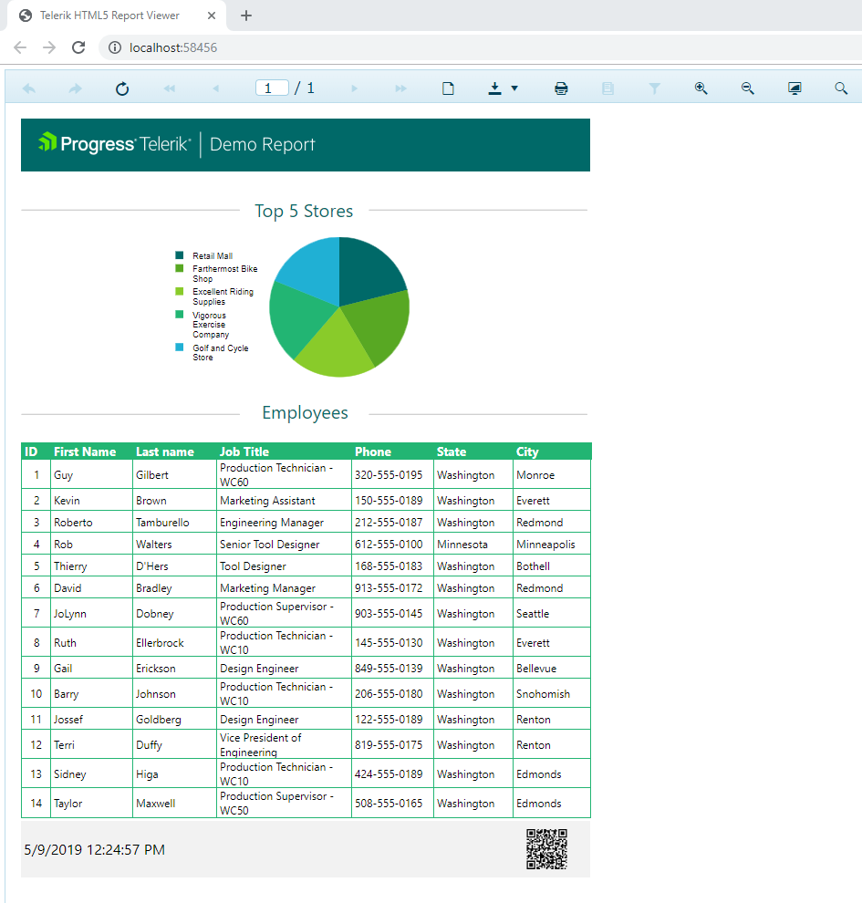

# Integrating the Report in .NET Framework Application


This article is part of the Demo report guide on getting started with Telerik Reporting and demonstrates         how to include the report in a web application with the [HTML5 Report Viewer]().       


1. Open __Visual Studio__.             

1. Navigate to __File__ > __New__ > __Project__             > __ASP.NET Web Application (.NET Framework Visual C#)__.             

1. Select __Empty project Template__ > __OK__.             

1. Right-click the project. Select __Add__ > __New Item__ > __Telerik HTML5 Report Viewer Page [version]__.           Name the file "index.html".           

1. In the __Configure reporting engine__ dialog, the selections will remain the same as set by default, that is,               __REST Service__ > __Create new Rest Service__). Click __Next__.               

  

1. Click __Existing report definition__             and select __Choose an Existing check TRDP, TRDB or TRDX report definition__ to start embedding the report.             

1. Browse to the report location. Click __Next__ > __Next__ > __Finish__.               

  

1. Include the connection string in the web.config file which is nececssary because of the added named connection string to the report.               If the report uses an embedded connection, you do not have to add it again to the Visual Studio project.               The connection string looks similar to the following:             

    
      ````xml
<connectionStrings>
<add name="Telerik.Reporting.Examples.CSharp.Properties.Settings.TelerikConnectionString"
connectionString="Data Source=(local)\SQLEXPRESS;Initial Catalog=AdventureWorks;Integrated Security=SSPI"
providerName="System.Data.SqlClient"/>
</connectionStrings>
````


## Previewing the Result

Preview the result by running the project.           

  

