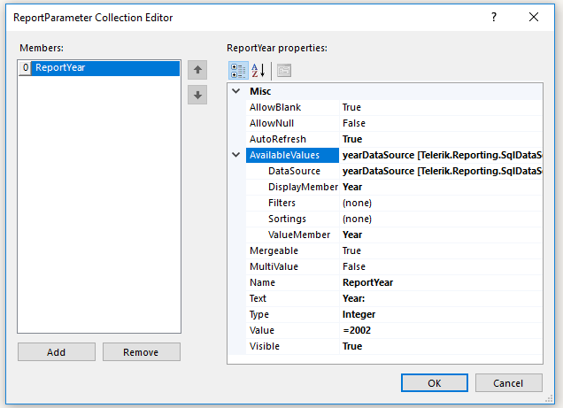
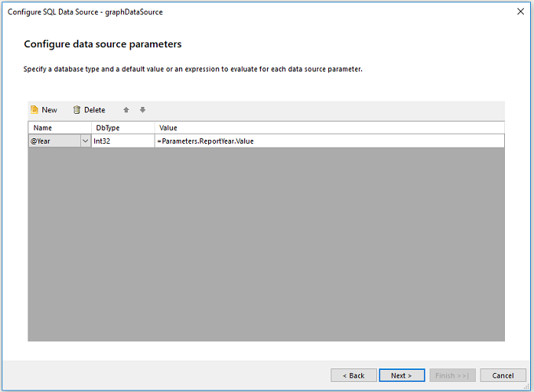

# Parameterizing the Graph


This article is part of the Demo report guide on getting started with Telerik Reporting.         It demonstrates how to add a report parameter and change the __graphDataSource__ of the graph         so that the user can select a year based on which the graph will display the top five stores.       


1. Add a new SqlDatasource component for the graph with the following query:             

    
      ````sql
SELECT DISTINCT YEAR(OrderDate) AS Year
FROM         Sales.SalesOrderHeader
ORDER BY Year
````


1. Rename the data source to __yearDataSource__.             

1. Right-click outside the report. Select __Report Parameters__ to add the [report parameter]() of the year.             

1. Set __ReportYear__ as in the following way:               

  

1. Right-click __graphDataSource__. Select __Configure__ and click __Next__             until the __Configure data source command__ is displayed.             

1. Change the WHERE clause in the following way:             

    
      ````sql
WHERE  (YEAR(SOH.OrderDate) = @Year)
````


1. Set __Configure data source parameters__ dialog in the following way:               

  

1. Set __Configure Design Time Parameters__ :             

   + __Name__ : @Year

   + __Value__ : 2002As a result, the year that will be displayed by default will be 2002.

1. Click __Next__ and __Finish__.             

## Previewing the Result

Preview the result by clicking __Preview__ > __PrintPreview__.           

  

